```mermaid
graph TD
    Root["NEMO12 PARENT CARE KNOWLEDGE HUB<br/>(/)"]
    
    Root --> M1["1. OVERVIEW<br/>(/overview)"]
    Root --> M2["2. PARENT JOURNEY<br/>(/journey)"]
    Root --> M3["3. PLAYBOOKS ★ MEGA MENU<br/>(/playbooks)"]
    Root --> M4["4. DECISION LOGS<br/>(/decision-logs)"]

    %% Overview Sub-items
    M1 --> M1_1["Why Parent Care (/overview/why-parent-care)"]
    M1 --> M1_2["Parent Jobs (/overview/parent-jobs)"]
    M1 --> M1_3["Core Principles (/overview/core-principles)"]
    M1 --> M1_4["Capability Map (/overview/capability-map)"]

    %% Parent Journey
    M2 --> M2_1["Journey Map (/journey)"]

    %% Playbooks Mega Menu (5 Tầng AARRR / 8 Playbooks)
    M3 --> G1["1. Acquisition"]
    M3 --> G2["2. Activation"]
    M3 --> G3["3. Retention"]
    M3 --> G4["4. Referral"]
    M3 --> G5["5. Revenue"]

    G1 --> P1["Marlins Day (/playbooks/marlins-day)"]
    G1 --> P2["Marlins Workshop (/playbooks/marlins-workshop)"]
    G1 --> P3["Community & Social (/playbooks/community)"]
    
    G2 --> P4["Trial Class (/playbooks/trial-class)"]
    
    G3 --> P5["Live Class (/playbooks/live-class)"]
    G3 --> P6["Family Meeting (/playbooks/family-meeting)"]
    
    G4 --> P7["Growth Story (/playbooks/growth-story)"]
    G4 --> P8["Referrals Program (/playbooks/referrals)"]
    
    G5 --> P9["Next Steps (/playbooks/next-steps)"]

    %% Decision Logs
    M4 --> D1["Midpoint Pulse (/decision-logs/midpoint-pulse)"]
    M4 --> D2["Trial Support (/decision-logs/trial-support)"]
    M4 --> D3["Human Trigger (/decision-logs/human-trigger)"]
    M4 --> D4["High-Touch (/decision-logs/high-touch)"]
    M4 --> D5["Completion (/decision-logs/completion)"]
```

# A1 · SITEMAP & NAVIGATION ARCHITECTURE
## Nemo12 & Marlins Care Knowledge Hub (Simplified Operator-First Model)

> **Triết lý kiến trúc thông tin (IA Philosophy)**:  
> *"Minimal Cognitive Load, Maximum Operational Focus."*  
> Hệ thống sitemap được tinh gọn tối đa thành **4 Navigation chính** trên Top Bar. Loại bỏ sự dàn trải của 13 điểm chạm vi mô bằng cách hợp nhất thành **9 Playbooks theo workflow thực tế**, biến **Parent Journey** thành một bản đồ tương tác trực quan (Interactive Map), và tích hợp trực tiếp **5 Decision Logs (DARs)**.

---



---

## 1. Master Sitemap Tree (Cấu trúc Phân cấp Tổng thể theo AARRR)

```
NEMO12 PARENT CARE
│
├── OVERVIEW
│   ├── Why Parent Care
│   ├── Parent Jobs
│   ├── Core Principles
│   └── Capability Map
│
├── PARENT JOURNEY
│   └── Interactive Journey Map
│
├── PLAYBOOKS (AARRR SEQUENTIAL)
│   │
│   ├── 1. ACQUISITION
│   │   ├── Marlins Day (Offline CN 14h-17h)
│   │   ├── Marlins Workshop (Zoom tối T5 20h-22h)
│   │   └── Community & Social (3 Groups Zalo & FB Mentors)
│   │
│   ├── 2. ACTIVATION
│   │   └── Trial Class (2 buổi Trial Class CN)
│   │
│   ├── 3. RETENTION
│   │   ├── Live Class (12 buổi Live Class CN)
│   │   └── Family Meeting (Gặp mặt ăn uống gia đình)
│   │
│   ├── 4. REFERRAL
│   │   ├── Growth Story (Hồ sơ trưởng thành 5 phần)
│   │   └── Referrals Program (Chính sách & Link 15% - 15%)
│   │
│   └── 5. REVENUE
│       └── Next Steps (Tư vấn lộ trình tiếp theo)
│
└── DECISION LOGS
    ├── Midpoint Pulse
    ├── Trial Support
    ├── Human Trigger
    ├── High-Touch
    └── Completion
```

---

## 2. Chi tiết 4 Cụm Navigation Chính

### 2.1 Navigation 1: OVERVIEW (`/overview`)
*Định vị lý do tồn tại của Parent Care, giải mã nhu cầu cốt lõi của phụ huynh, triết lý vận hành và ranh giới Con người vs Hệ thống.*

| Trang (Page) | Route Slug | Nội dung chính | Logic tinh gọn & Đóng gói |
| :--- | :--- | :--- | :--- |
| **Why Parent Care** | `/overview/why-parent-care` | • Lý do tồn tại của hệ thống chăm sóc phụ huynh.<br/>• Bối cảnh 12 buổi học + Marlins Day.<br/>• Guardrail: Giúp phụ huynh thấu hiểu & hỗ trợ con, không trao quyền kiểm soát/gây áp lực. | Trả lời câu hỏi nền tảng nhất: *Vì sao Nemo12 làm Parent Care?* |
| **Parent Jobs** | `/overview/parent-jobs` | • Ma trận JTBD (Jobs To Be Done) toàn diện của Phụ huynh.<br/>• 3 Tiers ưu tiên: Functional, Emotional, Social Jobs.<br/>• Bảng ánh xạ Pain → Need → Desired Outcome.<br/>• Traceability link trực tiếp tới Canonical Docs: `https://docs.nemo12.com/product/parent-jtbd` (JTBD-P1 → P6). | Gom toàn bộ JTBD & Nhu cầu vào 1 trang duy nhất, dễ đối chiếu. |
| **Core Principles** | `/overview/core-principles` | • Triết lý kim chỉ nam: *"Automate the evidence. Humanize the meaning."*<br/>• 7 Nguyên tắc vận hành cốt lõi của Nemo12 & Marlins.<br/>• Nguyên tắc kênh: *"Zalo is a Channel, Not a Touchpoint."* | Quy chuẩn hành vi & tư duy cho toàn bộ Mentors và Operators. |
| **Capability Map** | `/overview/capability-map` | • Ma trận phân định năng lực: System vs Mentor vs Marlins.<br/>• Trách nhiệm của từng vai trò (Machines detect; humans judge).<br/>• Failure Modes & các bẫy vận hành cần phòng tránh. | Tích hợp System Role / Mentor Role / Marlins Role vào chung Capability Map. |

---

### 2.2 Navigation 2: PARENT JOURNEY (`/journey`)
*Một trang Interactive Map duy nhất thể hiện toàn bộ hành trình trải nghiệm của phụ huynh từ lúc cân nhắc đến khi hoàn thành và tiếp tục đồng hành.*

#### Cấu trúc luồng 7 Giai đoạn (Journey Pipeline) & Ánh xạ AARRR Funnel:
```
Consideration  ──►  Trial  ──►  Decision  ──►  Early Learning  ──►  Core Learning  ──►  Completion  ──►  Continuation
[Acquisition]     [---- Activation ----]      [------------ Retention ------------]      [Referral]       [Revenue]
```

#### Bảng tổng quan phân bổ Điểm chạm & AARRR Funnel:
| Giai đoạn (Stage) | Mốc thời gian | Tầng AARRR Funnel | Trọng tâm trải nghiệm | Playbooks liên quan |
| :--- | :--- | :--- | :--- | :--- |
| **01. Consideration** | Trước khóa học | **Acquisition** | Phụ huynh hiểu rõ mục đích, tin tưởng phương pháp giáo dục và biết cách chuẩn bị cho con. | Trial Care (T1), Marlins Day (T3) |
| **02. Trial Learning** | Buổi 1 – 2 | **Activation** | Con được tự do khám phá tư duy; phụ huynh nhận báo cáo bằng chứng dữ liệu khách quan. | Trial Care (T2) |
| **03. Decision** | Sau 2 buổi Trial | **Activation → Conversion** | Nhận tư vấn trung thực về mức độ phù hợp của con, không bị chèo kéo bán hàng. | Trial Care (T4) |
| **04. Early Learning** | Buổi 1 – 3 | **Retention** | An tâm thấy con bắt nhịp môi trường học tập, mentor luôn sẵn sàng hỗ trợ. | Progress Update (T5), Parent Support (T9) |
| **05. Core Learning** | Buổi 4 – 9 | **Retention** | Nhìn thấy sự tiến bộ thực chất bằng dữ liệu, cảm nhận con được thấu hiểu qua quan sát của Mentor. | Progress Update (T5), Mentor Insight (T6), Parent Support (T7), Milestones (T13), Family Experience (T10) |
| **06. Completion** | Buổi 10 – 12 | **Referral** | Gia đình sở hữu một bức tranh trưởng thành toàn diện 5 phần, tự hào về nỗ lực của con. | Growth Story (T11) |
| **07. Continuation** | Hậu 12 buổi | **Revenue** | Được tư vấn bước phát triển tiếp theo trung thực dựa trên nhu cầu học sinh. | Next Steps (T12), Marlins Day (T3) |

#### Cơ chế tương tác (Interactive Stage Inspector):
Khi click vào từng Stage trên Journey Map, giao diện hiển thị ngay bảng điều khiển chi tiết theo công thức:
$$\text{Parent Need} \longrightarrow \text{Desired Experience} \longrightarrow \text{Key Playbooks}$$

```
+-------------------------------------------------------------------------------------------------------------------------+
| [STAGE 5: CORE LEARNING · SESSIONS 4–9]  ⚡ RETENTION                                                                   |
+-------------------------------------------------------------------------------------------------------------------------+
| • Parent Needs:        Understand Progress  ·  Understand Child  ·  Child Is Seen                                       |
| • Desired Experience:  Nhìn thấy sự tiến bộ thực chất bằng dữ liệu, cảm nhận con được thấu hiểu và tôn trọng.          |
| • Key Playbooks:       [Progress Update ↗]  ·  [Mentor Insight ↗]  ·  [Parent Support ↗]  ·  [Milestones ↗]            |
+-------------------------------------------------------------------------------------------------------------------------+
```

---

### 2.3 Navigation 3: PLAYBOOKS (`/playbooks`)
*Trọng tâm tác nghiệp thực chiến. Sắp xếp theo **5 tầng AARRR Funnel**, tinh gọn và liền mạch theo dòng thời gian.*

```
+-------------------------------------------------------------------------------------------------------------------------+
| MEGA MENU: PLAYBOOKS (5 NHÓM / 9 WORKFLOWS CHÍNH)                                                                       |
+-------------------------------------------------------------------------------------------------------------------------+
| [TRIAL]                             | [PROGRESS]                          | [SUPPORT]                                   |
| • Trial Care                        | • Progress Update                   | • Parent Support                            |
|   (Pre-Trial + Evidence + Decision) |   (Báo cáo dữ liệu tự động)        |   (Inbound + Risk + Expectation Gaps)       |
|                                     | • Mentor Insight                    | • Marlins Day                               |
|                                     |   (Quan sát định tính con người)    |   (Trải nghiệm chiều Chủ Nhật đặc trưng)    |
+-------------------------------------+-------------------------------------+---------------------------------------------+
| [KEY MOMENTS]                       | [COMPLETION]                        | 💡 MỖI PLAYBOOK ĐỀU TÍCH HỢP ĐỦ:            |
| • Milestones                        | • Growth Story                      | 1. Bối cảnh & Mục tiêu (Context & Jobs)     |
|   (Dấu mốc nỗ lực / Chúc mừng)      |   (Hồ sơ tổng kết sự trưởng thành)  | 2. Quy trình Thực thi Chuẩn (SOP)           |
| • Family Experience                 | • Next Steps                        | 3. Mẫu Tin nhắn Zalo / Email / Kịch bản     |
|   (Gặp gỡ, Bữa ăn, Thăm nhà)        |   (Tư vấn định hướng theo nhu cầu)  | 4. Tiêu chuẩn Đánh giá Rubric 3×5 (L1–L5)   |
+-------------------------------------------------------------------------------------------------------------------------+
```

#### Chi tiết 9 Playbooks và Logic Hợp nhất:

1. **Group 1: TRIAL**
   - **`Trial Care` (`/playbooks/trial-care`)**:
     - *Logic hợp nhất*: Gộp trọn gói workflow: **Chuẩn bị trước buổi (Pre-Trial) $\rightarrow$ Dữ liệu học tập thực tế (Trial Evidence) $\rightarrow$ Hỗ trợ ra quyết định (Trial Decision)**.
     - *Tương ứng*: T1, T2, T4.

2. **Group 2: PROGRESS**
   - **`Progress Update` (`/playbooks/progress-update`)**:
     - *Logic*: System-led reporting. Báo cáo tiến độ học tập hàng tuần tự động bằng dữ liệu và bằng chứng minh bạch (T5).
   - **`Mentor Insight` (`/playbooks/mentor-insight`)**:
     - *Logic*: Qualitative human insight. Những quan sát định tính sâu sắc, chân thực từ Mentor về tính cách, tư duy và thái độ học tập của trẻ (T6).

3. **Group 3: SUPPORT**
   - **`Parent Support` (`/playbooks/parent-support`)**:
     - *Logic hợp nhất*: Tích hợp toàn bộ xử lý vấn đề phát sinh: **Phụ huynh chủ động hỏi (Parent-Initiated) + Cảnh báo nguy cơ học tập (Learning Risk / T7) + Khủng hoảng kỳ vọng (Expectation gaps)**.
     - *Workflow phân nhánh (Triage Branches)*:
       $$\text{Parent Concern / Risk Trigger} \longrightarrow \text{Triage} \longrightarrow \begin{cases} \text{Answer (System / Quick)} \\ \text{Mentor (1-on-1 Consultation)} \\ \text{Marlins Day (Sunday Reflection)} \end{cases}$$
     - *Lưu ý*: Midpoint Parent Pulse đóng vai trò là một cơ chế khảo sát nhỏ nằm bên trong Parent Support / Journey Map.
   - **`Marlins Day` (`/playbooks/marlins-day`)**:
     - *Logic*: Giữ riêng biệt vì đây là trải nghiệm đặc trưng của Nemo12 chiều Chủ Nhật (Anh Đắc chủ trì), giúp phụ huynh tháo gỡ ngộ nhận và hình thành mô hình tư duy giáo dục đúng đắn (T3).

4. **Group 4: KEY MOMENTS**
   - **`Milestones` (`/playbooks/milestones`)**:
     - *Logic*: Ghi nhận và chúc mừng những dấu mốc tiến bộ đột phá hoặc nỗ lực vượt bậc của học sinh (T13).
   - **`Family Experience` (`/playbooks/family-experience`)**:
     - *Logic*: Trải nghiệm gắn kết con người chiều sâu: Gặp gỡ gia đình, bữa ăn thân mật, thăm nhà, lưu giữ ảnh kỷ niệm hoặc hàn gắn niềm tin khi cần thiết (T10).

5. **Group 5: COMPLETION**
   - **`Growth Story` (`/playbooks/growth-story`)**:
     - *Logic*: Câu chuyện trưởng thành sau 12 buổi, chuyển hóa toàn bộ dữ liệu học tập thành bức tranh phát triển toàn diện (T11).
   - **`Next Steps` (`/playbooks/next-steps`)**:
     - *Logic*: Tư vấn bước phát triển tiếp theo dựa trên đúng nhu cầu thực tế của học sinh (*"Con cần gì tiếp theo?"* thay vì *"Nemo12 bán gì tiếp theo?"*) (T12).

---

### 2.4 Navigation 4: DECISION LOGS (`/decision-logs`)
*Hiển thị trực tiếp 5 Quyết định Thiết kế Kiến trúc (DARs) cốt lõi, minh bạch hóa lý do đưa ra các lựa chọn vận hành.*

| Quyết định (DAR) | Route Slug | Vấn đề & Quyết định chính |
| :--- | :--- | :--- |
| **Midpoint Pulse** | `/decision-logs/midpoint-pulse` | • *Vấn đề*: Có nên khảo sát định kỳ giữa khóa không?<br/>• *Quyết định (DAR 01)*: Thử nghiệm pilot siêu ngắn gọn (2 câu hỏi), không biến thành gánh nặng thủ tục. |
| **Trial Support** | `/decision-logs/trial-support` | • *Vấn đề*: Cách tư vấn sau 2 buổi Trial?<br/>• *Quyết định (DAR 02)*: Tập trung vào dữ liệu năng lực thực tế của trẻ, không dùng kỹ thuật chốt sales ép buộc. |
| **Human Trigger** | `/decision-logs/human-trigger` | • *Vấn đề*: Khi nào con người (Mentor) bắt buộc can thiệp?<br/>• *Quyết định (DAR 03)*: Hệ thống cảnh báo tự động khi phát hiện sụt giảm nỗ lực/bài tập $\rightarrow$ Mentor phán đoán và can thiệp thấu cảm. |
| **High-Touch** | `/decision-logs/high-touch` | • *Vấn đề*: Tần suất và lý do tổ chức gặp gỡ gia đình / thăm nhà?<br/>• *Quyết định (DAR 04)*: Kích hoạt theo khoảnh khắc ý nghĩa (Meaningful Moments), không làm theo lịch định kỳ hình thức. |
| **Completion** | `/decision-logs/completion` | • *Vấn đề*: Báo cáo kết thúc khóa như thế nào?<br/>• *Quyết định (DAR 05)*: Xây dựng narrative câu chuyện trưởng thành (Growth Story) xuyên suốt 12 buổi học. |

---

## 3. Bảng Ánh xạ Toàn bộ Route & NavItems (Master Route Mapping)

| Nav Category | Sub-item / Page Title | URL Slug | Ghi chú tích hợp |
| :--- | :--- | :--- | :--- |
| **Overview** | Why Parent Care | `/overview/why-parent-care` | PRD §1, §3, §4 |
| **Overview** | Parent Jobs | `/overview/parent-jobs` | PRD §5, §6 |
| **Overview** | Core Principles | `/overview/core-principles` | PRD §1, §9.6 |
| **Overview** | Capability Map | `/overview/capability-map` | PRD §7 (System vs Mentor vs Marlins) |
| **Parent Journey** | Journey Map | `/journey` | Interactive 7-Stage Pipeline Map |
| **Playbooks (Trial)** | Trial Care | `/playbooks/trial-care` | Pre-Trial + Evidence + Decision (T1, T2, T4) |
| **Playbooks (Progress)** | Progress Update | `/playbooks/progress-update` | Weekly System-led Report (T5) |
| **Playbooks (Progress)** | Mentor Insight | `/playbooks/mentor-insight` | Qualitative Human Insight (T6) |
| **Playbooks (Support)** | Parent Support | `/playbooks/parent-support` | Inbound + Learning Risk + Triage (T7, T8, T9) |
| **Playbooks (Support)** | Marlins Day | `/playbooks/marlins-day` | Sunday Reflection Experience (T3) |
| **Playbooks (Key Moments)** | Milestones | `/playbooks/milestones` | Celebration & Transformation (T13) |
| **Playbooks (Key Moments)** | Family Experience | `/playbooks/family-experience` | High-touch Meaningful Moments (T10) |
| **Playbooks (Completion)** | Growth Story | `/playbooks/growth-story` | 12-Session Growth Narrative (T11) |
| **Playbooks (Completion)** | Next Steps | `/playbooks/next-steps` | Need-based Recommendation (T12) |
| **Decision Logs** | Midpoint Pulse | `/decision-logs/midpoint-pulse` | DAR 01 Detail |
| **Decision Logs** | Trial Support | `/decision-logs/trial-support` | DAR 02 Detail |
| **Decision Logs** | Human Trigger | `/decision-logs/human-trigger` | DAR 03 Detail |
| **Decision Logs** | High-Touch | `/decision-logs/high-touch` | DAR 04 Detail |
| **Decision Logs** | Completion | `/decision-logs/completion` | DAR 05 Detail |

---

## 4. Breadcrumb Rules & Schema

1. **Overview Pages**: `Home` > `Overview` > `[Page Title]` (Ví dụ: `Home` > `Overview` > `Capability Map`)
2. **Journey Page**: `Home` > `Parent Journey`
3. **Playbook Pages**: `Home` > `Playbooks` > `[Nhóm Playbook]` > `[Tên Playbook]` (Ví dụ: `Home` > `Playbooks` > `Support` > `Parent Support`)
4. **Decision Logs**: `Home` > `Decision Logs` > `[Tên Decision]` (Ví dụ: `Home` > `Decision Logs` > `Human Trigger`)

---

## 5. Tài liệu Đối chiếu Liên kết (Cross-References)

- **PRD Requirements**: [PRD — Nemo12 Parent Care Hub (`A_Requirements/nemo12_parent_care_prd.md`)](file:///Users/danghong/Documents/Marlins%20Care/A_Requirements/nemo12_parent_care_prd.md)
- **UI Design System**: [B1 · UI Design System (`B_System Design/B1_UI_Design_System.md`)](file:///Users/danghong/Documents/Marlins%20Care/B_System%20Design/B1_UI_Design_System.md)
- **Master SOPs & Rubrics**: [Playbooks, SOPs & Rubrics Master (`C_Playbooks_and_SOPs/Playbooks_SOPs_Rubrics_Master.md`)](file:///Users/danghong/Documents/Marlins%20Care/C_Playbooks_and_SOPs/Playbooks_SOPs_Rubrics_Master.md)
- **Data Repository**: [Structured Data Repository (`data/knowledge_hub_data.js`)](file:///Users/danghong/Documents/Marlins%20Care/data/knowledge_hub_data.js)
