```mermaid
graph TD
    Root["NEMO12 PARENT CARE<br/>(/)"]
    
    Root --> M1["1. OVERVIEW<br/>(/overview)"]
    Root --> M2["2. PARENT JOURNEY<br/>(/journey)"]
    Root --> M3["3. PLAYBOOKS<br/>(/playbooks)"]
    Root --> M4["4. DECISION LOGS<br/>(/decision-logs)"]

    %% Overview Sub-items
    M1 --> M1_1["Why Parent Care (/overview/why-parent-care)"]
    M1 --> M1_2["Parent Jobs (/overview/parent-jobs)"]
    M1 --> M1_3["Core Principles (/overview/core-principles)"]
    M1 --> M1_4["Capability Map (/overview/capability-map)"]

    %% Parent Journey (3 Phases)
    M2 --> Ph1["Pha 1: Trước Khóa Học"]
    M2 --> Ph2["Pha 2: Trong Khóa Học"]
    M2 --> Ph3["Pha 3: Sau Khóa Học"]

    %% Playbooks (Master Framework + 9 Workflows)
    M3 --> PMF["Master Framework (/playbooks/master-framework)"]
    M3 --> P1["Community & Social (/playbooks/community)"]
    M3 --> P2["Marlins Workshop (/playbooks/marlins-workshop)"]
    M3 --> P3["Marlins Day (/playbooks/marlins-day)"]
    M3 --> P4["Trial Class (/playbooks/trial-class)"]
    M3 --> P5["Live Class (/playbooks/live-class)"]
    M3 --> P6["Family Meeting (/playbooks/family-meeting)"]
    M3 --> P7["Growth Story (/playbooks/growth-story)"]
    M3 --> P8["Next Steps (/playbooks/next-steps)"]
    M3 --> P9["Referrals Program (/playbooks/referrals)"]

    %% Decision Logs
    M4 --> D1["Midpoint Pulse (/decision-logs/midpoint-pulse)"]
    M4 --> D2["Trial Support (/decision-logs/trial-support)"]
    M4 --> D3["Human Trigger (/decision-logs/human-trigger)"]
    M4 --> D4["High-Touch (/decision-logs/high-touch)"]
    M4 --> D5["Completion (/decision-logs/completion)"]
```

# A1 · SITEMAP & NAVIGATION ARCHITECTURE
## Nemo12 & Marlins Care Knowledge Hub (Collapsible Tree Navigation Model)

> **Triết lý kiến trúc thông tin (IA Philosophy)**:  
> *"Minimal Cognitive Load, Maximum Operational Focus, Universal Modular Schema."*  
> Hệ thống sitemap được tinh gọn thành **4 Navigation chính** trên Top Bar. Cụm **Playbooks** được tổ chức dạng **Collapsible Sidebar Menu (Menu cây mở rộng/thu gọn)**: Dẫn đầu bởi **Master Framework** (Quy chuẩn kiến trúc & Rubrics chung), theo sau là **9 Playbooks chuẩn hóa** sử dụng chung bộ mục con đồng nhất (*Overview, Core Mindset, Operating SOP, Deliverables & Templates, Assessment Rubrics*).

---



---

## 1. Master Sitemap Tree (Collapsible Tree Navigation)

```text
NEMO12 PARENT CARE
│
├── 1. OVERVIEW
│   ├── Why Parent Care
│   ├── Parent Jobs (JTBD)
│   ├── Core Principles
│   └── Capability Map
│
├── 2. PARENT JOURNEY (3 MACRO PHASES)
│   ├── Pha 1: Trước Khóa Học (Pre-enrollment)
│   ├── Pha 2: Trong Khóa Học (Active 12-session Journey)
│   └── Pha 3: Sau Khóa Học (Post-course & Retention)
│
├── 3. PLAYBOOKS (COLLAPSIBLE SIDEBAR TREE)
│   │
│   ├── 📖 Master Framework (Quy chuẩn Kiến trúc & Rubrics chung)
│   │   ├── Architecture & Standards (3 Archetypes Tier 1-3)
│   │   └── Master Rubrics (3 Trục × 5 Cấp độ L1-L5)
│   │
│   ├── 📁 1. Community & Social ▾
│   │   ├── Overview
│   │   ├── Core Mindset
│   │   ├── Operating SOP
│   │   ├── Deliverables & Templates
│   │   └── Assessment Rubrics
│   │
│   ├── 📁 2. Marlins Workshop ▾
│   │   ├── Overview
│   │   ├── Core Mindset
│   │   ├── Session Agenda
│   │   ├── Operating SOP
│   │   └── Assessment Rubrics
│   │
│   ├── 📁 3. Marlins Day ▾
│   │   ├── Overview
│   │   ├── Core Mindset
│   │   ├── Session Agenda
│   │   ├── Operating SOP
│   │   └── Assessment Rubrics
│   │
│   ├── 📁 4. Trial Class ▾
│   │   ├── Overview
│   │   ├── Core Mindset
│   │   ├── Operating SOP (Pre-Trial · Evidence · Decision)
│   │   ├── Deliverables & Templates
│   │   └── Assessment Rubrics
│   │
│   ├── 📁 5. Live Class ▾
│   │   ├── Overview
│   │   ├── Core Mindset
│   │   ├── Operating SOP (Automated · Insight · Pulse · Milestones)
│   │   ├── Deliverables & Templates
│   │   └── Assessment Rubrics
│   │
│   ├── 📁 6. Family Meeting ▾
│   │   ├── Overview
│   │   ├── Core Mindset
│   │   ├── Stakeholder Mapping
│   │   ├── Session Agenda
│   │   ├── Mentor Guides
│   │   ├── Deliverables & Templates (Family Notes)
│   │   └── Assessment Rubrics
│   │
│   ├── 📁 7. Growth Story ▾
│   │   ├── Overview
│   │   ├── Core Mindset
│   │   ├── Operating SOP (5-Part Narrative)
│   │   ├── Deliverables & Templates
│   │   └── Assessment Rubrics
│   │
│   ├── 📁 8. Next Steps ▾
│   │   ├── Overview
│   │   ├── Core Mindset
│   │   ├── Operating SOP (Assessment Audit & Roadmap)
│   │   ├── Deliverables & Templates
│   │   └── Assessment Rubrics
│   │
│   └── 📁 9. Referrals Program ▾
│       ├── Overview
│       ├── Core Mindset
│       ├── Operating SOP (15% - 15% Policy)
│       ├── Deliverables & Templates
│       └── Assessment Rubrics
│
└── 4. DECISION LOGS
    ├── DAR 01: Midpoint Pulse
    ├── DAR 02: Trial Support
    ├── DAR 03: Human Trigger
    ├── DAR 04: High-Touch
    └── DAR 05: Completion
```

---

## 2. Chi tiết 4 Cụm Navigation Chính

### 2.1 Navigation 1: OVERVIEW (`/overview`)
*Định vị lý do tồn tại của Parent Care, giải mã nhu cầu cốt lõi của phụ huynh, triết lý vận hành và ranh giới Con người vs Hệ thống.*

| Trang (Page) | Route Slug | Nội dung chính | Logic tinh gọn & Đóng gói |
| :--- | :--- | :--- | :--- |
| **Why Parent Care** | `/overview/why-parent-care` | • Lý do tồn tại của hệ thống chăm sóc phụ huynh.<br/>• Bối cảnh 12 buổi học + Marlins Day.<br/>• Guardrail: Giúp phụ huynh thấu hiểu & hỗ trợ con, không trao quyền kiểm soát/gây áp lực. | Trả lời câu hỏi nền tảng nhất: *Vì sao Nemo12 làm Parent Care?* |
| **Parent Jobs** | `/overview/parent-jobs` | • Ma trận JTBD (Jobs To Be Done) toàn diện của Phụ huynh.<br/>• 3 Tiers ưu tiên: Functional, Emotional, Social Jobs.<br/>• Bảng ánh xạ Pain → Need → Desired Outcome. | Gom toàn bộ JTBD & Nhu cầu vào 1 trang duy nhất, dễ đối chiếu. |
| **Core Principles** | `/overview/core-principles` | • Triết lý kim chỉ nam: *"Automate the evidence. Humanize the meaning."*<br/>• 7 Nguyên tắc vận hành cốt lõi của Nemo12 & Marlins.<br/>• Nguyên tắc kênh: *"Zalo is a Channel, Not a Touchpoint."* | Quy chuẩn hành vi & tư duy cho toàn bộ Mentors và Operators. |
| **Capability Map** | `/overview/capability-map` | • Ma trận phân định năng lực: System vs Mentor vs Marlins.<br/>• Trách nhiệm của từng vai trò (Machines detect; humans judge).<br/>• Failure Modes & các bẫy vận hành cần phòng tránh. | Tích hợp System Role / Mentor Role / Marlins Role vào chung Capability Map. |

---

### 2.2 Navigation 2: PARENT JOURNEY (`/journey`)
*Bản đồ trải nghiệm 3 Pha Vòng Đời phụ huynh và học sinh Nemo12, hỗ trợ chuyển đổi linh hoạt giữa **Thẻ Tác Nghiệp (Cards View)** và **Bảng Ma Trận (Matrix View)**.*

| Pha (Phase) | Thời gian | Trọng tâm trải nghiệm | Playbooks tác nghiệp liên kết |
| :--- | :--- | :--- | :--- |
| **Pha 1: Trước Khóa Học** | Cân nhắc & Học thử | Hiểu rõ triết lý giáo dục, chuẩn bị chu đáo tâm thế cho con và nhận tư vấn trung thực dựa trên bằng chứng dữ liệu. | Community & Social, Marlins Workshop, Marlins Day, Trial Class |
| **Pha 2: Trong Khóa Học** | 12 Buổi Live Class | Nhìn thấy sự tiến bộ thực chất bằng dữ liệu, cảm nhận con được thấu hiểu qua quan sát độc bản của Mentor và có khoảnh khắc gia đình ý nghĩa. | Live Class Routine (T5-T13), Family Meeting (T10) |
| **Pha 3: Sau Khóa Học** | Tổng kết & Tiếp tục | Gia đình sở hữu câu chuyện trưởng thành 5 phần đầy tự hào, được định hướng lộ trình tiếp theo trung thực và gắn kết cộng đồng dài hạn. | Growth Story, Next Steps, Referrals Program |

---

### 2.3 Navigation 3: PLAYBOOKS (`/playbooks`)
*Trọng tâm tác nghiệp chuẩn hóa. Bắt đầu bằng trang **Master Framework** quy định chuẩn mực chung, theo sau là **9 Playbooks** tổ chức theo Sidebar dạng cây mở rộng/thu gọn (Collapsible Tree).*

#### A. Trang Quy chuẩn Dẫn đầu: Master Framework (`/playbooks/master-framework`)
* **Kiến trúc 3 Archetypes**:
  * `Tier 1: High-Touch / Human-Led` (Family Meeting, Marlins Day, Workshop): Tương tác trực tiếp, đối thoại sâu.
  * `Tier 2: Hybrid Routine` (Trial Class, Live Class, Growth Story): Nhịp lặp lại kết hợp Máy đo & Người phán đoán.
  * `Tier 3: System & Outreach` (Community, Next Steps, Referrals): Quy trình bán tự động, mở rộng cộng đồng & tái tục.
* **Master Assessment Rubrics Framework**:
  * Thang 5 Cấp độ: `L1 Deficient` $\rightarrow$ `L2 Basic` $\rightarrow$ `L3 Competent (DoD ⭐)` $\rightarrow$ `L4 Proficient` $\rightarrow$ `L5 Mastery`.
  * 3 Trụ cột đánh giá chuẩn: *1. Execution & Compliance · 2. Empathy & Insight Quality · 3. Parent Experience & Value*.

#### B. Danh mục 9 Playbooks Chi tiết:
1. **Community & Social Playbook** (`/playbooks/community`): Quản trị 3 nhóm Zalo & Storytelling Facebook Mentor.
2. **Marlins Workshop Playbook** (`/playbooks/marlins-workshop`): Chuyên đề trực tuyến Zoom tối Thứ 5.
3. **Marlins Day Playbook** (`/playbooks/marlins-day`): Trải nghiệm đối thoại & Fishbowl chiều Chủ Nhật cùng Anh Đắc.
4. **Trial Class Playbook** (`/playbooks/trial-class`): Quy trình trọn gói 2 buổi học thử (Pre-Trial ➔ Evidence ➔ Decision).
5. **Live Class Playbook** (`/playbooks/live-class`): Đồng hành 12 buổi học chính thức (Báo cáo máy + Insight Mentor + Khảo sát & Dấu mốc).
6. **Family Meeting Playbook** (`/playbooks/family-meeting`): Bữa ăn thân mật & Khoảnh khắc ý nghĩa gắn kết gia đình giữa kỳ.
7. **Growth Story Playbook** (`/playbooks/growth-story`): Hồ sơ tổng kết câu chuyện trưởng thành 5 phần sau 12 buổi học.
8. **Next Steps Playbook** (`/playbooks/next-steps`): Tư vấn lộ trình tiếp theo trung thực dựa trên nhu cầu học sinh.
9. **Referrals Program Playbook** (`/playbooks/referrals`): Cơ chế link giới thiệu & Chính sách tri ân 15% - 15% minh bạch.

---

### 2.4 Navigation 4: DECISION LOGS (`/decision-logs`)
*Minh bạch hóa 5 Quyết định Thiết kế Kiến trúc (DARs) cốt lõi của Nemo12 & Marlins Care.*

| Quyết định (DAR) | Route Slug | Vấn đề & Quyết định chính |
| :--- | :--- | :--- |
| **Midpoint Pulse** | `/decision-logs/midpoint-pulse` | • *DAR 01*: Khảo sát pilot siêu ngắn gọn (2 câu hỏi), không biến thành gánh nặng thủ tục. |
| **Trial Support** | `/decision-logs/trial-support` | • *DAR 02*: Tập trung vào dữ liệu năng lực thực tế của trẻ, không dùng kỹ thuật chốt sales ép buộc. |
| **Human Trigger** | `/decision-logs/human-trigger` | • *DAR 03*: Hệ thống cảnh báo tự động khi phát hiện sụt giảm $\rightarrow$ Mentor phán đoán và can thiệp thấu cảm. |
| **High-Touch** | `/decision-logs/high-touch` | • *DAR 04*: Kích hoạt theo khoảnh khắc ý nghĩa (Meaningful Moments), không làm theo lịch định kỳ hình thức. |
| **Completion** | `/decision-logs/completion` | • *DAR 05*: Xây dựng narrative câu chuyện trưởng thành (Growth Story) xuyên suốt 12 buổi học. |

---

## 3. Bảng Ánh Xạ Route Chi Tiết (Master Route Mapping)

| Nav Category | Level 1 (Parent Nav) | Level 2 (Section / Sub-item) | URL Slug |
| :--- | :--- | :--- | :--- |
| **Overview** | Overview | Why Parent Care | `/overview/why-parent-care` |
| **Overview** | Overview | Parent Jobs | `/overview/parent-jobs` |
| **Overview** | Overview | Core Principles | `/overview/core-principles` |
| **Overview** | Overview | Capability Map | `/overview/capability-map` |
| **Parent Journey** | Journey Map | Hybrid 3-Phase Interactive View | `/journey` |
| **Playbooks** | **Master Framework** | Architecture, Tiers & Master Rubrics | `/playbooks/master-framework` |
| **Playbooks** | Community & Social | Overview · Mindset · SOP · Templates · Rubrics | `/playbooks/community` |
| **Playbooks** | Marlins Workshop | Overview · Mindset · Agenda · SOP · Rubrics | `/playbooks/marlins-workshop` |
| **Playbooks** | Marlins Day | Overview · Mindset · Agenda · SOP · Rubrics | `/playbooks/marlins-day` |
| **Playbooks** | Trial Class | Overview · Mindset · SOP · Deliverables · Rubrics | `/playbooks/trial-class` |
| **Playbooks** | Live Class | Overview · Mindset · SOP · Deliverables · Rubrics | `/playbooks/live-class` |
| **Playbooks** | Family Meeting | Overview · Mindset · Stakeholders · Agenda · Guides · Rubrics | `/playbooks/family-meeting` |
| **Playbooks** | Growth Story | Overview · Mindset · 5-Part Narrative · Rubrics | `/playbooks/growth-story` |
| **Playbooks** | Next Steps | Overview · Mindset · SOP · Deliverables · Rubrics | `/playbooks/next-steps` |
| **Playbooks** | Referrals Program | Overview · Mindset · SOP · Templates · Rubrics | `/playbooks/referrals` |
| **Decision Logs** | Decision Logs | DAR 01: Midpoint Pulse | `/decision-logs/midpoint-pulse` |
| **Decision Logs** | Decision Logs | DAR 02: Trial Support | `/decision-logs/trial-support` |
| **Decision Logs** | Decision Logs | DAR 03: Human Trigger | `/decision-logs/human-trigger` |
| **Decision Logs** | Decision Logs | DAR 04: High-Touch | `/decision-logs/high-touch` |
| **Decision Logs** | Decision Logs | DAR 05: Completion | `/decision-logs/completion` |

---

## 4. Tài liệu Đối chiếu Liên kết (Cross-References)

- **PRD Requirements**: [PRD — Nemo12 Parent Care Hub (`A_Requirements/nemo12_parent_care_prd.md`)](file:///Users/danghong/Documents/Marlins%20Care/A_Requirements/nemo12_parent_care_prd.md)
- **Playbooks Master Framework**: [A6 · Playbooks Master Framework (`A_Requirements/A6_Playbooks_Master_Framework.md`)](file:///Users/danghong/Documents/Marlins%20Care/A_Requirements/A6_Playbooks_Master_Framework.md)
- **Content Standards**: [A7 · Content Standards & Lean Section Rules (`A_Requirements/A7_Content_Standards.md`)](file:///Users/danghong/Documents/Marlins%20Care/A_Requirements/A7_Content_Standards.md)
- **UI Design System**: [B1 · UI Design System (`B_System Design/B1_UI_Design_System.md`)](file:///Users/danghong/Documents/Marlins%20Care/B_System%20Design/B1_UI_Design_System.md)
- **Structured Data Repository**: [Structured Data (`data/knowledge_hub_data.js`)](file:///Users/danghong/Documents/Marlins%20Care/data/knowledge_hub_data.js)

