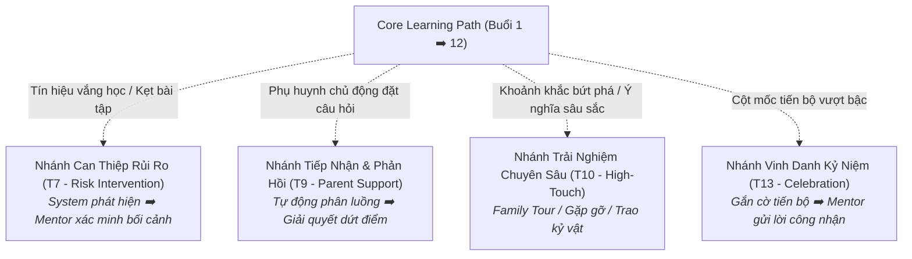

# A4 · Parent Journey Framework

## 1. Bản Chất Kiến Trúc Hành Trình

Hành trình phụ huynh tại Nemo12 & Marlins Care được thiết kế theo cấu trúc:
> **Core Path (Đường ray chính) + Triggered Branches (Các nhánh rẽ kích hoạt có điều kiện)**

Hành trình **không phải là một checklist cứng nhắc** bắt buộc mọi gia đình đều phải đi qua tất cả các điểm chạm, mà là một hệ thống phản ứng thông minh dựa trên tín hiệu thực tế.

---

## 2. Bảng Ánh Xạ 3 Pha Vòng Đời (3-Phase Framework)

| Pha (Phase) | Cột Mốc Thời Gian | JTBD Trọng Tâm | Trải Nghiệm Mong Muốn Của Phụ Huynh | Vai Trò Hệ Thống (System) | Vai Trò Con Người (Human) |
|---|---|---|---|---|---|
| **Pha 1: Trước Khóa Học** *(Pre-enrollment)* | Cân nhắc & 2 buổi Học thử | `F5`, `E1`, `S3`, `F1` | Hiểu rõ phương pháp, an tâm chuẩn bị tâm thế cho con và nhận tư vấn trung thực dựa trên bằng chứng. | Gửi thông tin chuẩn bị tự động (T1), trích xuất log bằng chứng Trial (T2). | Host **Marlins Day**, Tổ chức Workshop, Tư vấn **Fit Judgment** (T4). |
| **Pha 2: Trong Khóa Học** *(Active 12-session Journey)* | 12 Buổi Live Class | `F1`, `F4`, `E2`, `F2`, `S5` | Thấy con tiến bộ thực chất bằng dữ liệu, cảm nhận con được thấu hiểu qua Mentor và có kỷ niệm gia đình ý nghĩa. | Gửi báo cáo tiến độ tuần tự động (T5), phát hiện sụt giảm nỗ lực (T7). | **Live Class Routine (T5-T13)** quan sát độc bản, tổ chức **Family Meeting (T10)** giữa kỳ. |
| **Pha 3: Sau Khóa Học** *(Post-course & Retention)* | Tổng kết & Hậu 12 buổi | `S2`, `E5`, `F3`, `S4` | Sở hữu câu chuyện chuyển biến tư duy 5 phần tự hào, nhận định hướng tiếp theo trung thực và gắn kết cộng đồng dài hạn. | Tổng hợp dữ liệu Portfolio và kết xuất ấn phẩm số Growth Story (T11). | Viết nhận xét câu chuyện trưởng thành, tư vấn lộ trình **Next Steps (T12)**, hỗ trợ lan tỏa Referral. |

---

## 3. Các Nhánh Rẽ Kích Hoạt Có Điều Kiện (Triggered Branches)

Các nhánh này chỉ xuất hiện khi có tín hiệu kích hoạt cụ thể từ hệ thống hoặc nhu cầu gia đình:

---

## 4. Năng Lực Đồng Hành Xuyên Suốt (Persistent Capability)

* **Marlins Day (Chiều Chủ Nhật):** Không phải là sự kiện một lần trong giai đoạn Trial. Đây là **năng lực hỗ trợ thường trực (Persistent Capability)** sẵn sàng tiếp đón phụ huynh ở bất kỳ giai đoạn nào khi họ cần gỡ rối định kiến hoặc muốn trao đổi phương pháp giáo dục.
