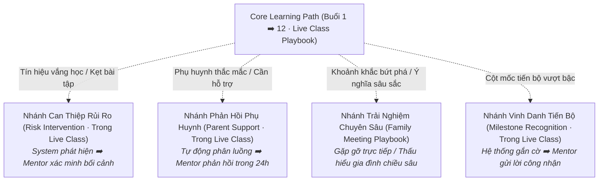

# A4 · Parent Journey Framework

## 1. Bản Chất Kiến Trúc Hành Trình

Hành trình phụ huynh tại Nemo12 & Marlins Care được thiết kế theo cấu trúc:
> **Core Path (Đường ray chính) + Triggered Branches (Các nhánh rẽ kích hoạt có điều kiện)**

Hành trình **không phải là một checklist cứng nhắc** bắt buộc mọi gia đình đều phải đi qua tất cả các điểm chạm, mà là một hệ thống phản ứng thông minh dựa trên tín hiệu thực tế. Toàn bộ hành trình được vận hành xoay quanh **6 Playbooks Chuẩn Hóa Theo Thứ Tự Thời Gian**.

---

## 2. Bảng Ánh Xạ 3 Pha Vòng Đời (3-Phase Framework)

| Pha (Phase) | Cột Mốc Thời Gian | JTBD Trọng Tâm | Trải Nghiệm Mong Muốn Của Phụ Huynh | Vai Trò Hệ Thống (System) | Vai Trò Con Người (Human) | Playbooks Vận Hành |
|---|---|---|---|---|---|:---:|
| **Pha 1: Trước Khóa Học** *(Pre-enrollment & Acquisition)* | Tiếp cận, Nhận thức & Workshop | `F5`, `E1`, `S3`, `F1` | Hiểu rõ phương pháp giáo dục bản chất, tháo gỡ bế tắc/ngộ nhận khi kèm con, chuẩn bị tâm thế vững vàng và tin tưởng đồng hành cùng Nemo12. | Tự động hóa đăng ký, gửi thông tin chuẩn bị Workshop, cập nhật học liệu tự học trên Family Portal. | Xây dựng thương hiệu cá nhân (**Social Media**), Quản trị cộng đồng (**Community**), Tổ chức Workshop trực tuyến tương tác cao (**Marlins Workshop**). | **Social Media, Community, Marlins Workshop** |
| **Pha 2: Trong Khóa Học** *(Active 12-session Journey)* | 12 Buổi Live Class | `F1`, `F4`, `E2`, `F2`, `S5` | Thấy con tiến bộ thực chất bằng dữ liệu, cảm nhận con được thấu hiểu qua Mentor, có kỷ niệm gia đình ý nghĩa và nhận Growth Story kết khóa. | Gửi báo cáo tiến độ tuần tự động, phát hiện sụt giảm nỗ lực / kẹt bài tập (**Live Class**). | **Live Class Mentoring Routine** (**Live Class**) quan sát độc bản & can thiệp sư phạm; tổ chức **Family Meeting** (**Family Meeting**) tại khoảnh khắc ý nghĩa. | **Live Class, Family Meeting** |
| **Pha 3: Sau Khóa Học** *(Post-course & Retention)* | Tái tục & Lan tỏa cộng đồng | `S2`, `E5`, `F3`, `S4` | Tiếp tục đồng hành dài hạn và trở thành đại sứ lan tỏa giá trị giáo dục Nemo12 đến bạn bè. | Quản trị mã liên kết và ghi nhận ưu đãi tự động 15% - 15% trên Family Portal (**Referrals Program**). | Chăm sóc và tri ấn phụ huynh đại sứ (**Referrals Program**). | **Referrals Program** |

---

## Triggered Branches

Các nhánh này chỉ xuất hiện khi có tín hiệu kích hoạt cụ thể từ hệ thống hoặc nhu cầu gia đình:

---

## Persistent Capabilities

* **Marlins Workshop (15h00 - 17h00 Chủ Nhật):** Không phải là sự kiện một lần duy nhất. Đây là **năng lực hỗ trợ thường trực (Persistent Capability)** trên Zoom sẵn sàng tiếp đón phụ huynh ở bất kỳ giai đoạn nào khi họ cần gỡ rối định kiến hoặc muốn trao đổi phương pháp giáo dục.
