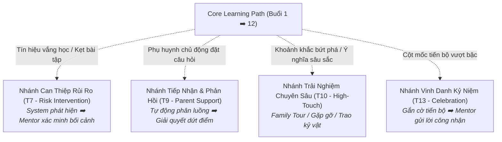

# A4 · Parent Journey Framework

## 1. Bản Chất Kiến Trúc Hành Trình

Hành trình phụ huynh tại Nemo12 & Marlins Care được thiết kế theo cấu trúc:
> **Core Path (Đường ray chính) + Triggered Branches (Các nhánh rẽ kích hoạt có điều kiện)**

Hành trình **không phải là một checklist cứng nhắc** bắt buộc mọi gia đình đều phải đi qua tất cả các điểm chạm, mà là một hệ thống phản ứng thông minh dựa trên tín hiệu thực tế.

---

## 2. Bảng Ánh Xạ Hành Trình Theo Các Giai Đoạn (Journey Stages)

| Giai Đoạn (Stage) | Cột Mốc Thời Gian | JTBD Trọng Tâm | Trải Nghiệm Mong Muốn Của Phụ Huynh | Vai Trò Hệ Thống (System) | Vai Trò Con Người (Human) |
|---|---|---|---|---|---|
| **1. Consideration** *(Cân nhắc)* | Trước Trial | `S3` | Có đủ thông tin và niềm tin ban đầu để sẵn sàng cho con trải nghiệm thử. | Cung cấp thông tin chuẩn bị Trial tự động (T1). | Giải đáp thắc mắc phát sinh. |
| **2. Trial** *(Học thử 2 buổi)* | Buổi Trial 1 & 2 | `F3`, `E1`, `S1` | Hiểu rõ phương pháp của Nemo12 và biết cách đồng hành cùng con. | Trích xuất bằng chứng học tập sau buổi học (T2). | **Marlins Day** (Host chia sẻ định hướng giáo dục). |
| **3. Decision** *(Quyết định chính thức)* | Sau Trial | `E5`, `S3` | Hiểu rõ gia đình và trung tâm đang cam kết đồng hành về điều gì. | Gửi báo cáo tổng hợp Trial. | **Fit Judgment** (Tham vấn sự phù hợp, không chèo kéo). |
| **4. Early Learning** *(Khởi động)* | Buổi 1 – 3 | `F1`, `E1`, `E2` | Cảm nhận con được theo dõi sát sao ngay từ những bước đi đầu tiên. | Gửi cập nhật tiến độ hàng tuần tự động (T5). | Quan sát phát hiện sớm các bỡ ngỡ ban đầu. |
| **5. Core Learning** *(Thực chiến sâu)* | Buổi 4 – 9 | `F4`, `E2` | Thấu hiểu con sâu sắc hơn qua những chuyển biến tư duy thực tế. | Lưu trữ sản phẩm dự án và log năng lực liên tục. | **Mentor Personal Insight** (Nhận xét định tính độc bản). |
| **6. Midpoint Pulse** *(Dò tìm khoảng trống)* | ~ Buổi 6 | `F2`, `E3` | Cơ hội bày tỏ các băn khoăn thầm kín một cách nhẹ nhàng. | Gửi form khảo sát siêu nhẹ $\le$ 3 phút (T8 - DAR 01). | Phân luồng xử lý nếu phát hiện kỳ vọng sai lệch. |
| **7. Late Learning** *(Tích lũy bứt phá)* | Buổi 10 – 12 | `F1`, `F4`, `E5` | Nhìn thấy sự trưởng thành tích lũy và chuyển hóa tư duy rõ rệt. | Tổng hợp toàn bộ dữ liệu Portfolio 12 buổi học. | Chuẩn bị nội dung tổng kết chiều sâu. |
| **8. Completion** *(Tốt nghiệp)* | Sau Buổi 12 | `E5`, `F3` | Nhìn lại trọn vẹn câu chuyện chuyển biến và đích đến tiếp theo. | Kết xuất ấn phẩm số Growth Story tương tác (T11). | Chấp bút phần cảm nhận ý nghĩa & đối thoại định hướng. |
| **9. Continuation** *(Đồng hành dài hạn)* | Sau khóa học | `F3`, `S3` | Biết rõ bước đi tiếp theo phù hợp nhất cho năng lực của con. | Đề xuất lộ trình học tập tiếp theo. | **Learner-Need-First Advice** (Tư vấn dựa trên nhu cầu học sinh). |

---

## 3. Các Nhánh Rẽ Kích Hoạt Có Điều Kiện (Triggered Branches)

Các nhánh này chỉ xuất hiện khi có tín hiệu kích hoạt cụ thể từ hệ thống hoặc nhu cầu gia đình:

---

## 4. Năng Lực Đồng Hành Xuyên Suốt (Persistent Capability)

* **Marlins Day (Chiều Chủ Nhật):** Không phải là sự kiện một lần trong giai đoạn Trial. Đây là **năng lực hỗ trợ thường trực (Persistent Capability)** sẵn sàng tiếp đón phụ huynh ở bất kỳ giai đoạn nào khi họ cần gỡ rối định kiến hoặc muốn trao đổi phương pháp giáo dục.
