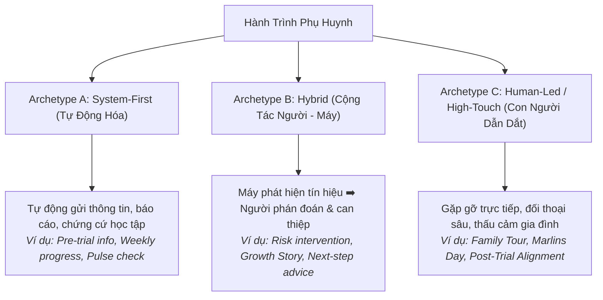

# C · Playbooks & SOPs Master Framework

> **Bộ khung kiến trúc & Tiêu chuẩn vận hành Parent Care — Nemo12 & Marlins Care**  
> **Phiên bản:** v2.0 (Modular Framework Architecture)  
> **Tương thích:** Dolphin Family Workspace, Dory Sensemaking Engine & SDD-023/024/026

---

## 1. Triết Lý & Nguyên Tắc Vận Hành Bất Biến

1. **Triết lý cốt lõi:** *"Automate the evidence. Humanize the meaning."*
   - **System:** Đảm nhiệm Dữ liệu + Quy mô + Tính nhất quán (Data + Scale + Consistency).
   - **Mentor:** Đảm nhiệm Bối cảnh + Phán đoán + Mối quan hệ (Context + Judgment + Relationship).
   - **Marlins Host:** Thấu cảm + Phá vỡ định kiến/hiểu lầm + Định hướng đồng hành (Parent Reflection + Misconception Resolution + Deeper Support).

2. **Nguyên tắc vận hành nền tảng:**
   - **Machines detect, humans judge:** Máy móc tự động trích xuất log/bằng chứng, con người thấu cảm và đưa ra phán đoán bối cảnh.
   - **Family-Centric Observation:** Ghi nhận và phân tích theo đơn vị Gia đình (`family_contacts`), phân tách riêng theo từng chủ thể (Bố, Mẹ, Con).
   - **Dory Sensemaking:** Chuẩn hóa 6 trục dữ liệu định tính (`pain`, `jtbd`, `need`, `belief`, `goal`, `fact`) trực tiếp vào Family Notes để tối ưu hóa bộ 5 thẻ Scorecard (Understanding, Journey, Reach, Momentum, Evidence).
   - **Quy tắc thời gian (Efficiency Rule):** Mỗi SOP tác nghiệp của Mentor ≤ 15 phút (ngoại trừ các tương tác High-Touch trực tiếp / Marlins Day).
   - **Chuẩn Definition of Done (DoD):** Mức **Level 3 (L3)** trong bảng Rubric là điều kiện tiên quyết bắt buộc để hoàn thành một nhiệm vụ.

---

## 2. Phân Loại Hình Thái Touchpoint (Touchpoint Archetypes)

Mọi điểm chạm trong hành trình phụ huynh đều được quy chuẩn vào 1 trong 3 hình thái thiết kế:

---

## 3. Cấu Trúc Chuẩn Của Một Playbook / SOP (Standard Specification)

Mỗi Playbook chi tiết khi được ban hành phải tuân thủ cấu trúc chuẩn hóa theo cấp độ (Tier) và **Quy tắc Đặt tên Tiêu đề Section (Lean Section Title Rule: Pure English, ≤ 3 Words, không mở ngoặc)**:

### 3.1. Cấu trúc Đầy đủ (Dành cho Tier 1: Human-Led / High-Touch & Special Components)
Áp dụng cho các điểm chạm chuyên sâu như **Family Tour / Meeting (T10)**, **Marlins Day (T3)**, **Post-Trial Alignment (T4)**:
1. **Stakeholder Mapping (hoặc Stakeholder JTBD):** Phân tích nhu cầu, việc cần làm của 3 bên (Phụ huynh, Học sinh, Đơn vị đào tạo).
2. **Session Agenda:** Khung thời lượng chi tiết từng phút, nguyên tắc điều phối (ví dụ: *Listen 70% - Ask 20% - Talk 10%*).
3. **Mentor Guides:**
   * **Question Bank:** Bộ câu hỏi mở gợi mở tương tác tự nhiên.
   * **Observation Guide:** Danh mục các dấu hiệu cần quan sát thực địa (*Family Dynamics, Learning Environment, Hidden Motivation*).
   * **Exit Checklist:** Tiêu chí bắt buộc phải đạt trước khi kết thúc buổi gặp.
4. **Family Notes:** Mẫu ghi chép Family Notes chuẩn hóa, phân định rõ giữa *Fact – Observation – Interpretation*.
5. **SOP Steps:** Checklist các bước trước, trong và sau buổi gặp (Pre - In - Post).
6. **Do's & Don'ts:** Nguyên tắc hướng dẫn sư phạm và điều cấm kỵ.
7. **Assessment Rubrics:** Ma trận đo lường chất lượng 5 cấp độ (L1 - L5 với L3 là DoD).

### 3.2. Cấu trúc Rút gọn (Dành cho Tier 2 & Tier 3: Hybrid & System-First)
Áp dụng cho các điểm chạm tự động hoặc micro-touchpoint:
1. **Purpose & JTBD:** Job cụ thể của phụ huynh được giải quyết.
2. **SOP Steps:** Thao tác ngắn gọn $\le$ 15 phút, phân định rõ System Action vs Human Action.
3. **Do's & Don'ts:** Hướng dẫn thực thi.
4. **Communication Templates:** Mẫu tin nhắn, định dạng báo cáo (chỉ áp dụng cho kênh số).
5. **Assessment Rubrics:** Tiêu chuẩn đánh giá tinh gọn (3 tiêu chí × 5 cấp độ).

---

## 4. Khung Đánh Giá Chuẩn Hóa (Standard Quality Rubrics)

Mọi hoạt động chăm sóc và tương tác đều được đo lường trên thang 5 cấp độ:

| Cấp Độ | Danh Xưng | Định Nghĩa Chất Lượng | Trạng Thái |
| :---: | :--- | :--- | :---: |
| **L1** | **Chưa Đạt (Deficient)** | Không làm, làm sai quy trình, hoặc mang tính đối phó, gây phiền hà/lo lắng cho gia đình. | ❌ Không chấp nhận |
| **L2** | **Cơ Bản (Basic)** | Làm đúng máy móc, chỉ dừng lại ở mức giao dịch hành chính bề mặt, thiếu sự thấu cảm. | ⚠️ Cần đào tạo lại |
| **L3** | **Đạt Chuẩn (Competent - DoD)** | **Chuẩn hoàn thành bắt buộc**. Đạt đầy đủ mục tiêu của Touchpoint, thu thập đúng insight và tạo được sự tin cậy. | ✅ Definition of Done |
| **L4** | **Tốt (Proficient)** | Thấu cảm cao, xử lý linh hoạt theo bối cảnh riêng của gia đình, mang lại trải nghiệm mượt mà. | 🌟 Khuyến khích |
| **L5** | **Xuất Sắc (Mastery)** | Tạo nên những khoảnh khắc gắn kết sâu sắc (Meaningful Moments), thay đổi tích cực cách gia đình đồng hành cùng con. | 🏆 Hình mẫu chuẩn |

---

## 5. Quy Định Quản Trị & Phân Tách Tài Liệu (Governance)

* **Playbooks Master Framework (File này):** Là tài liệu bất biến cấp cao, chỉ cập nhật khi có sự thay đổi về triết lý hoặc chuẩn kiến trúc hệ thống.
* **Touchpoint Inventory / Catalog (`Touchpoint_Catalog.md`):** Là danh mục quản lý danh sách các điểm chạm hiện hành (được phép thêm, sửa, gộp linh hoạt theo chu kỳ kinh doanh).
* **Playbooks Directory (`playbooks/`):** Mỗi Playbook/SOP cụ thể được lưu thành từng file độc lập (ví dụ: `T10_STC_Family_Tour_Playbook.md`, `T03_Marlins_Day_Playbook.md`), kế thừa cấu trúc từ Master Framework này.
