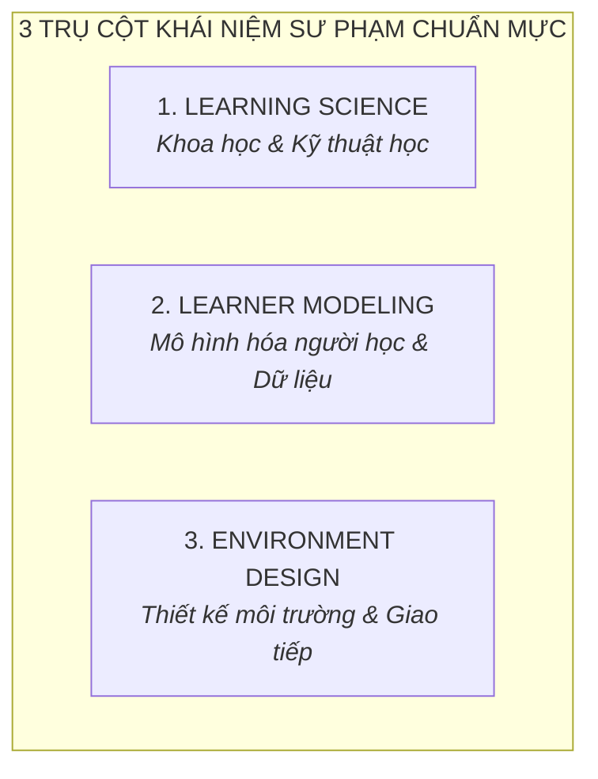

# A9 · Topic Library & Pedagogy Standards

> **Hệ thống từ điển sư phạm cốt lõi và 7 lăng kính tranh biện phục vụ khai phóng nhận thức giáo dục cho phụ huynh Nemo12 & Marlins Care**  
> **Áp dụng cho:** Toàn bộ chuỗi chuyên đề Marlins Workshop (Online Zoom tối Thứ 5), Fishbowl Marlins Day (Offline Chủ Nhật), Kênh đúc kết Mentor và Cổng tự học Family Portal.

---

## 1. Mục Đích & Nguyên Tắc Vận Hành (Purpose & Core Principles)

1. **Chuẩn mực hóa Tri thức Sư phạm (Canonical Pedagogy):** Cung cấp nguồn tài nguyên tri thức duy nhất (Single Source of Truth) về khoa học nhận thức, mô hình người học và thiết kế môi trường sống cho toàn bộ đội ngũ Host, Mentor và phụ huynh.
2. **Mô hình 2 Lớp (Two-Layer Architecture):**
   * **Lớp Dẫn Nhập (Argument Angles):** 7 Luận điểm tranh luận sắc bén dùng để kích hoạt tư duy, bóc tách ngộ nhận bề mặt của cha mẹ.
   * **Lớp Bản Chất (Core Concepts):** Kho tàng khái niệm chuẩn mực quốc tế giải thích tận gốc cơ chế học tập và đưa ra giải pháp thực hành.
3. **Ngôn ngữ bình dân, chuẩn xác bản chất (Democratized Pedagogy):** Chuyển hóa các thuật ngữ học thuật phức tạp thành các ẩn dụ đời sống và công cụ trực quan dễ thực hành tại gia đình.

---

## 2. Phần A: Bảy Lăng Kính Tranh Biện (7 Provocative Argument Angles)

*Bảng đối chiếu 7 luận điểm sắc bén dùng làm chủ đề dẫn dắt trong các phiên Workshop và Marlins Day:*

| # | Luận Điểm Dẫn Dắt | Ngộ Nhận Bề Mặt Của Phụ Huynh | Sự Thật Bản Chất Sư Phạm | Concepts Ánh Xạ Để Đào Sâu |
| :---: | :--- | :--- | :--- | :--- |
| **1** | **Điểm cao $\ne$ Hiểu sâu** | Nghĩ rằng con được điểm 9, 10 trên lớp là đã thực sự làm chủ kiến thức. | 4 cách đạt điểm cao mà rỗng tuếch: học vẹt, học tủ, luyện mẹo, áp lực gia đình. Điểm số chỉ phản ánh 1 khoảnh khắc, không đo được năng lực tư duy. | `Bloom's Taxonomy`, `Mastery Level`, `Worked Examples` |
| **2** | **Nhiều bài $\ne$ Học tốt** | Càng ép con làm nhiều đề, cày nhiều phiếu bài tập thì con càng học giỏi. | Làm đến bài thứ 20 cùng một dạng chỉ tạo phản xạ sao chép máy móc, gây kiệt quệ nhận thức và triệt tiêu khả năng tự đào sâu bản chất. | `Spaced Practice`, `Retrieval Practice`, `Cognitive Load` |
| **3** | **Test không phải để phán xét learner** | Coi bài kiểm tra là "bản án" để kết luận con lười biếng, tiếp thu chậm hay kém cỏi. | Một bài test là câu hỏi dành cho hệ thống dạy học (*"Cách tiếp cận đã trúng điểm mù của con chưa?"*), không phải công cụ để định tội đứa trẻ. | `Assessment $\ne$ Learning`, `Assessment Experience` |
| **4** | **Mọi learner model đều có uncertainty** | Tin vào các bài trắc nghiệm tính cách/sinh trắc phán chắc nịch tương lai của con. | Con người luôn vận động và biến đổi; một hệ thống/người thầy khoa học luôn tôn trọng "khoảng bất định" để kiên nhẫn quan sát và đồng hành. | `Learner Model`, `Evidence`, `Readiness` |
| **5** | **Không phải cuộc thi nào cũng đáng tham gia** | Ép con sưu tập thật nhiều huy chương/chứng chỉ phong trào để làm đẹp hồ sơ. | Mỗi kỳ thi đều trả giá đắt bằng thời gian và áp lực tâm lý. Cha mẹ cần tính toán ROI thực chất: *"Kỳ thi này bồi đắp gì cho năng lực tự học của con?"*. | `Competency Framework`, `Building 21` |
| **6** | **Mục tiêu cuối cùng không chỉ là thi đỗ** | Xem việc đỗ vào trường Chuyên/Chọn là đích đến hoàn tất của hành trình nuôi dạy. | Đỗ chuyên chỉ là một cánh cửa mở ra; nếu không chuẩn bị năng lực tự học và sức khỏe tinh thần, con rất dễ rơi vào khủng hoảng sau cánh cửa đó. | `Student Portrait`, `Pedagogy`, `BEM Model` |
| **7** | **Student Portrait quan trọng hơn danh sách KPI** | Đánh giá sự trưởng thành của con hoàn toàn bằng bảng điểm và thứ hạng lớp học. | Cái gì đo được sẽ bị tối ưu hóa phiến diện (Goodhart's Law). Cha mẹ cần nhìn bức chân dung phẩm chất toàn diện thay vì danh sách chỉ số rời rạc. | `Student Portrait`, `Mental Model`, `Evidence` |

---

## 3. Phần B: Thư Viện Khái Niệm Cốt Lõi (Core Concepts Library)

### 3.1 Trụ Cột 1: Learning Science (Khoa Học & Kỹ Thuật Học)
*Giải mã cơ chế tiếp thu của não bộ và các phương pháp sư phạm thực chứng:*

1. **Learning Experience vs Assessment Experience:**
   * *Learning Experience (Trải nghiệm học tập):* Không gian an toàn để tò mò, khám phá, thử nghiệm và được phép phạm sai lầm.
   * *Assessment Experience (Trải nghiệm đánh giá):* Hoạt động thu thập dữ liệu về điểm nghẽn nhận thức mà không tạo áp lực trừng phạt.
   * *Nguyên lý bất biến:* **Assessment $\ne$ Learning** (Đo lường chỉ là phép đo, không thể thay thế cho quá trình chuyển hóa tri thức).
2. **Scaffolding (Bắc giàn giáo sư phạm):**
   * Kỹ thuật người lớn hỗ trợ đúng mức tại Vùng phát triển gần nhất (Zone of Proximal Development - ZPD), sau đó từng bước "rút giàn giáo" để đứa trẻ tự đứng vững trên đôi chân của mình.
3. **Retrieval Practice (Truy xuất chủ động / Active Recall):**
   * Việc đọc đi đọc lại tài liệu thụ động chỉ tạo ảo tưởng ghi nhớ; chủ động tự kiểm tra bằng cách nhớ lại và giải thích khái niệm giúp kiến thức khắc sâu vào trí nhớ dài hạn gấp 3 lần.
4. **Spaced Practice (Luyện tập ngắt quãng / Giãn cách):**
   * Phân bổ các phiên học ngắn cách nhau vài ngày thay vì dồn toàn bộ thời gian cày cuốc trong một đêm, giúp não bộ có thời gian củng cố các liên kết thần kinh.
5. **Worked Examples & Cognitive Load (Bài toán mẫu & Giảm tải nhận thức):**
   * Khi tiếp cận dạng bài phức tạp, phân tích chi tiết các bước giải mẫu giúp giải phóng bộ nhớ làm việc (Working Memory), ngăn ngừa trạng thái quá tải nhận thức.
6. **Mastery Level (Học kỹ tới đâu):**
   * Tiêu chuẩn làm chủ tri thức bản chất: Đạt đến mức độ hiểu sâu nguyên lý gốc rễ trước khi chuyển sang các chủ đề nâng cao kế tiếp.
7. **Bloom's Taxonomy (Thang đo cấp độ tư duy 6 bậc):**
   * *Bậc 1–3 (Cơ bản):* Nhớ (Remember) $\to$ Hiểu (Understand) $\to$ Vận dụng (Apply công thức có sẵn).
   * *Bậc 4–6 (Bản chất):* Phân tích (Analyze) $\to$ Đánh giá (Evaluate) $\to$ Sáng tạo (Create sản phẩm công nghệ/AI mới).
8. **Curriculum Architecture (Kiến trúc chương trình học):**
   * `Knowledge Node`: Điểm nút tri thức cấu thành mạng lưới kiến thức (Knowledge Graph).
   * `Learning Package`, `Module & Unit`, `Ngữ liệu`: Đơn vị đóng gói tài liệu, bài tập và dự án thực tế.

---

### 3.2 Trụ Cột 2: Learner Modeling (Mô Hình Hóa Người Học & Dữ Liệu Thực Chứng)
*Cách thức hệ thống và Mentor thu thập, giải mã và khắc họa học sinh thông qua dữ liệu sống:*

1. **Learner Model & Uncertainty:**
   * Hồ sơ số hóa động mô tả sự tiến bộ của con (mắt xích đã vững, điểm nghẽn kiến thức, tốc độ phản xạ). Hệ thống luôn giữ khoảng bất định (Uncertainty) để tránh dán nhãn định kiến lên học sinh.
2. **Student Portrait (Chân dung học sinh độc bản):**
   * Bức chân dung đa chiều khắc họa: Phong cách tư duy, mức độ kiên trì vượt khó, sở thích công nghệ, thế mạnh độc đáo và khát vọng tự thân của con.
3. **Mental Model (Mô hình tư duy nội tại):**
   * Hệ thống niềm tin và lăng kính nhìn nhận thế giới ẩn sâu trong tâm trí trẻ, chi phối cách con phản ứng khi đối mặt với thất bại hay bài toán khó.
4. **Evidence-Based Learning (Học tập dựa trên bằng chứng):**
   * Đánh giá học sinh dựa trên sản phẩm thực tế con làm ra (Dự án website, công cụ AI, nhật ký phản tư) thay vì dựa trên cảm tính hay lời khen xã giao.
5. **Readiness & Recommendation (Độ sẵn sàng & Đề xuất cá nhân hóa):**
   * Đánh giá chính xác mức độ sẵn sàng về mặt tâm lý và học thuật để đưa ra khuyến nghị lộ trình phù hợp nhất (Fit Judgment).

---

### 3.3 Trụ Cột 3: Environment Design (Thiết Kế Môi Trường & Giao Tiếp Gia Đình)
*Khung tư duy kiến tạo không gian sống, thiết lập văn hóa gia đình và phương pháp giao tiếp thấu cảm:*

1. **BEM Model (Behavior – Experience – Mental Model):**
   * Cơ chế hình thành hành vi:
     $$\text{Mental Model (Mô hình tư duy)} \longrightarrow \text{Experience (Trải nghiệm cảm xúc)} \longrightarrow \text{Behavior (Hành vi bề mặt con bộc lộ)}$$
   * *Ứng dụng:* Muốn sửa hành vi "lười học / nghiện game" của con, bố mẹ không thể chỉ cấm đoán bên ngoài mà phải giải quyết từ Trải nghiệm bất lực và Mô hình tư duy sợ thất bại bên trong.
2. **NVC (Nonviolent Communication - Giao Tiếp Trắc Ẩn):**
   * Bộ công cụ 4 bước đối thoại với con:
     * **1. Facts (Sự thật khách quan):** *"Bố thấy con ngồi vào bàn học 45 phút nhưng chưa bắt đầu làm bài..."* (Không phán xét).
     * **2. Feelings (Cảm xúc chân thật):** *"...bố cảm thấy lo lắng và băn khoăn..."* (Không đổ lỗi).
     * **3. Needs (Nhu cầu thực sự):** *"...vì bố rất mong con giữ được sự tự tin và không bị ngợp bài vở..."*
     * **4. Requests (Đề xuất cụ thể):** *"Con có thể chia sẻ cho bố biết con đang kẹt ở câu nào để hai bố con mình cùng xem không?"*
3. **Building 21 (Mô hình môi trường giáo dục đổi mới):**
   * Triết lý thiết kế môi trường giáo dục dựa trên năng lực (Competency-Based), kết nối trực tiếp bài học với đời sống thực tế, trao quyền tự chủ và tôn trọng nhịp độ phát triển riêng của từng học sinh.
4. **Competency Framework (Khung năng lực thực tế):**
   * Bộ tiêu chuẩn đo lường năng lực giải quyết vấn đề, tư duy phản biện, khả năng tự học và ứng dụng công nghệ AI vào đời sống thực.
5. **Psychological Safety (Vùng an toàn tâm lý tại gia đình):**
   * Không gian gia đình nơi đứa trẻ cảm thấy an toàn tuyệt đối khi nói lên suy nghĩ thật, dám đem bài kiểm tra điểm kém về chia sẻ với bố mẹ mà không sợ bị mắng mỏ hay so sánh với "con nhà người ta".

---

## 4. Hướng Dẫn Vận Dụng Trong Thực Tế (Application Playbook Linkage)

| Điểm Chạm / Playbook | Cách Thức Sử Dụng Topic Library |
| :--- | :--- |
| **Marlins Workshop (`P03`)** | Mỗi tối Thứ 5 chọn **1 Lăng kính tranh biện trong Phần A** làm chủ đề thảo luận, sau đó kết nối sang **2–3 Concepts trong Phần B** để phụ huynh thực hành trong Breakout Room 4F. |
| **Marlins Day (`P04`)** | Dùng các Lăng kính tranh biện làm câu hỏi mồi trong phiên **Fishbowl Dialogue**, sau đó Mentor demo giải pháp bằng chứng thực tế trên màn hình Nemo12. |
| **Social Media (`P01`)** | Mentor trích xuất 1 Concept sâu sắc (như Scaffolding hay BEM Model) kết hợp với 1 câu chuyện thật tại lớp Sư Tử Con để viết bài phản tư theo khung `T-A-C-E`. |
| **Family Meeting (`P07`)** | Mentor áp dụng mô hình `BEM` và công cụ `NVC` để giải mã bối cảnh gia đình và thiết lập cam kết đồng hành 3 bên. |
