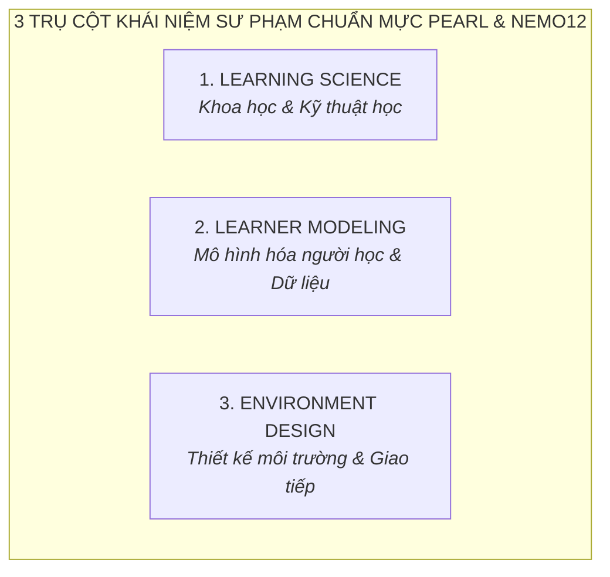

# A9 · Topic Library & Pedagogy Standards

> **Hệ thống từ điển sư phạm cốt lõi và 7 lăng kính tranh biện phục vụ khai phóng nhận thức giáo dục cho phụ huynh Nemo12 & Marlins Care**  
> **Nguồn trích dẫn chuẩn mực:**
> * [Pearl · Bảy câu đáng đổi cách nghĩ (Mental Models)](https://pearl.nemo12.com/mental-models/)
> * [Pearl · Từ điển những khái niệm xuyên suốt (Pearl Dictionary)](https://pearl.nemo12.com/tu-dien)
> 
> **Áp dụng cho:** Toàn bộ chuỗi chuyên đề Marlins Workshop (Online Zoom tối Thứ 5), Fishbowl Marlins Day (Offline Chủ Nhật), Kênh đúc kết Mentor và Cổng tự học Family Portal.

---

## 1. Mục Đích & Nguyên Tắc Vận Hành (Purpose & Core Principles)

1. **Chuẩn mực hóa Tri thức Sư phạm (Canonical Pedagogy):** Cung cấp nguồn tài nguyên tri thức duy nhất (Single Source of Truth) kết nối toàn bộ hệ sinh thái Nemo12 và Marlins Care.
2. **Mô hình 2 Lớp (Two-Layer Architecture):**
   * **Lớp Dẫn Nhập (Argument Angles):** 7 Luận điểm tranh luận sắc bén dùng để kích hoạt tư duy, bóc tách ngộ nhận bề mặt của cha mẹ tại các buổi đối thoại.
   * **Lớp Bản Chất (Core Concepts):** Kho tàng khái niệm chuẩn mực quốc tế giải thích tận gốc cơ chế học tập và đưa ra giải pháp thực hành.
3. **Ngôn ngữ bình dân, chuẩn xác bản chất (Democratized Pedagogy):** Giữ nguyên thuật ngữ tiếng Anh chuẩn quốc tế và diễn giải bằng góc nhìn đời sống thực tế, giúp phụ huynh dễ dàng chuyển hóa thành hành vi đồng hành cùng con tại nhà.

---

## 2. Phần A: Bảy Lăng Kính Tranh Biện (7 Provocative Argument Angles)
*Tham chiếu: [pearl.nemo12.com/mental-models/](https://pearl.nemo12.com/mental-models/)*

*Bảng đối chiếu 7 luận điểm sắc bén dùng làm chủ đề dẫn dắt trong các phiên Workshop và Marlins Day:*

| # | Luận Điểm Dẫn Dắt | Ngộ Nhận Bề Mặt Của Phụ Huynh | Sự Thật Bản Chất Sư Phạm | Concepts Ánh Xạ Để Đào Sâu |
| :---: | :--- | :--- | :--- | :--- |
| **1** | **Điểm cao $\ne$ Hiểu sâu** | Nghĩ rằng con được điểm 9, 10 trên lớp là đã thực sự làm chủ kiến thức. | Bốn cách đạt điểm cao mà không hiểu (học vẹt, học tủ, luyện mẹo, áp lực gia đình). Điểm số chỉ phản ánh 1 khoảnh khắc đo, không đo được năng lực tư duy bản chất. | `Bloom's Taxonomy`, `Mastery Level`, `Worked Examples` |
| **2** | **Làm nhiều bài $\ne$ Học tốt** | Càng ép con cày nhiều đề, làm nhiều phiếu bài tập thì con càng học giỏi. | Bài thứ hai mươi cùng dạng gần như không dạy thêm tư duy gì mới. Khối lượng là thứ dễ đo nhất nhưng lại dễ gây nhầm lẫn nhất, triệt tiêu khả năng tự đào sâu. | `Spaced Practice`, `Retrieval Practice`, `Cognitive Load` |
| **3** | **Test không phải để phán xét learner** | Coi bài kiểm tra là "bản án" để kết luận con lười biếng, tiếp thu chậm hay kém cỏi. | Một bài đo là câu hỏi dành cho hệ thống dạy học (*"Cách tiếp cận đã trúng điểm mù của con chưa?"*), không phải công cụ để định tội đứa trẻ. | `Assessment $\ne$ Learning`, `Assessment Experience` |
| **4** | **Mọi learner model đều có uncertainty** | Tin vào các bài trắc nghiệm tính cách/sinh trắc phán chắc nịch tương lai của con. | Con người luôn vận động và biến đổi. Một hệ thống/người thầy dám nói *"Tôi chưa biết, cần thêm dữ liệu quan sát"* đáng tin hơn hệ thống lúc nào cũng có số liệu cố định. | `Learner Model`, `Evidence`, `Confidence Score` |
| **5** | **Không phải cuộc thi nào cũng đáng tham gia** | Ép con sưu tập thật nhiều huy chương/chứng chỉ phong trào để làm đẹp hồ sơ. | Mỗi cuộc thi đều có một cái giá (thời gian, áp lực tâm lý, chi phí cơ hội). Cha mẹ cần tính toán ROI thực chất: *"Cuộc thi này mua được gì cho năng lực tự học của con?"*. | `Competency Framework`, `Building 21` |
| **6** | **Mục tiêu cuối cùng không chỉ là thi đỗ** | Xem việc đỗ vào trường Chuyên/Chọn là đích đến hoàn tất của hành trình nuôi dạy. | Đỗ là một cánh cửa, không phải đích đến. Chuyện gì xảy ra sau khi cánh cửa mở? Nếu không có bản lĩnh tự học và sức khỏe tinh thần, con rất dễ rơi vào khủng hoảng. | `Student Portrait`, `Pedagogy`, `BEM Model` |
| **7** | **Student Portrait quan trọng hơn danh sách KPI** | Đánh giá sự trưởng thành của con hoàn toàn bằng bảng điểm và thứ hạng lớp học. | Cái gì đo được sẽ bị tối ưu hóa (Goodhart's Law). Đó là lý do phải cẩn thận với thứ mình chọn để đo: Cần nhìn bức chân dung toàn diện thay vì danh sách chỉ số rời rạc. | `Student Portrait`, `Mental Model`, `Evidence` |

---

## 3. Phần B: Thư Viện Khái Niệm Cốt Lõi (Core Concepts Library)

---

### 3.1 Trụ Cột 1: Learning Science (Khoa Học & Kỹ Thuật Học)
*Giải mã cơ chế tiếp thu của não bộ, kỹ thuật sư phạm thực chứng và cấu trúc chương trình:*

1. **Learning Experience vs Assessment Experience:**
   * **Learning Experience:** Hoạt động được thiết kế để *làm cho learner giỏi hơn* (giải thích, ví dụ, bài mẫu giải sẵn, luyện tập có gợi ý, phản tư). Thành công đo bằng *"con có học được gì mới không"*, không phải *"đúng bao nhiêu câu"*.
   * **Assessment Experience:** Hoạt động được thiết kế để *biết learner đang ở đâu*. Nó không dạy mà thu thập thông tin để giảm bất định với số câu hỏi ít nhất.
   * **Assessment $\ne$ Learning:** Đo lường chỉ là phép đo, không thể thay thế cho quá trình chuyển hóa tri thức bên trong não bộ.
2. **Scaffolding (Chiếc giàn giáo sư phạm):**
   * Kỹ thuật người lớn hỗ trợ đúng mức tại Vùng phát triển gần nhất (ZPD), sau đó từng bước "rút giàn giáo" để đứa trẻ tự đứng vững và làm chủ năng lực.
3. **Retrieval Practice (Truy xuất chủ động / Active Recall):**
   * Đọc lại sách nhiều lần chỉ tạo ảo tưởng quen thuộc; chủ động gập sách lại cố nhớ ra và tự giải thích khái niệm giúp kiến thức khắc sâu vào trí nhớ dài hạn gấp 3 lần.
4. **Spaced Practice (Luyện tập ngắt quãng / Giãn cách):**
   * Phân bổ các phiên học ngắn cách nhau vài ngày thay vì dồn toàn bộ thời gian cày cuốc trong một đêm, tạo điều kiện cho não bộ củng cố liên kết thần kinh.
5. **Worked Examples & Cognitive Load (Bài toán mẫu & Tải trọng nhận thức):**
   * Khi gặp bài khó, phân tích chi tiết từng bước giải mẫu giúp giải phóng bộ nhớ làm việc (Working Memory), ngăn ngừa tình trạng ngợp nhận thức.
6. **Mastery & Retention (Độ thuần thục & Khả năng lưu giữ):**
   * **Mastery:** Mức độ người học đạt tới ở một mảng kiến thức theo quan sát gần nhất. Mastery không tự giảm theo thời gian.
   * **Retention:** Trạng thái trí nhớ hiện tại. *"Từng vững"* và *"hiện còn nhớ"* là hai câu hỏi tách biệt.
7. **Bloom's Taxonomy (Thang đo cấp độ tư duy 6 bậc):**
   * *Bậc 1–3:* Nhớ (Remember) $\to$ Hiểu (Understand) $\to$ Vận dụng (Apply công thức).
   * *Bậc 4–6:* Phân tích (Analyze) $\to$ Đánh giá (Evaluate) $\to$ Sáng tạo (Create giải pháp/sản phẩm mới).
8. **Curriculum Architecture (Kiến trúc học liệu xuyên suốt):**
   * **Knowledge Node:** Điểm nút/mảnh kiến thức cụ thể (định lý, hằng đẳng thức, ngôi kể) trong mạng lưới tri thức.
   * **Module & Unit:** `Module` là mảnh năng lực đo riêng được (3–6 unit); `Unit` là cụm học trọn vẹn trong một lần ngồi.
   * **Learning Package:** Năng lực người học phải chứng minh được (cắt ngang nội dung các chương sách truyền thống).
   * **Ngữ liệu:** Văn bản, bài toán, thí nghiệm dùng để rèn và đo năng lực (không thuộc riêng về package nào).
   * **Mastery Level (Thang 1–12):** Vị trí năng lực của learner độc lập với khối lớp đang ngồi theo chuẩn Building 21.

---

### 3.2 Trụ Cột 2: Learner Modeling (Mô Hình Hóa Người Học & Dữ Liệu Thực Chứng)
*Cách thức hệ thống và Mentor thu thập, phân tích và thấu hiểu học sinh qua dữ liệu sống:*

1. **Learner Model & Context Model:**
   * **Learner Model:** Bức tranh có cấu trúc mà hệ thống dựng về một người học: mảng kiến thức đang ở mức nào, độ tin cậy tới đâu, phong cách học và thói quen làm bài. Đây là kết luận suy ra, luôn kèm mức chắc chắn, không phải hồ sơ cố định.
   * **Context Model:** Bối cảnh học tập thực tế: thời gian làm bài, thiết bị sử dụng, mức độ mệt mỏi, áp lực thi cử tại trường.
2. **Confidence Score & Uncertainty (Độ tin cậy & Vùng bất định):**
   * Điểm đo lường mức độ chắc chắn của hệ thống về một kết luận năng lực. Nếu thiếu dữ liệu, hệ thống tự động giữ trạng thái Uncertainty để tiếp tục quan sát thay vì phán xét vội vã.
3. **Student Portrait (Chân dung học sinh độc bản):**
   * Chân dung tương lai mà gia đình và con cùng dựng lên: con muốn trở thành người như thế nào, mạnh ở đâu, quan tâm gì. Portrait trả lời *"Chúng ta mong con trở thành ai"*, trong khi Learner Model trả lời *"Con hiện tại là ai"*.
4. **Mental Model (Mô hình tư duy nội tại):**
   * Cách một người *hiểu ngầm* về việc gì đó vận hành (ví dụ: *"học nhiều bài thì giỏi lên"* là một mental model chi phối mọi quyết định). Nâng cấp mental model là chìa khóa chuyển hóa bền vững.
5. **Evidence (Dữ liệu bằng chứng thực tế):**
   * Quan sát cụ thể, gần với sự thật: *“Sai 4/5 câu phân tích đa thức, hơn 3 phút mỗi câu, dùng gợi ý ở 3 câu”*. Evidence không phải là kết luận cảm tính (*"yếu đại số"*), giúp hệ thống tự động điều chỉnh khi có quan sát mới.
6. **Readiness & Recommendation (Độ sẵn sàng & Đề xuất hành động):**
   * **Readiness:** Khoảng cách từ năng lực hiện tại của con tới *một mục tiêu cụ thể* (kỳ thi này, ngày này, dạng đề này).
   * **Recommendation:** Việc hệ thống đề xuất làm tiếp theo (học bài này, ôn phần kia, nghỉ ngơi), luôn lưu rõ lý do và phiên bản dữ liệu đã dùng.
7. **Cập Nhật Liên Tục (Continuous Calibration):**
   * Hồ sơ người học không bao giờ đóng băng; mỗi hành vi gõ phím, thời gian dừng câu hỏi và dự án hoàn thành đều hiệu chỉnh lại bức tranh năng lực theo thời gian thực.

---

### 3.3 Trụ Cột 3: Environment Design & Educational Schools (Thiết Kế Môi Trường & Trường Phái)
*Khung tư duy kiến tạo không gian sống, giao tiếp gia đình và các triết lý giáo dục nền tảng:*

1. **BEM Model (Behavior – Experience – Mental Model):**
   * Cơ chế hình thành hành vi:
     $$\text{Mental Model (Mô hình tư duy ẩn)} \longrightarrow \text{Experience (Trải nghiệm cảm xúc)} \longrightarrow \text{Behavior (Hành vi bề mặt con bộc lộ)}$$
   * *Ứng dụng:* Muốn gỡ bỏ hành vi "lười học / chống đối" của con, cha mẹ phải gỡ từ Trải nghiệm bất lực và Niềm tin sợ thất bại bên trong.
2. **NVC (Nonviolent Communication - Giao Tiếp Trắc Ẩn):**
   * Khung 4 bước đối thoại với con không phán xét:
     * **1. Facts (Sự thật khách quan):** Ghi nhận điều quan sát thấy, không kèm định kiến hay phán xét.
     * **2. Feelings (Cảm xúc chân thật):** Bộc lộ cảm xúc yêu thương, lo lắng của bố mẹ một cách chân thành.
     * **3. Needs (Nhu cầu thực sự):** Nói rõ mong muốn con có được sự tự tin và phương pháp học đúng đắn.
     * **4. Requests (Đề xuất cụ thể):** Đưa ra một hành động nhỏ, khả thi để hai bên cùng phối hợp.
3. **Building 21 (Mô hình giáo dục dựa trên năng lực):**
   * Khung năng lực dùng làm xương sống cho toàn bộ curriculum Nemo12: Mô tả người học bằng câu *"Tôi làm được gì"* ở từng mức độ, thay vì bằng khối lớp đang ngồi.
4. **Competency-Based Education (Giáo dục dựa trên năng lực thực chiến):**
   * Đánh giá người học dựa trên năng lực giải quyết vấn đề thực tế và sản phẩm hoàn thiện, không dựa trên thời gian ngồi trong lớp hay điểm số thi mẹo.
5. **Inquiry-Based Learning & AoPS Mindset (Học qua truy vấn & Nguyên lý gốc):**
   * Thúc đẩy học sinh tự đặt câu hỏi sâu, giải các bài toán phi quy ước (Non-routine problems) và đào sâu bản chất toán học/công nghệ từ nguyên lý đầu tiên (First Principles).
6. **Constructivism vs Direct Instruction (Kiến tạo vs Chỉ dẫn trực tiếp):**
   * Phối hợp hài hòa giữa việc để con tự khám phá xây dựng mô hình tư duy (Constructivism) và sự hướng dẫn mẫu khúc chiết của Mentor khi con gặp điểm nghẽn (Direct Instruction).
7. **Psychological Safety (Vùng an toàn tâm lý tại gia đình):**
   * Thiết lập không gian gia đình nơi con dám thừa nhận sai lầm, dám mang bài kiểm tra điểm kém về chia sẻ với bố mẹ mà không sợ bị trừng phạt hay so sánh độc hại.

---

## 4. Hướng Dẫn Vận Dụng Trong Thực Tế (Application Playbook Linkage)

| Điểm Chạm / Playbook | Cách Thức Sử Dụng Topic Library |
| :--- | :--- |
| **Marlins Workshop (`P03`)** | Mỗi tối Thứ 5 chọn **1 Lăng kính tranh biện trong Phần A** làm chủ đề thảo luận, sau đó kết nối sang **2–3 Concepts trong Phần B** để phụ huynh thực hành trong Breakout Room 4F. |
| **Marlins Day (`P04`)** | Dùng các Lăng kính tranh biện làm câu hỏi mồi trong phiên **Fishbowl Dialogue**, sau đó Mentor demo giải pháp bằng chứng thực tế trên màn hình Nemo12. |
| **Social Media (`P01`)** | Mentor trích xuất 1 Concept sâu sắc (như Scaffolding hay BEM Model) kết hợp với 1 câu chuyện thật tại lớp Sư Tử Con để viết bài phản tư theo khung `T-A-C-E`. |
| **Family Meeting (`P07`)** | Mentor áp dụng mô hình `BEM` và công cụ `NVC` để giải mã bối cảnh gia đình và thiết lập cam kết đồng hành 3 bên. |
