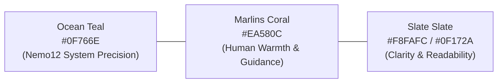
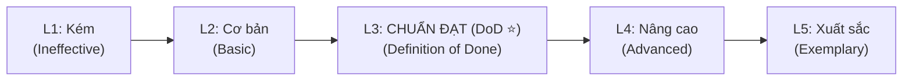

# B1 · UI Design System: Nemo12 & Marlins Care

> **Triết lý thiết kế (Design Philosophy)**:  
> *"Clarity over Decoration. Evidence over Slogans. Human Warmth within System Precision."*  
> Kế thừa ngôn ngữ chuẩn từ [Nemo12 Canonical Documentation System](https://docs.nemo12.com/) kết hợp nét ấm áp, tin cậy đặc trưng của **Marlins Care**.

---

## 1. Foundations & Design Tokens

### 1.1 Color Palette & CSS Variables



```css
:root {
  /* Brand Core Tokens */
  --color-primary: #0F766E;       /* Ocean Teal (Main Brand) */
  --color-primary-hover: #0D9488;
  --color-primary-soft: rgba(15, 118, 110, 0.12);
  --color-accent: #EA580C;        /* Marlins Coral (Action & Highlights) */

  /* Functional Roles & Status Badges */
  --color-system: #0284C7;        /* Blue: Automated System Evidence */
  --color-mentor: #0D9488;        /* Teal: Mentor Context & Judgment */
  --color-marlins: #EA580C;       /* Coral: Marlins Care / Reflection */
  --color-hybrid: #7C3AED;        /* Violet: System + Mentor Collaborative */
  --color-risk: #DC2626;          /* Red: Learning Risk / Concern */
  --color-milestone: #059669;     /* Emerald: Milestone Achievement */

  /* Surface & Text (Light Mode default) */
  --bg-app: #F8FAFC;
  --bg-surface: #FFFFFF;
  --text-primary: #0F172A;
  --text-secondary: #475569;
  --text-muted: #94A3B8;
  --border-subtle: #E2E8F0;
  --border-strong: #CBD5E1;
}

[data-theme="dark"], .dark {
  --color-primary: #2DD4BF;
  --color-primary-soft: rgba(45, 212, 191, 0.16);
  --bg-app: #090D16;
  --bg-surface: #111827;
  --text-primary: #F8FAFC;
  --text-secondary: #CBD5E1;
  --text-muted: #64748B;
  --border-subtle: #1E293B;
  --border-strong: #334155;
}
```

---

### 1.2 Typography & Spacing Scale

* **Phông chữ:** **Inter** (Body & Headings) + **JetBrains Mono** (Mã ID, Code, Rubric Tokens).
* **Thang Spacing (4px/8px Scale):** `space-1` (4px), `space-2` (8px), `space-4` (16px), `space-6` (24px), `space-8` (32px), `space-12` (48px).

| Element | Font Family | Size | Weight | Line Height |
| :--- | :--- | :---: | :---: | :---: |
| **Display H1** | Inter | 32px / 2.0rem | 700 (Bold) | 1.25 |
| **Section H2** | Inter | 24px / 1.5rem | 600 (Semibold) | 1.30 |
| **Subsection H3** | Inter | 18px / 1.125rem | 600 (Semibold) | 1.40 |
| **Body Regular** | Inter | 14px / 0.875rem | 400 (Regular) | 1.50 |
| **Caption / Badge**| Inter | 12px / 0.75rem | 600 (Semibold) | 1.40 |
| **Code / Code ID** | JetBrains Mono | 13px / 0.8125rem | 500 (Medium) | 1.40 |

---

## 2. Layout & Component Specifications

### 2.1 3-Column Documentation Layout

| Thành phần | Kích thước | Trạng thái & Cơ chế hiển thị |
| :--- | :---: | :--- |
| **Top Navigation Bar** | `64px sticky` | Chứa Brand Cluster, phím tắt tìm kiếm `⌘K`, Menu TopNav, Theme Toggle. |
| **Left Sidebar Nav** | `280px sticky` | Phân tầng danh mục; Active link có viền nhấn `3px solid var(--color-primary)`. |
| **Main Content Viewport** | `Max 920px` | Đảm bảo độ dài dòng đọc tối ưu (65–85 ký tự); render trực tiếp Markdown. |
| **Right Aside (TOC)** | `240px sticky` | Tự động quét `<h2>`, `<h3>` theo chuẩn [A7_Content_Standards.md](file:///Users/danghong/Documents/Marlins%20Care/A_Requirements/A7_Content_Standards.md). |

---

### 2.2 Role & Status Badges

| Badge Type | CSS Class | Ý Nghĩa Ngữ Cảnh |
| :--- | :--- | :--- |
| `System` | `.badge-system` | Bằng chứng / quy trình tự động hóa bởi hệ thống |
| `Mentor` | `.badge-mentor` | Tương tác trực tiếp & phán đoán chuyên môn của Mentor |
| `Marlins` | `.badge-marlins` | Hoạt động định hướng phụ huynh, Marlins Day |
| `Hybrid` | `.badge-hybrid` | Phối hợp Người + Máy (Máy phát hiện ➔ Người can thiệp) |
| `Risk` | `.badge-risk` | Tín hiệu cảnh báo nguy cơ học tập hoặc vướng mắc |
| `Milestone` | `.badge-milestone` | Cột mốc tiến bộ vượt bậc, hoàn thành xuất sắc |

---

### 2.3 Assessment Rubric Matrix (Definition of Done)

Ma trận đánh giá chuẩn hóa 5 cấp độ (L1–L5), trong đó **Level 3 (DoD ⭐)** luôn là mốc bàn giao đạt chuẩn bắt buộc:



* **Quy chuẩn hiển thị:** Cột Level 3 được làm nổi bật với nền `var(--color-primary-soft)` và font chữ đậm hơn các cột còn lại.

---

### 2.4 Callouts & Containers

* **`::: tip Gợi ý thực hiện (Best Practice)`**: Khung viền xanh lá/teal hướng dẫn thao tác chuẩn.
* **`::: warning Cảnh báo / Rủi ro`**: Khung viền hổ phách/cam nhắc nhở các sai phạm phổ biến.
* **`::: danger Điều cấm kỵ (Don't)`**: Khung viền đỏ cảnh báo các hành vi vi phạm nghiêm trọng.

---

## 3. Responsive & Accessibility Standards (A11y)

* **Breakpoints:** Mobile (`< 640px` - Single column, Drawer navigation), Tablet (`640px – 1024px`), Desktop (`> 1024px` - 3 Columns).
* **WCAG 2.1 AA:** Độ tương phản chữ/nền tối thiểu $\ge 4.5:1$ cho Normal text.
* **Keyboard Navigation:** Hỗ trợ phím `Tab` duyệt menu, `⌘K` mở tìm kiếm tức thì, `Esc` đóng modal/drawer.
* **Transitions:** Chuyển trang và hover êm ái với `150ms - 200ms cubic-bezier(0.4, 0, 0.2, 1)`.
