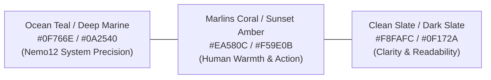
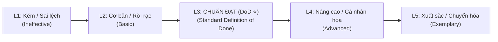

# B1 · UI Design System: Nemo12 & Marlins Care Knowledge Hub

> **Triết lý thiết kế (Design Philosophy)**:  
> *"Clarity over Decoration. Evidence over Slogans. Human Warmth within System Precision."*  
> Kế thừa ngôn ngữ chuẩn từ [Nemo12 Canonical Documentation System](https://docs.nemo12.com/) kết hợp nét ấm áp, tin cậy đặc trưng của **Marlins Care** (đồng hành cùng phụ huynh và gia đình).

---

## 1. Foundations & Design Tokens

Design System được xây dựng theo chuẩn CSS Custom Properties (Variables), hỗ trợ mượt mà cả **Light Theme** và **Dark Theme** với độ tương phản cao đạt chuẩn WCAG 2.1 AA/AAA.

### 1.1 Color Palette (Bảng màu nhận diện)



#### CSS Variables Tokens:
```css
:root {
  /* Brand Primary: Ocean Depth & Precision */
  --color-primary-50: #F0FDFA;
  --color-primary-100: #CCFBF1;
  --color-primary-200: #99F6E4;
  --color-primary-300: #5EEAD4;
  --color-primary-400: #2DD4BF;
  --color-primary-500: #14B8A6;
  --color-primary-600: #0D9488;
  --color-primary-700: #0F766E; /* Core Brand Primary */
  --color-primary-800: #115E59;
  --color-primary-900: #134E4A;
  --color-primary-950: #042F2E;

  /* Marlins Care Accent: Warmth, Guidance & Human Touch */
  --color-accent-50: #FFF7ED;
  --color-accent-100: #FFEDD5;
  --color-accent-200: #FED7AA;
  --color-accent-300: #FDBA74;
  --color-accent-400: #FB923C;
  --color-accent-500: #F97316; /* Core Accent Coral */
  --color-accent-600: #EA580C;
  --color-accent-700: #C2410C;

  /* Functional Roles & Touchpoint Tags */
  --color-system: #0284C7;     /* Blue: Automated System Evidence */
  --color-mentor: #0D9488;     /* Teal: Mentor Context & Judgment */
  --color-marlins: #EA580C;    /* Coral: Marlins Care / Parent Reflection */
  --color-hybrid: #7C3AED;     /* Violet: System + Mentor Collaborative */
  --color-risk: #DC2626;       /* Red: Learning Risk / Concern (T7) */
  --color-milestone: #059669;  /* Emerald: Positive Milestone (T13) */

  /* Neutral Backgrounds & Text (Light Mode default) */
  --bg-app: #F8FAFC;
  --bg-surface: #FFFFFF;
  --bg-surface-elevated: #FFFFFF;
  --bg-surface-subtle: #F1F5F9;
  
  --text-primary: #0F172A;
  --text-secondary: #475569;
  --text-muted: #94A3B8;
  --border-subtle: #E2E8F0;
  --border-strong: #CBD5E1;

  /* Elevation Shadows */
  --shadow-sm: 0 1px 2px 0 rgb(0 0 0 / 0.05);
  --shadow-md: 0 4px 6px -1px rgb(0 0 0 / 0.07), 0 2px 4px -2px rgb(0 0 0 / 0.05);
  --shadow-lg: 0 10px 15px -3px rgb(0 0 0 / 0.08), 0 4px 6px -4px rgb(0 0 0 / 0.04);
  --shadow-glow-teal: 0 0 20px -5px rgba(13, 148, 136, 0.25);
  --shadow-glow-coral: 0 0 20px -5px rgba(234, 88, 12, 0.25);

  /* Radius & Transitions */
  --radius-xs: 4px;
  --radius-sm: 6px;
  --radius-md: 10px;
  --radius-lg: 16px;
  --radius-full: 9999px;
  --transition-fast: 150ms cubic-bezier(0.4, 0, 0.2, 1);
  --transition-normal: 250ms cubic-bezier(0.4, 0, 0.2, 1);
}

/* Dark Mode Tokens (Tương thích chuẩn VitePress / docs.nemo12.com) */
[data-theme="dark"], .dark {
  --bg-app: #090D16;
  --bg-surface: #111827;
  --bg-surface-elevated: #1F2937;
  --bg-surface-subtle: #162032;
  
  --text-primary: #F8FAFC;
  --text-secondary: #CBD5E1;
  --text-muted: #64748B;
  --border-subtle: #1E293B;
  --border-strong: #334155;

  --shadow-sm: 0 1px 2px 0 rgb(0 0 0 / 0.3);
  --shadow-md: 0 4px 6px -1px rgb(0 0 0 / 0.4);
  --shadow-lg: 0 10px 20px -3px rgb(0 0 0 / 0.5);
}
```

---

### 1.2 Typography System

Phông chữ tiêu chuẩn: **Inter** (hoặc **Plus Jakarta Sans**) cho Body & UI, kết hợp **JetBrains Mono** cho ID mã số, Code, Tokens và Rubric Matrix.

| Element | Font Family | Size (px / rem) | Weight | Line Height | Letter Spacing |
|---|---|---|---|---|---|
| **Display H1** | Inter / Display | 32px / 2.0rem | 700 (Bold) | 1.25 | -0.025em |
| **Section H2** | Inter | 24px / 1.5rem | 600 (Semibold) | 1.3 | -0.02em |
| **Subsection H3** | Inter | 18px / 1.125rem | 600 (Semibold) | 1.4 | -0.01em |
| **Body Large** | Inter | 16px / 1.0rem | 400 / 500 | 1.6 | Normal |
| **Body Regular** | Inter | 14px / 0.875rem | 400 | 1.5 | Normal |
| **Caption / Badge** | Inter | 12px / 0.75rem | 600 | 1.4 | +0.02em |
| **Code / Code ID** | JetBrains Mono | 13px / 0.8125rem | 500 | 1.4 | -0.01em |

---

### 1.3 Spacing & Layout Grid

Tuân thủ hệ số **4px / 8px scale**:
- `space-1`: 4px | `space-2`: 8px | `space-3`: 12px | `space-4`: 16px
- `space-5`: 20px | `space-6`: 24px | `space-8`: 32px | `space-12`: 48px | `space-16`: 64px
- **Layout Grid**: 
  - **Sidebar Nav Width**: `280px` (Collapsible trên Mobile/Tablet).
  - **Main Content Max-Width**: `920px` (Đảm bảo độ dài dòng đọc tối ưu 65–85 ký tự).
  - **Table of Contents (On-this-page)**: `240px` (Right aside).

---

## 2. Component Specifications

### 2.1 Navigation & Shell Layout Specification (Chuẩn VitePress / Documentation Hub)

Design System chỉ định nghĩa **cấu trúc giao diện, kích thước, token màu sắc, trạng thái tương tác (interaction states) và cơ chế hiển thị** của bộ khung điều hướng (Navigation Shell). Toàn bộ nội dung liên kết, danh sách mục và cấu trúc cây phân cấp sẽ do **Sitemap data độc lập** cung cấp động (Dynamic Data Binding).

```
┌──────────────────────────────────────────────────────────────────────────────────────────────┐
│  [TopNavBar: 64px sticky]   Logo + Title   |   Search Component (⌘K)   |   NavItems   ThemeToggle │
├─────────────────────────┬────────────────────────────────────────────┬───────────────────────┤
│ [Left Sidebar: 280px]   │  [Main Viewport: Max 920px]                │ [Right Aside: 240px]  │
│                         │                                            │                       │
│ ▼ Group Header (L0)     │  # Document Heading                        │ Table of Contents     │
│   • SubItem Link (L1)   │  > Callout / Alert Box                     │  • Anchor Link H2     │
│   ▶ Nested Group (L1)   │                                            │  • Anchor Link H3     │
│     • Leaf Link (L2)    │  Article content, tables, components...    │                       │
│                         │                                            │  [Back to Top ↑]      │
└─────────────────────────┴────────────────────────────────────────────┴───────────────────────┘
```

#### A. Top Navigation Bar (Thanh điều hướng trên cùng)
- **Kích thước & Vị trí**:
  - `height: 64px; width: 100%;`
  - `position: sticky; top: 0; z-index: 50;`
  - `background: var(--bg-app); backdrop-filter: blur(12px); -webkit-backdrop-filter: blur(12px);`
  - `border-bottom: 1px solid var(--border-subtle);`
- **Các thành phần UI chuẩn**:
  1. **Brand Cluster**: Logo icon + Chữ định danh phân hệ (`font-size: 16px; font-weight: 600; color: var(--text-primary)`).
  2. **Search Trigger Input**:
     - Nút kích hoạt mở modal tìm kiếm nhanh (`height: 36px; border-radius: var(--radius-sm); background: var(--bg-surface-subtle); border: 1px solid var(--border-subtle)`).
     - Chứa icon Search, placeholder text và `<kbd>` shortcut badge (`⌘K` / `Ctrl K`).
  3. **Global Nav Items Container**: Danh sách liên kết điều hướng cấp cao (`display: flex; gap: var(--space-4)`).
     - **Item State**: `color: var(--text-secondary); font-size: 14px; font-weight: 500`.
     - **Hover State**: `color: var(--color-primary-600)`.
     - **Active State**: `color: var(--color-primary-700); font-weight: 600; border-bottom: 2px solid var(--color-primary-600)`.
  4. **Appearance & Controls**: Component nút bấm chuyển đổi Dark/Light mode (`width: 36px; height: 36px; border-radius: var(--radius-full)`).
  5. **Mobile Hamburger Button**: Ẩn trên desktop (`display: none`), hiển thị trên mobile/tablet (`display: flex; align-items: center`).

#### B. Left Sidebar Navigation (Cột điều hướng phân tầng bên trái)
- **Kích thước & Layout**:
  - `width: 280px; height: calc(100vh - 64px); position: sticky; top: 64px;`
  - `overflow-y: auto; overflow-x: hidden;`
  - `border-right: 1px solid var(--border-subtle); background: var(--bg-app);`
  - `padding: var(--space-4) var(--space-3);`
- **Hệ thống phân cấp mục (Hierarchy Levels)**:
  - **Level 0 (Group Header)**: `font-size: 13px; font-weight: 700; text-transform: uppercase; letter-spacing: 0.05em; color: var(--text-muted); padding: var(--space-3) var(--space-2) var(--space-1);`
  - **Level 1 (Nav Item / Subgroup)**:
    - Item là liên kết: `font-size: 14px; color: var(--text-secondary); padding: 6px var(--space-3); border-radius: var(--radius-sm); display: flex; align-items: center; justify-content: space-between;`
    - Subgroup mở rộng/thu gọn: Có icon mũi tên (`caret icon`) xoay chuyển trạng thái `transform: rotate(90deg)` khi mở rộng (`aria-expanded="true"`).
  - **Level 2 (Nested Leaf Item)**: `padding-left: var(--space-6); font-size: 13px;`
- **Trạng thái tương tác của Item (Interactive States)**:
  - **Hover**: `background: var(--bg-surface-subtle); color: var(--text-primary);`
  - **Active (Đang được chọn)**:
    - `background: var(--color-primary-50); color: var(--color-primary-700); font-weight: 600;`
    - `border-left: 3px solid var(--color-primary-600);`
    - (Dark mode: `background: var(--color-primary-950); color: var(--color-primary-300);`)
  - **Badge tích hợp**: Hỗ trợ gắn kèm badge nhỏ (`pill badge`) ở đuôi mục để hiển thị trạng thái (ví dụ: New, Pilot, Owner tag).

#### C. Right Aside Navigation (Mục lục động "On-this-page") & Content Section Standards
- **Kích thước & Layout**:
  - `width: 240px; height: calc(100vh - 64px); position: sticky; top: 64px;`
  - `padding: var(--space-6) var(--space-4); display: flex; flex-direction: column;`
- **Quy tắc Đặt tên Tiêu đề Section (Lean Section Title Rule - ≤ 3 Words)**:
  - Tất cả các thẻ tiêu đề Section (`<h2>`, `<h3>`, Mục lục TOC) **bắt buộc phải là Pure English, ngắn gọn, súc tích và KHÔNG VƯỢT QUÁ 3 TỪ**.
  - ❌ **CẤM**: Tiêu đề dài dòng hoặc kèm chú thích mở ngoặc như: `Stakeholders Analysis & JTBD Mapping (Giá Trị Sau Buổi Gặp)`, `Session Agenda (Khung Thời Lượng 60 Phút Thực Chiến)`, `Standard Operating Procedure (SOP Steps)`.
  - ✅ **CHUẨN MỰC (≤ 3 Words)**:
    - `Stakeholder Mapping` (2 từ) hoặc `Stakeholder JTBD` (2 từ)
    - `Session Agenda` (2 từ)
    - `Mentor Guides` (2 từ)
    - `Question Bank` (2 từ)
    - `Observation Guide` (2 từ)
    - `Exit Checklist` (2 từ)
    - `Family Notes` (2 từ)
    - `SOP Steps` (2 từ)
    - `Do's & Don'ts` (3 từ)
    - `Assessment Rubrics` (2 từ)
    - `Communication Templates` (2 từ)
- **Cơ chế hoạt động TOC**:
  - Tự động bắt sự kiện cuộn trang (Scrollspy) để làm nổi bật đề mục tương ứng.
  - **Active Marker**: Thanh đánh dấu nhỏ trượt dọc theo liên kết đang kích hoạt (`position: absolute; left: 0; width: 2px; height: 16px; background: var(--color-primary-600); transition: top var(--transition-fast);`).
  - **Action Link**: Nút *"Lên đầu trang ↑"* ở chân danh mục (`font-size: 12px; color: var(--text-muted); cursor: pointer`).

---

### 2.2 Card Component & Status Badge System

Hệ thống Card và Badge được sử dụng để hiển thị các đơn vị nội dung có phân loại vai trò, trạng thái hoặc cấp độ:

| Badge Type | CSS Class | Color Token | Ứng dụng |
|---|---|---|---|
| `Automated / System` | `.badge-system` | `--color-system` (`#0284C7`) | Quy trình/dữ liệu tự động |
| `Human / Specialist` | `.badge-mentor` | `--color-mentor` (`#0D9488`) | Tương tác người thực hiện |
| `Community / Guidance`| `.badge-marlins` | `--color-marlins` (`#EA580C`)| Hoạt động định hướng, cộng đồng |
| `Collaborative / Hybrid`| `.badge-hybrid` | `--color-hybrid` (`#7C3AED`) | Phối hợp Người + Máy |
| `Alert / Critical` | `.badge-risk` | `--color-risk` (`#DC2626`) | Cảnh báo rủi ro, cần chú ý |
| `Success / Achievement`| `.badge-milestone`| `--color-milestone` (`#059669`)| Cột mốc hoàn thành, ghi nhận |

```html
<!-- Generic Card Component Template -->
<div class="card-item">
  <div class="card-header">
    <div class="meta-tags">
      <span class="tag-id">CODE-01</span>
      <span class="badge badge-mentor">Owner / Role</span>
      <span class="tag-stage">Category / Phase</span>
    </div>
    <h3 class="card-title">Card Heading Title</h3>
  </div>
  <p class="card-desc">Mô tả ngắn gọn mục đích và nội dung cốt lõi của card component.</p>
  <div class="card-footer">
    <span class="meta-time">⏱ Estimate: ≤ 15 min</span>
    <button class="btn btn-outline">Xem chi tiết →</button>
  </div>
</div>
```

---

### 2.3 Assessment Rubric Matrix Component (3 Criteria × 5 Levels)

Bảng ma trận đánh giá chuẩn hóa được thiết kế dạng lưới 5 mức độ, trong đó **Level 3 (Definition of Done)** luôn được làm nổi bật để làm mốc chuẩn bàn giao:



#### Quy chuẩn hiển thị & Tương tác:
- **Cột Level 3 (DoD)**: Đường viền nổi bật (`border: 2px solid var(--color-primary-600)`), nền nhấn nhẹ (`var(--color-primary-50)` / Dark: `var(--color-primary-950)`).
- **Interactive State**: Hỗ trợ chọn nhanh từng mức độ để tính điểm hoặc đánh dấu checklist hoàn thành.

```html
<div class="rubric-container">
  <table class="rubric-matrix">
    <thead>
      <tr>
        <th class="col-criteria">Tiêu chí (Criteria)</th>
        <th class="lvl-col">L1 (Kém)</th>
        <th class="lvl-col">L2 (Cơ bản)</th>
        <th class="lvl-col lvl-dod">L3 (Chuẩn DoD ⭐)</th>
        <th class="lvl-col">L4 (Nâng cao)</th>
        <th class="lvl-col">L5 (Xuất sắc)</th>
      </tr>
    </thead>
    <tbody>
      <tr>
        <td class="crit-title">Tiêu chí đánh giá</td>
        <td>Mô tả hành vi L1</td>
        <td>Mô tả hành vi L2</td>
        <td class="lvl-dod-cell">Mô tả tiêu chuẩn tối thiểu đạt chuẩn</td>
        <td>Mô tả hành vi vượt chuẩn</td>
        <td>Mô tả hành vi kiểu mẫu</td>
      </tr>
    </tbody>
  </table>
</div>
```

---

### 2.4 Timeline & Callout Notification Components

- **Timeline Execution**: Phân định trực quan giữa bước tự động của hệ thống (🤖 `.step-system`) và thao tác trực tiếp của nhân sự (👤 `.step-human`).
- **Callout Containers**: Các khối thông điệp nhấn mạnh quy chuẩn với các cấp độ ngữ nghĩa:

```html
<!-- Callout Boxes Standard -->
<div class="callout callout-tip">
  <div class="callout-title">💡 Gợi ý thực hiện (Best Practice / Do)</div>
  <p>Nội dung hướng dẫn thực hành tốt nhất cho người vận hành.</p>
</div>

<div class="callout callout-danger">
  <div class="callout-title">🚫 Cấm kỵ / Cảnh báo (Warning / Don't)</div>
  <p>Nội dung cảnh báo các sai phạm hoặc hành vi cần tránh.</p>
</div>
```

---

### 2.5 Code & Communication Template Box (One-Click Copy)

Component hiển thị các đoạn văn bản mẫu, script hoặc template với tính năng sao chép nhanh và cú pháp biến số `{{variable_name}}`:

```html
<div class="template-box">
  <div class="template-header">
    <span class="template-label">Template / Script Title</span>
    <button class="btn-copy" onclick="copyTemplate(this)">📋 Sao chép mẫu</button>
  </div>
  <pre class="template-content"><code>[Tiêu đề / Kịch bản]
Xin chào {{recipient_name}},
Nội dung thông điệp hoặc mã mẫu được định dạng chuẩn...</code></pre>
</div>
```

---

## 3. Responsive Breakpoints & Accessibility (A11y)

### 3.1 Breakpoint System
- **Mobile (< 640px)**: Single column, Sidebar biến thành Drawer trượt, Tables chuyển sang dạng Stacked Card, Rubric hỗ trợ cuộn ngang mượt mà (Swipe scroll).
- **Tablet (640px – 1024px)**: 2-column Grid cho Touchpoint Cards, Sidebar thu gọn dạng Icon hoặc Collapsible menu.
- **Desktop (> 1024px)**: Layout 3 cột đầy đủ (Sidebar Trái - Nội dung chính Giữa - Mục lục On-this-page Phải).

### 3.2 Accessibility Standards (WCAG 2.1 AA)
1. **Tương phản màu sắc**: Text/Background đạt tỉ lệ ≥ 4.5:1 (Normal text) và ≥ 3:1 (Large text).
2. **Keyboard Navigation**: Hỗ trợ phím `Tab`, `Escape` (đóng modal/drawer), `Enter`/`Space` (kích hoạt tương tác), `Cmd+K` (mở tìm kiếm).
3. **Focus States**: Hiển thị đường viền `outline: 2px solid var(--color-primary-500)` rõ nét khi focus bằng bàn phím.
4. **Semantic HTML5**: Sử dụng chuẩn xác `<header>`, `<nav>`, `<main>`, `<aside>`, `<article>`, `<section>`, `<h1>`–`<h3>`.

---

## 4. UI/UX Interaction & Micro-animations

- **Page Transitions**: Chuyển trang/tab mượt mà với `opacity` và `translateY` nhẹ (10px, 200ms ease-out).
- **Hover Micro-effects**: Touchpoint cards nâng nhẹ `translateY(-3px)` kèm đổ bóng màu thương hiệu `--shadow-glow-teal` hoặc `--shadow-glow-coral`.
- **Badge Animation**: Trạng thái `Risk Alert` hoặc `Pilot` có hiệu ứng breathing pulse tinh tế để thu hút sự chú ý của Mentor/Operator.

---

## 5. Artifact Directory & File Mapping

Tài liệu này được lưu trữ và liên kết chuẩn hóa tại:
- File thiết kế: [`/Users/danghong/Documents/Marlins Care/B_System Design/B1_UI_Design_System.md`](file:///Users/danghong/Documents/Marlins%20Care/B_System%20Design/B1_UI_Design_System.md)
- Kiến trúc hệ thống: [`/Users/danghong/Documents/Marlins Care/B_System Design/B1_System_Design.md`](file:///Users/danghong/Documents/Marlins%20Care/B_System%20Design/B1_System_Design.md)
- PRD gốc: [`/Users/danghong/Documents/Marlins Care/Requirements/nemo12_parent_care_prd.md`](file:///Users/danghong/Documents/Marlins%20Care/Requirements/nemo12_parent_care_prd.md)
