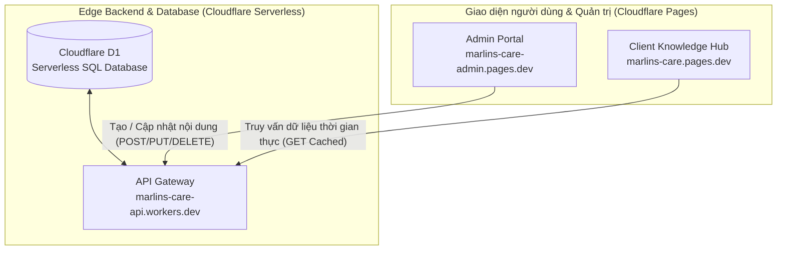

# B2 · System Architecture & Tech Stack Specifications

> **Hệ thống kiến trúc kỹ thuật & Đặc tả ngăn xếp công nghệ (Tech Stack)**  
> **Nền tảng:** Nemo12 & Marlins Care Knowledge Hub  
> **Phiên bản:** v2.0.0 · **Mô hình triển khai:** Decoupled Headless Edge Architecture trên hạ tầng miễn phí của Cloudflare (Cloudflare Pages `*.pages.dev` + Workers API `*.workers.dev` + D1 Database).

---

## 1. Tổng Quan Ngăn Xếp Công Nghệ (Headless Edge Architecture)

Marlins Care Knowledge Hub được xây dựng và triển khai 100% trên nền tảng Serverless miễn phí của Cloudflare:



### Chi tiết các tầng công nghệ & Subdomain Cloudflare miễn phí:

| Tầng Kiến Trúc (Layer) | Công Nghệ / Dịch Vụ | Tên miền mặc định Cloudflare (Free) | Mục Đích Sử Dụng |
| :--- | :--- | :--- | :--- |
| **Edge Database** | **Cloudflare D1** | `marlins_care_db` | Cơ sở dữ liệu SQLite Serverless tại Edge, lưu trữ Playbooks, SOPs, FAQs, Rubrics và Decision Logs. |
| **API Gateway** | **Cloudflare Workers** | `marlins-care-api.*.workers.dev` | API Gateway tiếp nhận requests, xử lý routing, auth và truy vấn D1. |
| **Admin Portal** | **Cloudflare Pages** | `marlins-care-admin.pages.dev` (hoặc `/admin`) | Cổng quản trị cho phép đội ngũ Ops/Mentors thêm, sửa, xóa nội dung mà không cần Git. |
| **Client Knowledge Hub** | **Cloudflare Pages** | `marlins-care.pages.dev` | Giao diện đọc tài liệu chính thức, gọi API Workers để fetch và hiển thị dữ liệu siêu tốc. |
| **Design System** | **Ocean Teal Tokens** | — | Kế thừa hệ thống màu sắc, kiểu chữ và components chuẩn từ `B1_UI_Design_System.md`. |
| **Edge CDN & Security** | **Cloudflare Global Network** | — | Tự động kích hoạt HTTP/3, TLS 1.3, Brotli và phân phối toàn cầu miễn phí. |

---

## 2. Thiết Kế Cơ Sở Dữ Liệu Cloudflare D1 (Database Schema)

Dữ liệu được tổ chức chuẩn hóa quan hệ thành các bảng chính:

```sql
-- 1. Bảng Module / Phân hệ chính
CREATE TABLE modules (
    id TEXT PRIMARY KEY,
    title TEXT NOT NULL,
    slug TEXT NOT NULL UNIQUE,
    order_index INTEGER DEFAULT 0
);

-- 2. Bảng Playbooks
CREATE TABLE playbooks (
    id TEXT PRIMARY KEY,
    module_id TEXT NOT NULL,
    title TEXT NOT NULL,
    slug TEXT NOT NULL UNIQUE,
    tier TEXT CHECK(tier IN ('Tier 1', 'Tier 2', 'Tier 3')),
    touchpoints TEXT,
    objective TEXT,
    trigger_condition TEXT,
    standard_time TEXT,
    target_audience TEXT,
    owner TEXT,
    output TEXT,
    order_index INTEGER DEFAULT 0,
    created_at DATETIME DEFAULT CURRENT_TIMESTAMP,
    updated_at DATETIME DEFAULT CURRENT_TIMESTAMP,
    FOREIGN KEY (module_id) REFERENCES modules(id)
);

-- 3. Bảng Khối Nội Dung (Sections) của Playbook
CREATE TABLE playbook_sections (
    id TEXT PRIMARY KEY,
    playbook_id TEXT NOT NULL,
    section_key TEXT NOT NULL, -- overview, stakeholder-mapping, session-agenda, sop-steps, dos-donts, assessment-rubrics, decision-logs, faq
    title TEXT NOT NULL,
    content_html TEXT NOT NULL,
    order_index INTEGER DEFAULT 0,
    FOREIGN KEY (playbook_id) REFERENCES playbooks(id)
);

-- 4. Bảng FAQs
CREATE TABLE faqs (
    id TEXT PRIMARY KEY,
    playbook_id TEXT NOT NULL,
    question TEXT NOT NULL,
    answer TEXT NOT NULL,
    order_index INTEGER DEFAULT 0,
    FOREIGN KEY (playbook_id) REFERENCES playbooks(id)
);
```

---

## 3. Cấu Trúc Thư Mục & Tổ Chức Mã Nguồn (Directory Structure)

```
Marlins Care/
├── api/                         # Cloudflare Workers API Gateway (api.domain.com)
│   ├── src/
│   │   ├── index.ts             # REST API Router (Hono / Worker)
│   │   ├── db/schema.sql        # Cloudflare D1 Database Schema & Seed Data
│   │   └── routes/              # Handlers cho Playbooks, SOPs, FAQs
│   └── wrangler.toml            # Cấu hình Cloudflare Workers & D1 Binding
│
├── admin/                       # Admin Portal CRUD (admin.domain.com)
│   ├── index.html               # Trang quản trị
│   ├── css/admin.css            # Style quản trị
│   └── js/admin.js              # Logic CRUD tương tác trực tiếp với API Gateway
│
├── website/                     # Client Knowledge Hub (domain.com)
│   ├── index.html               # SPA Entry Point
│   ├── css/                     # Design System & Components Styles
│   ├── js/                      # App Logic (Router, Renderer, API Client)
│   │   ├── api.js               # Service gọi api.domain.com (kèm local fallback)
│   │   ├── app.js               # Main Controller
│   │   └── components/          # Renderers (Playbooks, Journeys, Rubrics)
│   └── _headers                 # Security & CORS Headers
│
├── A_Requirements/              # Yêu cầu nghiệp vụ & Tiêu chuẩn chuẩn hóa
├── B_System Design/             # Thiết kế hệ thống & Kiến trúc kỹ thuật
└── C_Playbooks/                 # 8 Playbooks tác nghiệp chuẩn
```

---

## 4. API Endpoints Đặc Tả (API Gateway Specification)

| Method | Endpoint | Quyền hạn | Mô tả |
| :--- | :--- | :---: | :--- |
| `GET` | `/api/v1/playbooks` | Public | Lấy danh sách toàn bộ 8 Playbooks và cây điều hướng |
| `GET` | `/api/v1/playbooks/:slug` | Public | Lấy chi tiết nội dung đầy đủ của 1 Playbook theo slug |
| `POST` | `/api/v1/playbooks` | Admin | Tạo mới Playbook |
| `PUT` | `/api/v1/playbooks/:id` | Admin | Cập nhật thông tin và sections của Playbook |
| `DELETE`| `/api/v1/playbooks/:id` | Admin | Xóa Playbook |
| `GET` | `/api/v1/faqs` | Public | Lấy danh sách câu hỏi FAQ |
| `POST` | `/api/v1/faqs` | Admin | Thêm mới câu hỏi FAQ |

---

## 5. Pipeline Triển Khai & Vận Hành (Cloudflare Edge CI/CD)

1. **API Gateway (`api/`):** Triển khai tự động qua `wrangler deploy` kết nối cơ sở dữ liệu `cloudflare d1`.
2. **Admin Portal (`admin/`):** Triển khai qua Cloudflare Pages với tên miền phụ `admin.domain.com`, tích hợp Cloudflare Access để phân quyền đăng nhập an toàn.
3. **Client Hub (`website/`):** Triển khai qua Cloudflare Pages tại tên miền chính `domain.com`, tải dữ liệu động từ API và hỗ trợ bộ nhớ đệm Edge Cache thông minh.
