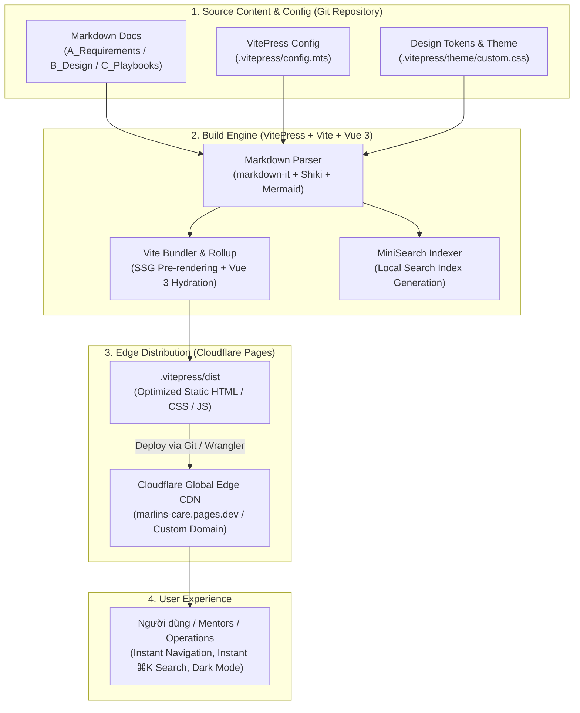
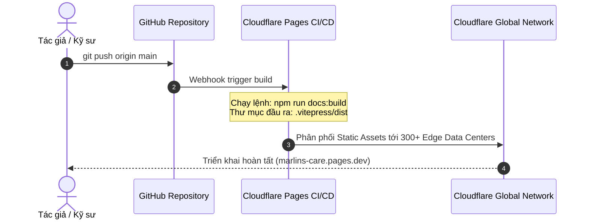

# B2 · System Architecture & Tech Stack Specifications

> **Hệ thống kiến trúc kỹ thuật & Đặc tả ngăn xếp công nghệ (Tech Stack)**  
> **Nền tảng:** Nemo12 & Marlins Care Knowledge Hub  
> **Mô hình kiến trúc:** **Markdown-first Static Site Generation (SSG)** dựa trên **VitePress** kết hợp triển khai phân phối toàn cầu qua **Cloudflare Pages Edge CDN**.

---

## 1. Tổng Quan Kiến Trúc Hệ Thống (Architecture Overview)

Marlins Care Knowledge Hub được thiết kế theo mô hình **JAMstack / SSG (Static Site Generation)** với triết lý: *"Markdown is the Single Source of Truth"*. Toàn bộ tài liệu nghiệp vụ, quy chuẩn thiết kế và cẩm nang tác nghiệp (Playbooks) được lưu trữ trực tiếp dưới dạng Markdown, biên dịch tự động bởi **VitePress** và phân phối qua mạng lưới Edge của Cloudflare:



---

## 2. Chi Tiết Ngăn Xếp Công Nghệ (Technology Stack Details)

| Tầng Công Nghệ | Thành Phần / Công Nghệ | Phiên Bản | Mục Đích & Vai Trò Kỹ Thuật |
| :--- | :--- | :---: | :--- |
| **Documentation Engine** | **VitePress** | `^1.0.0` | Framework tạo static doc site hiệu năng cao xây dựng trên nền **Vite** và **Vue 3**. |
| **Core Bundler & Dev Server** | **Vite + Rollup** | `v5.x` | Cung cấp Dev Server với Hot Module Replacement (HMR) tức thì dưới 50ms; tối ưu hóa tree-shaking và code-splitting khi đóng gói build. |
| **Search Engine** | **VitePress MiniSearch (Local Search)** | Built-in | Công cụ tìm kiếm nội bộ client-side siêu nhẹ, tự động sinh chỉ mục khi build, hỗ trợ phím tắt `⌘K` và tìm kiếm tiếng Việt tức thì không phụ thuộc API bên ngoài. |
| **Markdown Extensions** | **markdown-it + Shiki + Mermaid** | Built-in | Hỗ trợ cú pháp Markdown mở rộng: Container Callouts (`::: tip`, `::: warning`, `::: danger`), tô màu cú pháp code với Shiki, sơ đồ Mermaid và bảng biểu chuẩn. |
| **Design System Tokens** | **Ocean Teal & Marlins Coral Tokens** | v2.0.0 | Kế thừa toàn bộ hệ thống màu sắc, kiểu chữ và components chuẩn từ [B1_UI_Design_System.md](file:///Users/danghong/Documents/Marlins%20Care/B_System%20Design/B1_UI_Design_System.md). |
| **Hosting & Edge Delivery** | **Cloudflare Pages** | Serverless Edge | Lưu trữ và phân phối tệp tĩnh toàn cầu với độ trễ cực thấp, hỗ trợ HTTP/3, TLS 1.3, nén Brotli tự động và uptime 99.99%. |
| **Package Manager** | **Node.js & npm** | Node `>=18.0.0` | Quản lý gói phụ thuộc và scripts vận hành hệ thống. |

---

## 3. Cấu Trúc Thư Mục Chuẩn Hóa (Directory Structure)

Toàn bộ dự án được tổ chức khoa học theo cấu trúc chuẩn của VitePress:

```text
Marlins Care/
├── .vitepress/                  # Cấu hình cốt lõi & giao diện VitePress
│   ├── config.mts               # Cấu hình Metadata, TopNav, Sidebar, Search & Theme
│   └── theme/                   # Tùy biến giao diện (Custom Theme)
│       ├── index.ts             # Entry point theme kế thừa DefaultTheme
│       └── custom.css           # Design Tokens (Ocean Teal, Typography, Callouts, Badges)
│
├── A_Requirements/              # Yêu cầu nghiệp vụ & Tiêu chuẩn chuẩn hóa
│   ├── A1_Sitemap.md            # Sơ đồ cấu trúc nội dung & điều hướng
│   ├── A2_Product_Goal_and_Vision.md
│   ├── A3_Parent_JTBD_and_Needs.md
│   ├── A4_Parent_Journey_Framework.md
│   ├── A6_Playbooks_Template.md # Khung mẫu chuẩn 8 sections cho Playbooks
│   ├── A7_Content_Standards.md  # Tiêu chuẩn chất lượng nội dung & ngôn ngữ
│   ├── A8_DAR_Template.md       # Khung đánh giá quyết định kiến trúc
│   └── A9_Topic_Library_and_Pedagogy_Standards.md
│
├── B_System Design/             # Thiết kế hệ thống & Kiến trúc kỹ thuật
│   ├── B1_UI_Design_System.md   # Design Tokens, Components, Badges, Rubric Matrix
│   └── B2_Tech_Stack.md         # Đặc tả kiến trúc VitePress & Cloudflare Pages (Tài liệu này)
│
├── C_Playbooks/                 # 8 Cẩm nang tác nghiệp chuẩn hóa (P01 - P08)
│   ├── P01_Social_Media_Playbook.md
│   ├── P02_Community_Playbook.md
│   ├── P03_Marlins_Workshop_Playbook.md
│   ├── P04_Marlins_Day_Playbook.md
│   ├── P05_Trial_Class_Playbook.md
│   ├── P06_Live_Class_Playbook.md
│   ├── P07_Family_Meeting_Playbook.md
│   └── P08_Referrals_Program_Playbook.md
│
├── public/                      # Static Assets (Favicon, Logo, Images)
│   ├── favicon.ico
│   └── logo.svg
│
├── index.md                     # Trang chủ Landing Page của Knowledge Hub
├── package.json                 # Khai báo dependencies (vitepress) và scripts
└── README.md                    # Hướng dẫn tổng quan kho tri thức
```

---

## 4. Đặc Tả Cấu Hình VitePress (`.vitepress/config.mts`)

Cấu hình VitePress được viết bằng TypeScript (`config.mts`) đảm bảo type-safety và dễ bảo trì:

### 4.1 Điều Hướng Cấp Cao (Navigation & Sidebar)
* **Top Navigation Bar (`nav`):**
  * `Overview`: Giới thiệu tầm nhìn, mục tiêu và năng lực cốt lõi.
  * `Parent Journey`: Bản đồ hành trình phụ huynh và các điểm chạm.
  * `Playbooks`: Lối tắt trực tiếp đến danh mục 8 cẩm nang tác nghiệp (`/C_Playbooks/`).
  * `Requirements`: Quy chuẩn nội dung, DAR và thiết kế hệ thống.
* **Sidebar Đa Phân Hệ (`sidebar`):** Tự động chuyển đổi menu theo từng phân vùng đường dẫn tương ứng (`/overview/`, `/journey`, `/C_Playbooks/`, `/requirements/`).

### 4.2 Tìm Kiếm Nội Bộ Tức Thì (Local MiniSearch)
* Tích hợp sẵn `provider: 'local'` hỗ trợ:
  * Phím tắt kích hoạt: `⌘K` (macOS) hoặc `Ctrl+K` (Windows/Linux).
  * Việt hóa toàn bộ giao diện tìm kiếm (Search box, Reset button, Footer navigation keys).
  * Tự động quét toàn bộ tiêu đề H1, H2, H3 và nội dung đoạn văn bản để lập chỉ mục.

### 4.3 Tùy Biến Giao Diện Chuẩn Ocean Teal
Thông qua `.vitepress/theme/custom.css`, các biến CSS gốc của VitePress (`--vp-c-brand-1`, `--vp-c-brand-2`,...) được ánh xạ trực tiếp sang hệ màu chuẩn **Ocean Teal** (`#0F766E`) và **Marlins Coral** (`#EA580C`) theo đặc tả tại [B1_UI_Design_System.md](file:///Users/danghong/Documents/Marlins%20Care/B_System%20Design/B1_UI_Design_System.md).

---

## 5. Quy Trình Vận Hành & Lệnh Thực Thi (Operational Lifecycle)

### 5.1 Vòng Đời Phát Triển (Development Scripts)

Các lệnh thực thi được định nghĩa chuẩn trong `package.json`:

```bash
# 1. Cài đặt các gói phụ thuộc
npm install

# 2. Khởi chạy máy chủ phát triển cục bộ (Local Dev Server với HMR)
npm run docs:dev
# Mặc định lắng nghe tại http://localhost:5173

# 3. Đóng gói mã nguồn tĩnh chuẩn bị triển khai (Production Build)
npm run docs:build
# Kết quả xuất ra thư mục .vitepress/dist/

# 4. Kiểm tra trước bản build tĩnh tại môi trường cục bộ (Preview)
npm run docs:preview
# Khởi chạy máy chủ web cục bộ phục vụ các tệp trong .vitepress/dist/
```

### 5.2 Pipeline Triển Khai Tự Động (CI/CD via Cloudflare Pages)



1. **Kết nối Git:** Cloudflare Pages liên kết trực tiếp với repository GitHub.
2. **Build Configuration:**
   - **Framework Preset:** `VitePress`
   - **Build Command:** `npm run docs:build`
   - **Build Output Directory:** `.vitepress/dist`
   - **Node.js Version:** `18.x` hoặc `20.x`
3. **Môi trường Preview:** Mỗi Pull Request tự động tạo một URL Preview độc lập giúp kiểm duyệt nội dung trước khi merge vào nhánh `main`.

---

## 6. Tiêu Chuẩn Hiệu Năng & Bảo Mật (Performance & Security)

* **Hiệu Năng (Core Web Vitals):**
  * **Largest Contentful Paint (LCP):** $< 0.8\text{s}$ nhờ HTML được pre-render sẵn.
  * **Cumulative Layout Shift (CLS):** $= 0$ nhờ layout CSS ổn định không giật cục.
  * **First Input Delay / INP:** $< 50\text{ms}$ do chỉ hydrate các components tương tác nhỏ.
* **Bảo Mật (Zero-Backend Attack Surface):**
  * Không sử dụng máy chủ động hoặc cơ sở dữ liệu có nguy cơ injection; 100% tài nguyên là static assets được ký số và phục vụ qua HTTPS/TLS 1.3.
  * Tích hợp cấu hình Security Headers thông qua `_headers` (Content Security Policy, X-Content-Type-Options, HSTS).
