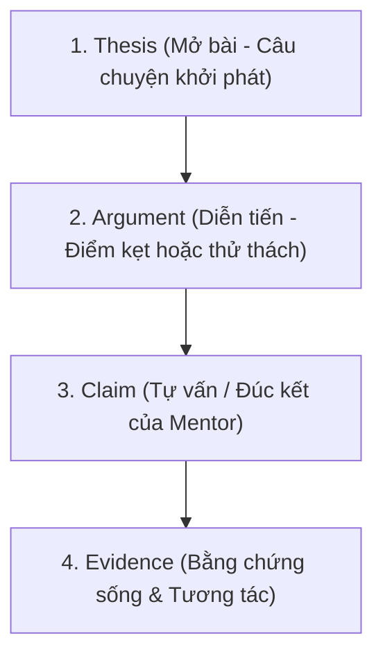

# P01 · Social Media Playbook

> **Quy trình đúc kết phản tư, thu thập bằng chứng học tập và kể chuyện chuyển hóa của học sinh trên mạng xã hội.**  
> **Triết lý:** *"Automate the evidence. Humanize the meaning."*

---

## Metadata Header
* **Objective:** Xây dựng niềm tin tự nhiên với phụ huynh qua bằng chứng thực tế và phản tư sư phạm chân thành, không quảng cáo lộ liễu.
* **Trigger:** Sau các buổi dạy tại lớp Sư Tử Con (khi có sản phẩm, khoảnh khắc bứt phá của học sinh).
* **Standard Time:** 35 phút / bài (10p thu thập + 20p soạn thảo + 5p xuất bản).
* **Target Audience:** Phụ huynh hiện tại của lớp và phụ huynh tiềm năng có con trong độ tuổi.
* **Owner:** Mentor Hồng (Human-Led Personal Branding).
* **Output:** 2 bài viết/tuần (Thứ 3 & Thứ 6) trên Facebook cá nhân + Tư liệu bằng chứng lưu trữ.

---

<h3>Core Mindset</h3>

> **"Nhẹ nhàng phổ thông — Không giáo điều học thuật — Minh bạch bằng người thật việc thật."**

Facebook cá nhân là không gian kết nối cảm xúc và lan tỏa giá trị sư phạm. Phụ huynh không cần nghe những thuật ngữ công nghệ đao to búa lớn, họ cần thấy **con họ được yêu thương, được lắng nghe và người thầy đang dạy con mình là một người tử tế, luôn trăn trở để tiến bộ mỗi ngày**.

| Priority | Trọng tâm | Định hướng thực thi |
| :--- | :--- | :--- |
| ⭐⭐⭐ | **Reflections của Mentor** | Khởi đầu từ việc tự vấn: *"Hôm nay học sinh đã dạy lại tôi điều gì?"* hoặc góc nhìn tâm lý trẻ thơ gần gũi. |
| ⭐⭐⭐ | **Evidence Mặt Người Thật** | Ưu tiên ảnh chụp khoảnh khắc tương tác thật, nụ cười, ánh mắt tập trung của học sinh và Mentor. |
| ⭐⭐⭐ | **Zero Hard-selling** | Hoàn toàn không chèn link bán khóa học; uy tín và sự chân thành tự chuyển hóa thành inbox hỏi thăm tự nhiên. |

---

<h3>Content Framework</h3>

Mọi bài viết đều được triển khai theo cấu trúc logic chuẩn **T-A-C-E (Thesis – Argument – Claim – Evidence)** nhưng được diễn đạt bằng ngôn từ đời thường, mềm mại:

| Cấu phần | Vai trò trong bài viết | Cách viết mẫu gợi ý |
| :--- | :--- | :--- |
| **1. Thesis** *(Mở bài)* | Đưa ra ngay tình huống hoặc một câu nói ngây ngô nhưng sâu sắc của học sinh. Vào đề trực diện, không lan man. | *"Chiều nay bạn Bơ (10 tuổi) hỏi tôi một câu làm tôi đứng hình mất 5 giây..."* |
| **2. Argument** *(Diễn tiến)* | Kể lại khoảnh khắc con gặp khó khăn khi làm web và cách con tự tìm cách vượt qua (hoặc cách Mentor đồng hành). | *"Bạn ấy loay hoay mãi với cái nút bấm trên trang web tự làm. Tôi định nhảy vào sửa hộ, nhưng rồi quyết định lùi lại..."* |
| **3. Claim** *(Đúc kết/Tự vấn)* | Bài học sâu sắc mà Mentor nhận được; góc nhìn tâm lý nhẹ nhàng, dễ hiểu cho bố mẹ. | *"Hóa ra tụi nhỏ không sợ bài khó, tụi nhỏ chỉ sợ người lớn không đủ kiên nhẫn để chờ chúng tự tìm ra lời giải."* |
| **4. Evidence** *(Bằng chứng)* | Ảnh mặt người thật (khoảnh khắc cười/tập trung), ảnh sản phẩm website con tự làm, hoặc ảnh chụp mẩu ghi chú dễ thương. | Ảnh chụp Mentor và học sinh bên chiếc laptop hiển thị giao diện web do chính tay con hoàn thiện. |

---

<h3>SOP Steps</h3>

| Giai đoạn | Thao tác cụ thể | Thời lượng | Deliverable / Ghi chú |
| :--- | :--- | :---: | :--- |
| **1. Thu thập dữ liệu** *(Ngay sau buổi học)* | • Chụp lại 2–3 bức ảnh khoảnh khắc đẹp (ưu tiên ảnh có mặt học sinh & Mentor). • Lưu lại link sản phẩm website hoặc chụp màn hình thành quả của các con. • Ghi nhanh 2–3 câu thoại hoặc chi tiết đắt giá vào sổ tay/notion. | 10p | Kho tư liệu thực tế (Evidences bạt ngàn) |
| **2. Chọn lọc & Soạn thảo** *(Trước ngày đăng)* | • Chọn 1 câu chuyện chạm nhất theo khung **T-A-C-E**. • Kiểm tra lại ngôn từ: Đảm bảo nhẹ nhàng, giản dị, không dùng từ ngữ học thuật đao to búa lớn. • Áp dụng quy tắc bảo mật danh tính học sinh. | 20p | Bản nháp bài viết hoàn chỉnh |
| **3. Đăng bài đúng lịch** *(Thứ 3 & Thứ 6)* | • Xuất bản bài viết vào khung giờ vàng trên Facebook cá nhân. • Đính kèm ảnh mặt người thật + link/ảnh sản phẩm con làm. | 5p | Bài post hiển thị công khai |
| **4. Chăm sóc tương tác** *(Post-publishing)* | • **Comment Handling:** Trả lời 100% bình luận của phụ huynh với sự trân trọng, chia sẻ thêm chi tiết đáng yêu về con. • Nếu có phụ huynh inbox hỏi thăm ➔ đón tiếp thấu cảm, giải đáp chân thành 1-1. | Linh hoạt | Tương tác gắn kết & Chuyển đổi tự nhiên |

---

<h3>Privacy Guidelines</h3>

Bảo vệ an toàn hình ảnh và thông tin của học sinh theo nguyên tắc đạo đức sư phạm:
1. **Quy tắc gọi tên:** 
   * Dùng tên gọi ở nhà / biệt danh dễ thương của con (ví dụ: *Bé Bơ, bạn Tít, bạn Sâu*).
   * Hoặc chỉ nhắc chung: *"Một bạn nhỏ lớp Sư Tử Con chiều nay..."*.
2. **Quy tắc Tag phụ huynh:** 
   * **Chỉ tag Facebook của bố mẹ khi đã được phụ huynh đồng ý trước** (hoặc khi bố mẹ chủ động tương tác trước).
   * Không tự ý tag phụ huynh vào các bài viết có nội dung nhạy cảm về tâm lý hay lỗi sai của con.
3. **Quy tắc hình ảnh:** 
   * Ưu tiên các góc chụp tự nhiên, ấm áp, rạng rỡ. Không đăng ảnh dìm hàng hoặc gây ảnh hưởng tiêu cực đến tâm lý của con.

---

<h3>Do's & Don'ts</h3>

| Nên Làm (Best Practices / Do's) | Cấm Kỵ (Avoid / Don'ts) |
| :--- | :--- |
| ✅ **Luôn có ảnh người thật:** Đảm bảo bài viết có hình ảnh chân thực của học sinh và Mentor để tạo cảm xúc chân thực và sự tin cậy. | ❌ **Không chèn CTA bán hàng:** Tuyệt đối không kêu gọi *"Inbox ngay để nhận ưu đãi khóa học"*, *"Đăng ký tại link này"* trên Facebook cá nhân. |
| ✅ **Tự vấn khiêm tốn:** Thể hiện tinh thần cầu tiến, học hỏi từ chính học sinh — Mentor không phải là "thợ dạy hoàn hảo", mà là người đồng hành tận tâm. | ❌ **Không dùng thuật ngữ đao to búa lớn:** Tránh các từ ngữ hàn lâm gây e ngại (ví dụ: *kiến trúc cognitive load, thuật toán đệ quy trừu tượng...*). |
| ✅ **Ngôn ngữ bình dân:** Giải thích mọi vấn đề tư duy/công nghệ bằng góc nhìn đời sống mà bất kỳ ông bố bà mẹ nào đọc cũng hiểu ngay. | ❌ **Không than phiền:** Không biến trang cá nhân thành nơi phàn nàn về học sinh nghịch hay phụ huynh khó tính. |
| ✅ **Phản hồi bình luận có tâm:** Coi phần comment như một buổi trò chuyện thân mật với từng phụ huynh. | ❌ **Không bỏ rơi bình luận:** Không để phụ huynh bình luận mà chỉ thả like hời hợt hoặc phớt lờ. |

---

<h3>Assessment Rubrics</h3>

Đánh giá chất lượng thực thi Social Media theo 3 tiêu chuẩn phổ quát (Thang đo L1 – L5, **L3 là Definition of Done ⭐**):

| Trụ Cột Đánh Giá | L1 (Chưa Đạt) | L2 (Cơ Bản) | L3 (Đạt Chuẩn - DoD ⭐) | L4 (Tốt) | L5 (Xuất Sắc) |
| :--- | :--- | :--- | :--- | :--- | :--- |
| **1. Execution & Compliance** | Không đăng bài, đăng thất thường tháng 1 bài, vi phạm bảo mật tên học sinh. | Đăng đủ 2 bài/tuần nhưng nội dung qua loa, thiếu ảnh người thật, viết lan man. | **Đăng đều đặn 2 bài/tuần (T3 & T6); đúng cấu trúc T-A-C-E; có ảnh mặt người thật & sản phẩm; tuân thủ quy tắc bảo mật.** | Nội dung chỉn chu, hình ảnh đẹp và tự nhiên; trả lời 100% comment của phụ huynh trong ngày. | Tạo thành series bài viết truyền cảm hứng có lượng theo dõi định kỳ cao từ cộng đồng cha mẹ. |
| **2. Tone & Reflection Depth** | Viết như bài quảng cáo bán khóa học; giọng điệu khoe khoang hoặc giáo điều. | Kể lại sự việc đơn thuần như biên bản buổi học, không bộc lộ bài học hay cảm xúc của Mentor. | **Lời văn nhẹ nhàng, không học thuật; bộc lộ rõ sự tự vấn, cầu tiến và tình yêu thương dành cho học sinh.** | Góc nhìn phản tư sâu sắc, chạm đến trăn trở nuôi dạy con của nhiều bậc cha mẹ. | Định vị vững chắc hình tượng Mentor có tâm, có tầm, là hình mẫu giáo dục đồng hành lý tưởng. |
| **3. Parent Engagement & Trust** | Bài viết gây tranh cãi tiêu cực hoặc không có tương tác nào từ phụ huynh. | Có tương tác bề nổi (bạn bè like dạo) nhưng không có phụ huynh quan tâm. | **Phụ huynh học sinh vào comment tự hào; bạn bè có con trong độ tuổi chủ động tương tác tích cực.** | Phụ huynh chủ động chia sẻ (share) bài viết về trang cá nhân; nhận được inbox hỏi xin lời khuyên giáo dục. | Uy tín tự nhiên chuyển hóa thành hàng loạt lời giới thiệu học sinh mới (Organic Referral) mà không cần sales. |

---

<h3>Decision Logs</h3>

Tổng hợp các quyết định kiến trúc và đánh giá CMMI bảo vệ cho phương pháp tiếp cận của Playbook P01:

#### 📌 DAR 07: Kênh Truyền Thông & Định Vị: Mentor Personal Branding vs Company Fanpage
* **Bối cảnh:** Lựa chọn kênh truyền thông mạng xã hội giữa Facebook cá nhân của Mentor và Fanpage công ty.
* **Ma trận đánh giá (CMMI Evaluation):**
  * *Option A (100% Fanpage):* 27/55 điểm — Reach tự nhiên thấp, phụ huynh có tâm lý phòng thủ cao.
  * *Option B (100% Personal):* 44/55 điểm — Reach cao nhưng thiếu tính kế thừa cho tổ chức.
  * *Option C (Hybrid: Mentor-First + Fanpage Curation) ⭐:* **50/55 điểm (Approved)**.
* **Quyết định:** Facebook cá nhân Mentor là mũi nhọn tiếp cận cảm xúc và xây dựng niềm tin tự nhiên (**Human-Led First**); Fanpage/Hub của tổ chức đóng vai trò tuyển tập, khuếch đại và lưu trữ tài sản tri thức.

#### 📌 DAR 08: Quyền Riêng Tư & Bảo Vệ Hình Ảnh Trẻ Em (Child Privacy & Consent)
* **Bối cảnh:** Sử dụng hình ảnh học sinh thực tế để tạo trust nhưng phải tuân thủ Luật Trẻ em & Nghị định 13/2023/NĐ-CP.
* **Ma trận đánh giá (CMMI Evaluation):**
  * *Option A (Đăng tự do):* 24/50 điểm — Rủi ro pháp lý và an toàn cho trẻ.
  * *Option B (Che mặt 100%):* 32/50 điểm — Mất tính cảm xúc và bằng chứng mặt người thật.
  * *Option C (Đồng thuận đa tầng từ Onboarding + Nickname) ⭐:* **48/50 điểm (Approved)**.
* **Quyết định:** Thiết lập **Cấu trúc Đồng thuận Đa tầng (Tiered Consent: Tier 1 Public / Tier 2 Obscured / Tier 3 Private)** ngay từ Form Onboarding; ẩn danh hóa 100% họ tên thật (chỉ dùng biệt danh) và không tự ý tag phụ huynh.

#### 📌 DAR 09: Định Vị Nội Dung: Zero Hard-Selling vs Chuyển Đổi Thực Tế
* **Bối cảnh:** Giữ vững giá trị giáo dục không bán hàng lộ liễu nhưng vẫn đo lường được hiệu quả tuyển sinh.
* **Ma trận đánh giá (CMMI Evaluation):**
  * *Option A (Chèn link bán khóa học):* 26/50 điểm — Mất sự tin cậy, biến trang cá nhân thành kênh telesales.
  * *Option B (Không đo lường):* 30/50 điểm — Mù mờ về hiệu quả tăng trưởng.
  * *Option C (Zero Hard-Selling + Đo lường ngầm qua CRM & Discovery) ⭐:* **48/50 điểm (Approved)**.
* **Quyết định:** Tuyệt đối giữ nguyên tắc **Zero Hard-Selling** trên trang cá nhân; đo lường chuyển đổi qua **CRM Tagging (`Lead_Source: Mentor_Social_Reflections`)** và câu hỏi khám phá nguồn tại Form Onboarding.

