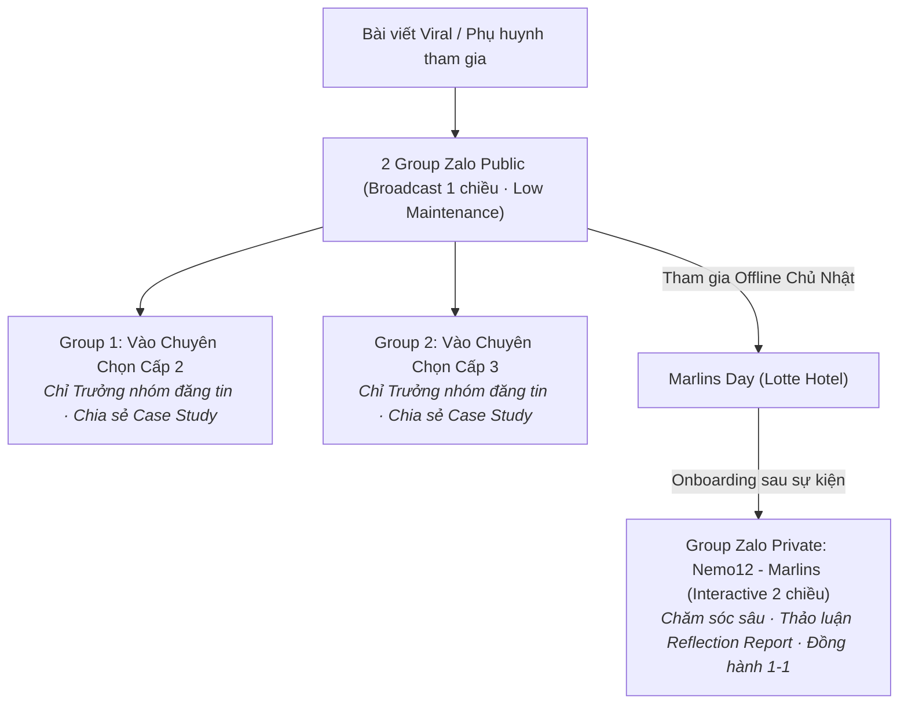
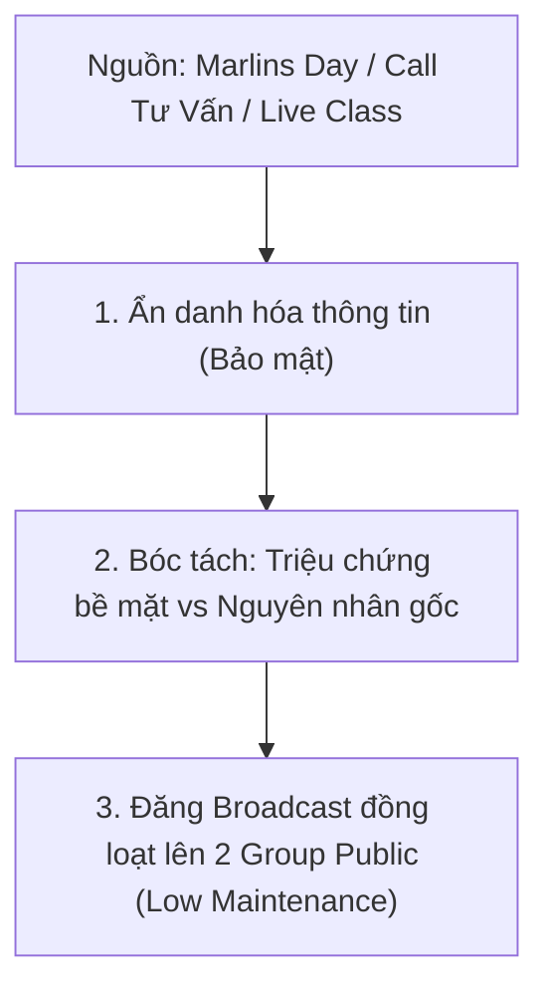

# P02 · Community Playbook

> **Quy trình vận hành hệ thống Group Zalo đa tầng (2 Broadcast Public + 1 Private Interactive) nuôi dưỡng niềm tin và chăm sóc sâu.**  
> **Triết lý:** *"Automate the evidence. Humanize the meaning."*

---

## Metadata Header
* **Objective:** Biến hệ thống Group Zalo cộng đồng thành không gian nuôi dưỡng niềm tin (Trust Building), phân tách đối tượng linh hoạt và vận hành tinh gọn.
* **Trigger:** Định kỳ hàng tuần (Thứ 2 chuẩn bị case, Thứ 3 & Thứ 5 phát sóng Public; Chủ Nhật đón tiếp phụ huynh Marlins Day vào Private).
* **Standard Time:** 25 phút / tuần (15p soạn Case Study + 10p gửi Broadcast đồng loạt).
* **Target Audience:** Phụ huynh quan tâm ôn thi Chuyên Toán/Lập trình Cấp 2, Cấp 3 và phụ huynh thân thiết Marlins.
* **Owner:** Mentor & System.
* **Output:** 1–2 bài Case Study tuần trên 2 Group Public + Phiên chăm sóc chuyên sâu trên Group Private Marlins.

---

<details open>
<summary><h3>Community Architecture</h3></summary>



| Loại Group | Tên Group & Link | Chế độ gửi tin | Trọng tâm nội dung & Hoạt động |
| :--- | :--- | :---: | :--- |
| **🌐 Public Group 1** | **Nemo12 - Vào Chuyên Chọn Cấp 2** | 📢 **Broadcast**<br>*(Chỉ Admin nhắn)* | • Nội dung chia sẻ chung với Group 2 (Case Study tuần, góc nhìn tâm lý, thông báo Marlins Day).<br>• Phân tách tệp phụ huynh cấp 2 để dễ quản trị danh sách. |
| **🌐 Public Group 2** | **Nemo12 - Vào Chuyên Chọn Cấp 3** | 📢 **Broadcast**<br>*(Chỉ Admin nhắn)* | • Nội dung chia sẻ chung với Group 1 (Case Study tuần, góc nhìn tâm lý, thông báo Marlins Day).<br>• Phân tách tệp phụ huynh cấp 3 để dễ quản trị danh sách. |
| **🔒 Private Group** | **Nemo12 - Marlins**<br>[Link Private](https://zalo.me/g/6zdmxy3dtjwzy7r5iscs) | 💬 **Interactive**<br>*(Mở chat 2 chiều)* | • Thảo luận chuyên sâu về **Reflection Report** sau Marlins Day.<br>• Phụ huynh tự do đặt câu hỏi, chia sẻ trăn trở gia đình.<br>• Mentor & Host đồng hành và chăm sóc cá nhân hóa. |

</details>

---

<details open>
<summary><h3>Case Study Engine</h3></summary>

Quy chuẩn chuyển hóa dữ liệu quan sát thực tế thành **Serial Case Study Ẩn Danh** đăng đồng thời trên 2 Group Public:



#### Công Thức Bóc Tách "Khám Bệnh":
* **Triệu chứng phụ huynh thấy (Symptom):** *"Con lớp 8, mẹ bảo lười học, không chịu làm bài tập, điểm toán tụt dốc..."*
* **Khám bệnh ra sự thật (Root Cause):** Hệ thống Nemo12 soi ra con không hề lười, mà bị **hổng kiến thức Bất đẳng thức & Biến đổi đại số từ tận kỳ 2 Lớp 7**, dẫn tới việc lên lớp 8 nghe giảng như "vịt nghe sấm" và sinh ra phản ứng phòng vệ là buông xuôi.
* **Kê đơn & Chuyển biến (Prescription):** Lộ trình vá đúng mắt xích bị hổng trong 3 tuần ➔  Con tự tin lấy lại nhịp học.

</details>

---

<details open>
<summary><h3>📋 SOP Steps</h3></summary>

| Giai đoạn | Thao tác chi tiết | Người phụ trách | Chu kỳ & Thời lượng |
| :--- | :--- | :--- | :---: |
| **1. Thu thập & Chọn Case** | • Trích xuất 1 case điển hình từ nhật ký Marlins Day, Call 1-1 hoặc Live Class.<br>• Ẩn danh 100% tên học sinh và thông tin gia đình. | Hồng | Thứ 2 hàng tuần (15p) |
| **2. Đăng Broadcast lên 2 Group Public** | • Đăng bài Case Study đồng loạt vào 2 Group Public (*Vào Chuyên Chọn Cấp 2 & Cấp 3*).<br>• Chế độ chỉ Admin nhắn tin giúp vận hành cực kỳ tinh gọn, không tốn thời gian kiểm duyệt chat. | Anh Đắc (Host) | Thứ 3 & Thứ 5 (10p) |
| **3. Vận hành Group Private Marlins** | • Sau sự kiện Marlins Day (17h00 Chủ Nhật), add phụ huynh tham gia vào Group Private.<br>• Đăng bài tổng hợp Reflection, mở không gian chat 2 chiều để tương tác thân mật với các bố mẹ. | Anh Đắc & Hồng | Chiều CN & Thứ 2 (20p) |
| **4. Đồng hành & Lắng nghe Private** | • Trực tiếp trả lời, tâm sự và tháo gỡ băn khoăn cho các phụ huynh trong nhóm Private. | Toàn team | Hàng ngày |

</details>

---

<details>
<summary><h3>💬 Content Templates</h3></summary>

#### Mẫu 1: Bài Đăng Broadcast Cho 2 Group Public (Không CTA)
```text
[GÓC KHÁM BỆNH HỌC TẬP #CASE_08] 
"Mẹ bảo con lười, nhưng khi khám ra thì sự thật lại hoàn toàn khác..."

Chào các bố mẹ trong group Nemo12!

Tuần vừa rồi trong buổi Marlins Day, em có gặp một người mẹ rất trăn trở: "Con chị dạo này lười lắm, cứ ngồi vào bàn học Toán là ngáp ngắn ngáp dài, điểm kiểm tra tụt dốc không phanh...".

Nhưng khi đưa con vào hệ thống Nemo12 để "khám" chi tiết từng mắt xích tư duy, kết quả làm cả mẹ lẫn con đều giật mình:
👉 Con KHÔNG HỀ LƯỜI.
👉 Điểm nghẽn thực sự: Con bị hổng đúng phần "Biến đổi đại số & Bất đẳng thức" từ học kỳ trước. 

Vì mắt xích đó bị gãy, nên khi học đến phần phân thức phức tạp, con hoàn toàn không theo kịp thầy cô trên lớp. Cảm giác bất lực kéo dài khiến con chọn cách "buông xuôi" để đỡ bị cảm giác thất bại — điều mà người lớn chúng ta rất dễ quy chụp thành chữ "LƯỜI".

💡 Bài học rút ra: Đừng vội mắng con khi điểm số tụt dốc. Hãy tìm đúng mắt xích kiến thức bị đứt gãy để nối lại cho con trước!
Chúc các bố mẹ một tuần mới nhiều năng lượng tích cực bên con!
```

#### Mẫu 2: Bài Đăng Dành Riêng Cho Group Private (Nemo12 - Marlins)
```text
Chào các bố mẹ trong gia đình Nemo12 - Marlins! 🌿

Sau buổi gặp gỡ Marlins Day chiều Chủ Nhật vừa rồi tại Sky Lounge Lotte Hotel, em và bạn Hồng có ngồi lại để hoàn thiện bản Reflection Report. 

Điều đọng lại sâu sắc nhất với team là chia sẻ của ba mẹ về "Khoảng cách thế hệ khi con bước vào tuổi dậy thì". Chúng ta ai cũng muốn tốt cho con, nhưng đôi khi sự kỳ vọng vô tình tạo thành một bức tường vô hình...

Team đã tổng hợp lại 3 góc nhìn quan sát quan trọng nhất từ buổi gặp vừa rồi. Mời cả nhà cùng đọc và chia sẻ thêm cảm nhận, tâm sự của mình vào nhóm nhé ạ!
```

</details>

---

<details>
<summary><h3>💡 Do's & Don'ts</h3></summary>

#### ✅ Do's (Nên làm)
* **Khóa chat ở 2 Group Public:** Giữ đúng thiết lập "Chỉ Trưởng/Phó nhóm gửi tin nhắn" để duy trì chất lượng thông tin sạch sẽ, tránh spam quảng cáo và giảm thiểu chi phí quản trị (Low Maintenance).
* **Mở tương tác ở Group Private:** Tạo không gian thân mật, tôn trọng để các phụ huynh đã đi offline thoải mái giãi bày tâm tư.
* **Kể chuyện thật, việc thật:** Dùng 100% dữ liệu quan sát thật từ Marlins Day, các buổi call tư vấn và Live Class.
* **Tôn trọng cảm xúc của bố mẹ:** Luôn chia sẻ với tinh thần gỡ rối, không phán xét cách nuôi dạy con.

#### ❌ Don'ts (Không được làm)
* **Không mở chat đại trà ở Public Group:** Tránh để các nhóm cộng đồng hàng nghìn người thành nơi gửi link rác, tin nhắn dạo gây phiền hà cho phụ huynh.
* **Không chèn bất kỳ CTA bán hàng nào:** Tuyệt đối không gắn link kêu gọi mua hàng, không chèn link phễu hay ép phụ huynh làm bài test.
* **Không biến group thành chợ rao vặt:** Cấm đăng các banner khuyến mãi, giảm giá sốc, chèo kéo đóng học phí kiểu telesale.
* **Không bịa đặt câu chuyện:** Tuyệt đối không tự bịa ra các case ảo thiếu logic sư phạm.

</details>

---

<details>
<summary><h3>📊 Assessment Rubrics</h3></summary>

Đánh giá chất lượng vận hành Hệ thống Community Group Zalo theo 3 tiêu chuẩn phổ quát (Thang đo L1 – L5, **L3 là Definition of Done ⭐**):

| Trụ Cột Đánh Giá | L1 (Chưa Đạt) | L2 (Cơ Bản) | L3 (Đạt Chuẩn - DoD ⭐) | L4 (Tốt) | L5 (Xuất Sắc) |
| :--- | :--- | :--- | :--- | :--- | :--- |
| **1. Execution & Compliance** | Quên khóa chat ở nhóm Public để spam tràn lan; không đăng case tuần; bỏ rơi nhóm Private. | Đăng bài thất thường, nội dung sao chép qua loa, chưa phân biệt rõ cách chăm sóc nhóm Private. | **Khóa chat 2 nhóm Public chuẩn xác (Low Maintenance); đăng đều đặn 1 case/tuần; nhóm Private chăm sóc ấm áp; 100% không CTA bán hàng.** | Vận hành cực kỳ tinh gọn, tiết kiệm thời gian; nội dung case hấp dẫn, tạo độ tin cậy tự nhiên cao. | Hệ thống cộng đồng vận hành tự động mượt mà, trở thành kênh lan tỏa tri thức cốt lõi của thương hiệu. |
| **2. Insight & Diagnosis Depth** | Phân tích hời hợt, quy chụp nguyên nhân cảm tính, không chỉ ra được mắt xích gãy. | Chỉ ra được lỗi sai nhưng chưa thuyết phục về mặt phương pháp sư phạm. | **Bóc tách chuẩn xác giữa Triệu chứng bề mặt vs Nguyên nhân gốc rễ; đưa ra bài học nhân văn, thực tế cho cha mẹ.** | Insight sắc sảo, đánh trúng điểm mù tâm lý của đại đa số phụ huynh có con học cấp 2/3. | Phụ huynh đọc case thấy hình ảnh con mình trong đó và thay đổi hoàn toàn thái độ đồng hành cùng con. |
| **3. Trust & Organic Connection** | Phụ huynh rời nhóm vì cảm thấy bị làm phiền hoặc bị bán hàng lộ liễu. | Phụ huynh đọc bài nhưng chỉ im lặng, chưa có sự gắn kết cảm xúc. | **Phụ huynh tin tưởng, đón đọc bài chia sẻ; phụ huynh nhóm Private chủ động chia sẻ tâm sự sâu sắc với Mentor.** | Nhiều phụ huynh nhóm Private chủ động cảm ơn; tự nguyện giới thiệu bạn bè tham gia sự kiện Marlins Day. | Nuôi dưỡng niềm tin tuyệt đối; cộng đồng tự vận hành và lan tỏa uy tín giáo dục của Nemo12 một cách bền vững. |

</details>

---

<details>
<summary><h3>❓ Strategic FAQ</h3></summary>

#### 📉 Nhóm 1: Về Tương Tác & Độ "Sống" Của Cộng Đồng (Community Engagement)
* **Q1:** *"Group Zalo khóa chat 1 chiều thì có khác gì kênh thông báo Zalo OA hay Fanpage đâu? Phụ huynh vào một thời gian thấy im ắng sẽ bấm 'Tắt thông báo' hoặc rời nhóm thì sao?"*  
  👉 **A:** Phụ huynh bận rộn rất ghét bị 'ting ting' bởi hàng trăm tin nhắn rác. Khóa chat giữ cho nhóm sạch sẽ, mỗi tin nhắn gửi đi đều là 1 bài Case Study có giá trị thực sự cao (tỷ lệ giữ chân Retention nhóm Zalo Broadcast thực tế cao hơn nhóm mở chat 60%). Phụ huynh muốn tương tác sẽ nhắn tin riêng với Admin hoặc đăng ký tham gia Marlins Day để vào nhóm Private.
* **Q2:** *"Sao nội dung của 2 nhóm Cấp 2 và Cấp 3 lại chia sẻ chung? Tâm lý cha mẹ có con thi Chuyên Cấp 2 khác hoàn toàn với cha mẹ có con thi Cấp 3, gửi chung bài có bị lệch tệp không?"*  
  👉 **A:** Bản chất tư duy logic (Toán học & Lập trình) và các điểm mù tâm lý (hổng mắt xích kiến thức, phản xạ buông xuôi) có tính quy luật chung. Tuy nhiên, việc tách 2 group là để chuẩn bị sẵn tệp phân loại (Segmentation) khi cần gửi các thông báo đặc thù về kỳ thi Chuyên từng cấp mà không làm phiền nhóm còn lại.

#### 🎯 Nhóm 2: Về Chuyển Đổi & Đo Lường Hiệu Quả (Acquisition & Funnel)
* **Q3:** *"Hiện tại nguồn phụ huynh mới đổ vào 2 Group Public này từ đâu? Ai là người kéo mem và mục tiêu KPI mỗi tháng là bao nhiêu phụ huynh mới?"*  
  👉 **A:** Nguồn đổ vào từ: (1) Bài viết viral trên Facebook cá nhân Mentor ([P01]), (2) Lời mời giới thiệu từ phụ huynh cũ (Referral), (3) Các bài chia sẻ chuyên môn trên diễn đàn. Mục tiêu không chạy theo số lượng ảo mà nhắm vào chất lượng phụ huynh thực sự quan tâm đến phương pháp học bản chất.

#### 🛡️ Nhóm 3: Về Rủi Ro Bảo Mật & Đạo Đức Sư Phạm (Ethics & Risk)
* **Q4:** *"Nếu một phụ huynh trong lớp đọc bài 'khám bệnh' thấy giống hệt chuyện nhà mình rồi nhắn tin chất vấn: 'Sao thầy lại đem chuyện con tôi lên kể cho cả thiên hạ?', em xử lý thế nào?"*  
  👉 **A:** Tuân thủ quy chuẩn [DAR 11]: Các case study luôn được tổng hợp/trộn lẫn dữ liệu từ nhiều buổi học khác nhau và hoàn toàn tập trung vào phân tích quy luật tâm lý/học thuật, tuyệt đối không nêu chi tiết định danh. Mentor luôn gửi lời cảm ơn và giải thích chân thành rằng đây là bài học chung giúp hàng trăm cha mẹ khác thấu hiểu con mình hơn.

</details>

---

<details open>
<summary><h3>🏛️ Decision Logs</h3></summary>

Tổng hợp các quyết định kiến trúc và đánh giá CMMI bảo vệ cho phương pháp tiếp cận của Playbook P02:

#### 📌 DAR 10: Kiến Trúc Phân Tầng Group Zalo: Broadcast Public vs Interactive Private
* **Bối cảnh:** Vận hành hệ thống cộng đồng phụ huynh lớn mà không làm loãng thông tin và không tốn nhân sự trực mod 24/7.
* **Ma trận đánh giá (CMMI Evaluation):**
  * *Option A (Mở chat 100% tất cả các nhóm):* 23/50 điểm — Ô nhiễm tin nhắn rác, phụ huynh tắt thông báo/rời nhóm hàng loạt.
  * *Option B (Chỉ dùng Fanpage/Zalo OA):* 27/50 điểm — Mất đi cảm giác ấm áp và gần gũi của Group cộng đồng.
  * *Option C (Mô hình phân tầng: 2 Broadcast Public + 1 Private Interactive) ⭐:* **48/50 điểm (Approved)**.
* **Quyết định:** Áp dụng mô hình **02 Public Groups cài đặt Broadcast 1 chiều (Low Maintenance, không spam)** để phát Case Study tuần + **01 Private Group (Nemo12 - Marlins) mở chat 2 chiều** cho phụ huynh sau sự kiện Marlins Day để chăm sóc sâu.

</details>

