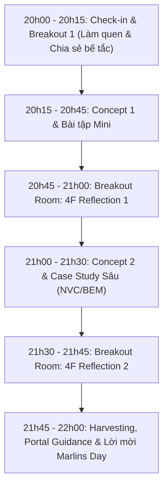

# P03 · Marlins Workshop Playbook

> **Quy trình tổ chức Workshop trực tuyến tương tác cao tối Thứ 5 hàng tuần qua Zoom (120 phút) kết hợp cổng tự học Family Portal.**  
> **Triết lý:** *"Automate the evidence. Humanize the meaning."*

---

## Metadata Header
* **Objective:** Giúp phụ huynh thấu hiểu triết lý giáo dục kiến tạo, tháo gỡ 7 ngộ nhận và tạo cầu nối đưa gia đình đến Marlins Day hoặc Trial Class.
* **Trigger:** Định kỳ **20h00 – 22h00 Tối Thứ 5 hàng tuần** qua Zoom.
* **Standard Time:** 120 phút Live Zoom tương tác; chuẩn bị ≤  30 phút; hậu kỳ ≤  15 phút.
* **Target Audience:** Phụ huynh từ 3 Group Zalo, phụ huynh theo dõi Mentor và phụ huynh học sinh hiện tại.
* **Owner:** Host: Anh Đắc, Co-Host: Mentor.
* **Output:** 1 buổi Zoom chuyển hóa chất lượng cao + Cập nhật học liệu trắc nghiệm lên Family Portal.

---

<h3>Core Mindset</h3>

> **"Không thuyết giảng một chiều — Chuyển hóa bằng trải nghiệm & Tự phản tư (4F Reflection)."**

Phụ huynh không cần nghe thêm những bài giảng lý thuyết hàn lâm xa rời thực tế. Họ cần một **không gian an toàn để soi chiếu bản thân, mổ xẻ những bế tắc hàng ngày khi kèm con học và tìm thấy công cụ thực hành cụ thể**.

| Trọng tâm | Định hướng thực thi |
| :--- | :--- |
| **High-Commitment Culture** | Thiết lập tiêu chuẩn tham gia nghiêm túc ngay từ cửa phòng Zoom (Bật cam/mic 100%). Ai không sẵn sàng hiện diện sẽ xem tài liệu tự học trên Portal. |
| **Concept Deep-Dive** | Mỗi buổi chọn đúng **1 Concept / 1 Ngộ nhận** trong Thư viện để đào thật sâu qua case study thực tế của học sinh Nemo12 (Một concept có thể đào nhiều lần ở các lứa tuổi khác nhau). |
| **Zero Hard-Selling** | Không biến Workshop thành buổi telesale chèo kéo khóa học. Giá trị tri thức và sự thấu cảm tự khắc chuyển hóa phụ huynh thành người đồng hành tại Marlins Day. |

---

<h3>📚 Concept Repository</h3>

Thư viện các khái niệm và trường phái sư phạm được khai thác luân phiên trong các buổi Workshop tối Thứ 5:

#### 1. Bảy Câu Đáng Đổi Cách Nghĩ (7 Mindset Shifts & Misconceptions)
1. **Điểm cao ≠  Hiểu sâu:** Bốn cách đạt điểm cao mà đầu óc rỗng tuếch (Học vẹt, học tủ, luyện mẹo, áp lực gia đình).
2. **Làm nhiều bài ≠  Học tốt:** Khối lượng bài tập là thứ dễ đo nhất nhưng cũng dễ gây ảo tưởng và triệt tiêu hứng thú tự học nhất.
3. **Test không phải để phán xét learner:** Một bài kiểm tra là câu hỏi dành cho hệ thống dạy học, không phải bản án kết tội đứa trẻ.
4. **Mọi learner model đều có uncertainty:** Một hệ thống dám nói *"Tôi chưa biết rõ điểm này ở con"* đáng tin cậy hơn hệ thống lúc nào cũng phán số liệu chắc nịch.
5. **Không phải cuộc thi nào cũng đáng tham gia:** Mỗi cuộc thi đều có cái giá phải trả về thời gian và tâm lý. Câu hỏi then chốt: *"Nó mua được gì thực chất cho sự trưởng thành của con?"*
6. **Mục tiêu cuối cùng không chỉ là thi đỗ:** Đỗ vào trường chuyên/chọn là một cánh cửa mở ra, không phải đích đến. Chuyện gì xảy ra với tâm lý và năng lực tự học của con sau khi cánh cửa đó mở?
7. **Student Portrait quan trọng hơn danh sách KPI:** Cái gì đo được sẽ được tối ưu hóa. Phải cẩn trọng tối đa với thứ mình chọn để đo lường con trẻ.

#### 2. Các Trường Phái Sư Phạm Ứng Dụng
* **Constructivism (Thuyết Kiến tạo) & Inquiry-Based Learning:** Dạy con bằng cách đặt câu hỏi gợi mở, để con tự xây dựng tri thức thay vì nhồi nhét đáp án có sẵn.
* **Mastery Learning & AoPS (Art of Problem Solving):** Học sâu bản chất, làm chủ từng nấc thang tư duy logic trước khi bước sang chủ đề mới.
* **Competency-Based & IB (Tú tài Quốc tế):** Đo lường sự tiến bộ dựa trên năng lực giải quyết vấn đề thực tế, tư duy phản biện và phẩm chất cá nhân.

#### 3. Bộ Công Cụ Đồng Hành Cùng Con Tại Nhà
* **NVC (Nonviolent Communication):** 4 bước giao tiếp thấu cảm không phán xét, không áp đặt, không bạo lực ngôn từ với con.
* **BEM Model:** Thấu hiểu sự tương hỗ giữa *Behavior (Hành vi)* ≤ ftrightarrow *Experience (Trải nghiệm)* ≤ ftrightarrow *Mental Model (Mô hình tư duy)* của trẻ.
* **Building 21 & Family Learning Environment:** Cách kiến tạo không gian và nhịp sinh hoạt nuôi dưỡng tính tự giác tự học tại nhà.

---

<h3>⏱️ Session Agenda</h3>

Cấu trúc chuẩn 120 phút (20h00 – 22h00) thiết kế theo mô hình **Double Reflection Loops**:

| Khung giờ | Nội dung hoạt động | Hình thức | Mục tiêu & Phương pháp |
| :---: | :--- | :---: | :--- |
| **20:00 – 20:15** (15') | **Warm-up & Breakout Check-in** | Nhóm nhỏ (3-4 người) | • Điểm danh Cam/Mic. • Phụ huynh chia sẻ 1 "cơn đau đầu / cảm giác bất lực" gần nhất khi kèm con học tại nhà. |
| **20:15 – 20:45** (30') | **Chuyên đề 1 & Bài tập Mini** | Toàn phòng | • Anh Đắc mổ xẻ 1 Ngộ nhận trọng tâm. • Giao bài tập tình huống thực tế (tình huống con lười học / trốn tránh bài khó). |
| **20:45 – 21:00** (15') | **Breakout 4F Reflection 1** | Nhóm nhỏ | Thực hành khung **4F**: • **Facts:** Sự thật con đã làm gì? • **Feelings:** Cảm xúc lúc đó của bố/mẹ là gì? • **Findings:** Ngộ nhận nào đang chi phối phản ứng của mình? • **Future:** Lần tới sẽ phản ứng khác đi như thế nào? |
| **21:00 – 21:30** (30') | **Chuyên đề 2 & Case Study Thực Chiến** | Toàn phòng | • Mentor Hồng chia sẻ góc nhìn sư phạm thực tế từ lớp học Nemo12. • Hướng dẫn công cụ NVC / BEM xử lý triệt để bế tắc. |
| **21:30 – 21:45** (15') | **Breakout 4F Reflection 2** | Nhóm nhỏ | Áp dụng giải pháp mới vào đúng trường hợp cụ thể của con mình; các bố mẹ góp ý chéo cho nhau. |
| **21:45 – 22:00** (15') | **Harvesting & Call To Action** | Toàn phòng | • Đại diện 2 phụ huynh chia sẻ bài học tâm đắc nhất. • Hướng dẫn làm bài tập theo pace riêng trên **Family Portal**. • Mời tham gia **Marlins Day** chiều Chủ Nhật tại Lotte Hotel. |

---

<h3>📋 SOP Steps</h3>

| Giai đoạn | Thao tác Hệ thống (System Action via Portal/Zalo) | Thao tác Con người (Host & Mentor Action) | Thời gian chuẩn |
| :--- | :--- | :--- | :---: |
| **1. Pre-Workshop** *(Trước 72h - 24h)* | • Tự động gửi thông báo chủ đề tuần và form đăng ký vào 3 Group Zalo. • Nhắc nhở quy định bất biến: **100% Bật Cam/Mic suốt 120 phút**. | • Host & Mentor thống nhất Concept trọng tâm và chuẩn bị 2 bài tập tình huống. • Duyệt danh sách phụ huynh đăng ký. | ≤  30 phút |
| **2. In-Workshop** *(20h00 - 22h00)* | • Phân phòng tự động (Breakout Rooms 3-4 phụ huynh/phòng theo [DAR 11]). • Chuyển các tài khoản tắt cam vào Main Room nghe thụ động. | • Host dẫn dắt nội dung, điều phối năng lượng phòng Zoom. • Mentor Hồng đảo qua các breakout rooms hỗ trợ phụ huynh thảo luận 4F. | 120 phút |
| **3. Post-Workshop** *(Sáng hôm sau)* | • Cập nhật bài tập trắc nghiệm và case study lên mục **Parent Self-Paced** trên Family Portal ([DAR 12]). • Gửi thông điệp cảm ơn và Infographic tóm tắt vào 3 Group Zalo. | • Mentor nhắn tin Zalo cảm ơn các phụ huynh đã phát biểu tích cực. • Phân luồng phụ huynh có nhu cầu gặp chuyên sâu để gửi thư mời **Marlins Day**. | ≤  15 phút |

---

<h3>💡 Do's & Don'ts</h3>

#### ✅ Do's (Nên làm)
* **Tôn trọng sự an toàn tâm lý (Psychological Safety):** Tạo không gian để cha mẹ dám thừa nhận sai lầm và sự bất lực của mình mà không sợ bị phán xét.
* **Giữ vững kỷ luật Cam/Mic:** Nghiêm túc duy trì văn hóa hiện diện trọn vẹn để nâng cao chất lượng thảo luận nhóm theo [DAR 11].
* **Đưa ra công cụ hành động tức thì:** Sau mỗi buổi, phụ huynh phải có ít nhất 1 câu hỏi hoặc 1 mẫu câu NVC cụ thể để về nói chuyện ngay với con vào sáng hôm sau.
* **Khuyến khích tự học theo pace riêng:** Nhắc phụ huynh truy cập Family Portal để tự làm bài tập trắc nghiệm và đo lường sự chuyển biến của chính mình theo [DAR 12].

#### ❌ Don'ts (Không được làm)
* **Không biến thành buổi bán hàng (Zero Hard-selling):** Cấm chào bán khóa học, cấm đưa bảng giá hoặc gây áp lực chốt sale trong phòng Zoom.
* **Không độc thoại slide:** Cấm Host nói liên tục quá 30 phút mà không có bài tập tương tác hoặc thảo luận breakout.
* **Không làm phụ huynh cảm thấy tội lỗi:** Tránh dùng ngôn từ chỉ trích cách dạy con của phụ huynh; luôn tiếp cận bằng sự đồng cảm và thấu hiểu bối cảnh.

---

<h3>📊 Assessment Rubrics</h3>

Đánh giá chất lượng vận hành Marlins Workshop theo 3 trụ cột chuẩn hóa (Thang đo L1 – L5, **L3 là Definition of Done ⭐**):

| Trụ Cột Đánh Giá | L1 (Chưa Đạt) | L2 (Cơ Bản) | L3 (Đạt Chuẩn - DoD ⭐) | L4 (Tốt) | L5 (Xuất Sắc) |
| :--- | :--- | :--- | :--- | :--- | :--- |
| **1. Execution & Discipline** | Phòng Zoom lộn xộn, nhiều người tắt cam, trễ giờ, breakout room không hoạt động. | Tổ chức đúng giờ nhưng không kiểm soát được cam/mic; thảo luận nhóm gượng gạo. | **100% bật cam/mic; phân phòng breakout mượt mà; tuân thủ đúng khung 120 phút.** | Không khí sôi nổi, điều phối breakout nhịp nhàng; Mentor hỗ trợ tháo gỡ bế tắc nhóm xuất sắc. | Buổi workshop trở thành một không gian chuyển hóa tâm lý sâu sắc; cộng đồng gắn kết mạnh mẽ. |
| **2. Insight & Transformation Quality** | Nói lý thuyết suông, không có bài tập tình huống, phụ huynh không đọng lại gì. | Nội dung còn chung chung, chưa chạm vào nỗi đau thật của việc kèm con học. | **Mổ xẻ trúng 1 Concept ngộ nhận; phụ huynh hoàn thành 2 vòng 4F Reflection tại chỗ.** | Phụ huynh vỡ òa nhận thức, nhiều bố mẹ xúc động chia sẻ câu chuyện gia đình thật. | Tạo ra bước ngoặt tư duy lâu dài trong cách cha mẹ giao tiếp và tôn trọng con cái. |
| **3. Conversion & Parent Engagement** | Phụ huynh rời phòng sớm > 50%; không ai quan tâm đến bước tiếp theo. | Phụ huynh nghe thụ động, ít tương tác trong phần Q&A và bài tập 4F. | **≥ 75% phụ huynh ở lại đến cuối; có phụ huynh chủ động đăng ký tham gia Marlins Day / Trial Class.** | Nhiều phụ huynh truy cập Portal làm bài tập tự học và đề xuất mời bạn bè tham gia buổi sau. | Tỷ lệ chuyển đổi tự nhiên sang Marlins Day và Trial Class đạt mức kỷ lục mà không cần sale. |

---

<h3>❓ Strategic FAQ</h3>

#### ⏱️ Nhóm 1: Về Thời Lượng & Tải Trọng Đội Ngũ (Capacity & Burnout)
* **Q1:** *"Tối Thứ 5 làm 120 phút từ 20h00 đến 22h00, rồi Chủ Nhật lại làm Marlins Day 3 tiếng tại Lotte Hotel. Tuần nào cũng làm cả hai sự kiện trực tiếp như vậy thì Host và Mentor có bị kiệt sức (burnout) không?"*  
  👉 **A:** Playbook đã chuẩn hóa sẵn Thư viện Concepts (7 ngộ nhận & 3 trường phái) và Kịch bản Double Loops 4F cố định. Host không cần soạn slide mới mỗi tuần mà chỉ chọn 1 case study thực tế từ lớp học để mổ xẻ. Thời gian chuẩn bị trước giờ chỉ ≤  30 phút. Hai hoạt động bổ trợ cho nhau: Workshop online là phễu gieo nhận thức, Marlins Day offline là nơi gặt hái gắn kết sâu.
* **Q2:** *"120 phút vào tối Thứ 5 có quá dài với các ông bố bà mẹ bận rộn không? Sao không rút xuống 60 phút?"*  
  👉 **A:** Nếu chỉ 60 phút thì chỉ đủ thời gian thuyết giảng 1 chiều (Webinar truyền thống), người nghe nghe xong sẽ quên ngay. Cần 120 phút vì có 2 vòng Breakout Rooms (4F Reflection) để cha mẹ tự tay giải bài toán của chính gia đình mình. Trải nghiệm tự làm và tự vỡ òa mới tạo ra sự chuyển hóa thực chất.

#### 🎯 Nhóm 2: Về Tỷ Lệ Chuyển Đổi & Đo Lường Hiệu Quả (Conversion & Funnel)
* **Q3:** *"Tổ chức Workshop miễn phí hoàn toàn, không cho bán hàng (Zero Hard-selling), vậy đo lường ROI của buổi tối Thứ 5 này bằng con số nào cụ thể?"*  
  👉 **A:** Đo lường bằng 2 chỉ số chuyển đổi phễu: (1) Số lượng phụ huynh đăng ký đi Marlins Day offline chiều Chủ Nhật (Mục tiêu ≥  30\% người tham gia), và (2) Số lượng phụ huynh đăng ký cho con học Trial Class 2 buổi ngay trong 48h sau sự kiện.
* **Q4:** *"Lỡ phụ huynh chỉ vào nghe 'chùa' kiến thức từ tuần này qua tuần khác mà không bao giờ đăng ký cho con học thì sao?"*  
  👉 **A:** Đó chính là vẻ đẹp của mô hình giáo dục đồng hành. Phụ huynh nghe nhiều và chuyển hóa sẽ trở thành những "Đại sứ tự nguyện" (Brand Advocates) tích cực nhất trong 3 Group Zalo cộng đồng, tự động giới thiệu các phụ huynh khác cho Nemo12.

#### 👥 Nhóm 3: Về Rủi Ro Vận Hành Phòng Zoom (Discipline & Facilitation Risk)
* **Q5:** *"Nếu chia Breakout Room 3-4 người mà rơi vào phòng toàn phụ huynh nhút nhát, không ai chịu mở lời thì xử lý thế nào để không bị 'chết' không khí?"*  
  👉 **A:** Trong SOP Bước 2 đã quy định: Mentor Hồng và Co-host liên tục đảo qua các phòng. Đồng thời, mỗi phòng đều có sẵn File bài tập tình huống 4F rõ ràng (Facts - Feelings - Findings - Future). Bố mẹ chỉ cần lần lượt đọc câu trả lời theo đúng 4 gạch đầu dòng có sẵn là cuộc trò chuyện tự nhiên diễn ra trôi chảy.

---

<h3>🏛️ Decision Logs</h3>

Tổng hợp các quyết định kiến trúc và đánh giá CMMI bảo vệ cho phương pháp tiếp cận của Playbook P03:

#### 📌 DAR 06: Định Vị Workshop Trực Tuyến & Tự Học: Marlins Workshop vs Khóa Học Phụ Huynh 4 Buổi
* **Bối cảnh:** Giúp phụ huynh thấu hiểu phương pháp đồng hành mà không làm kiệt sức đội ngũ khi đã có Marlins Day offline.
* **Ma trận đánh giá (CMMI Evaluation):**
  * *Option A (Mở Khóa học 4 buổi trả phí):* 26/50 điểm — Rào cản đăng ký cao, làm kiệt sức đội ngũ vận hành.
  * *Option B (Chỉ làm Webinar thuyết giảng 1 chiều):* 25/50 điểm — Tương tác kém, người nghe quên ngay sau buổi học.
  * *Option C (Interactive Live Tối T5 + Tự học theo Pace riêng trên Portal) ⭐:* **50/50 điểm (Approved)**.
* **Quyết định:** Tổ chức **Marlins Workshop định kỳ hàng tuần (Tối Thứ 5, 20h00 - 22h00)** theo hình thức tương tác cao (bắt buộc bật cam/mic, 2 vòng 4F Reflection), kết hợp nền tảng **Học theo Pace riêng trên Family Portal**; tuyệt đối không mở khóa học trả phí cồng kềnh.

#### 📌 DAR 11: Kỷ Luật Bật Cam/Mic & Phân Luồng Phòng Zoom (Cam/Mic Discipline & Waiting Room)
* **Bối cảnh:** Đảm bảo chiều sâu thực hành 4F Reflection trong phòng Zoom 120 phút mà không làm mất lòng phụ huynh bận rộn.
* **Ma trận đánh giá (CMMI Evaluation):**
  * *Option A (Bắt buộc 100%, ai tắt cam thì kick ra ngoài):* 29/50 điểm — Gây ức chế và làm mất tệp phụ huynh tiềm năng bận rộn.
  * *Option B (Thả nổi cam/mic):* 23/50 điểm — Phòng breakout bị "chết" không khí vì không ai mở lời.
  * *Option C (Phân luồng 2 tầng: Breakout 4F cho Cam/Mic + Main Room/Portal cho tắt cam) ⭐:* **48/50 điểm (Approved)**.
* **Quyết định:** Áp dụng mô hình **Phân luồng 2 tầng**: Phụ huynh bật Cam/Mic được xếp vào Breakout Rooms thực hành 4F chuyên sâu; phụ huynh xin phép tắt cam được giữ ở Main Room nghe thụ động và điều hướng sang tự học trên Family Portal.

#### 📌 DAR 12: Đóng Gói Học Liệu Phụ Huynh Tự Học (Parent Self-Paced LMS Micro-Modules)
* **Bối cảnh:** Giúp phụ huynh tiếp cận lộ trình chuyển hóa nhận thức giáo dục dù không thể tham gia Live Zoom tối Thứ 5 đều đặn.
* **Ma trận đánh giá (CMMI Evaluation):**
  * *Option A (Gửi toàn bộ Video Record 120 phút):* 24/50 điểm — Video quá dài, phụ huynh không có thời gian xem lại.
  * *Option B (Viết tài liệu PDF cẩm nang dài):* 25/50 điểm — Khô khan, tỷ lệ đọc hết dưới 10%.
  * *Option C (Micro-modules 3–5 phút + Trắc nghiệm tình huống trên Family Portal) ⭐:* **49/50 điểm (Approved)**.
* **Quyết định:** Số hóa Thư viện 7 Ngộ nhận và Bộ công cụ NVC/BEM thành các **Micro-modules 3–5 phút (Video ngắn + Trắc nghiệm tình huống + Mẫu câu thực hành)** trên **Family Portal (`marlins.nemo12.com`)** để cha mẹ tự học theo nhịp riêng.

