# P04 · Marlins Day Playbook

> **Sự kiện offline hàng tuần kết nối chiều sâu với phụ huynh, đối thoại thấu cảm bằng Fishbowl và trải nghiệm thực tế hệ thống Nemo12.**  
> **Triết lý:** *"Automate the evidence. Humanize the meaning."*

---

## Metadata Header
* **Objective:** Giúp phụ huynh tháo gỡ áp lực thi cử, nắm bắt phương pháp đồng hành cùng con và trực tiếp quan sát bằng chứng năng lực trên hệ thống Nemo12.
* **Trigger:** Định kỳ **15h00 – 17h00 Chiều Chủ Nhật hàng tuần** tại Lotte Hotel Hà Nội.
* **Standard Time:** 120 phút đối thoại trực tiếp; chuẩn bị logistics ≤  30 phút.
* **Target Audience:** Phụ huynh quan tâm phương pháp giáo dục bản chất (tối đa 10 phụ huynh/buổi).
* **Owner:** Host: Anh Đắc, Observer & Notes: Mentor Hồng.
* **Output:** Dữ liệu định tính cho Dory Notes + Kết nối phụ huynh vào Group Zalo Private Marlins.

---

<h3>Core Mindset</h3>

> **"Lắng nghe không phán xét — Thấu cảm trước, công nghệ theo sau."**

Marlins Day không phải là một buổi hội thảo bán hàng hay thuyết trình một chiều. **Đây là không gian an toàn để phụ huynh cởi bỏ áp lực, soi chiếu hành trình đồng hành cùng con và trải nghiệm giải pháp công nghệ dưới góc nhìn minh bạch.**

| Priority | Trọng tâm | Ý nghĩa vận hành |
| :--- | :--- | :--- |
| ⭐⭐⭐ | **Tạo Psychological Safety** | Giúp bố mẹ cởi mở chia sẻ những bế tắc, nỗi sợ vô hình và áp lực thi cử của con mà không sợ bị đánh giá. |
| ⭐⭐⭐ | **Phá vỡ định kiến (Misconception Resolution)** | Thông qua format Fishbowl và Reflection, phụ huynh tự nhận ra các điểm nghẽn trong cách thúc ép con học tập. |
| ⭐⭐⭐ | **Chứng minh bằng Dữ liệu sống (Live Evidence)** | Trực tiếp cho phụ huynh xem Nemo12 phân tích lỗ hổng kiến thức học sinh và sắp xếp thứ tự ưu tiên học tập trên màn hình thật. |

---

<h3>Stakeholder Mapping</h3>

| Stakeholder | Job cần giải quyết (JTBD) | Marlins Day mang lại giá trị gì? (Delivered Value) |
| :--- | :--- | :--- |
| **Phụ huynh tham dự** | Tìm phương pháp đúng đắn giúp con tự giác, học hiệu quả và đỗ chuyên Cấp 3 mà gia đình không bị kiệt sức. | Sự đồng cảm từ cộng đồng PH cùng mục tiêu, giải tỏa áp lực, nhìn thấy giải pháp học tập cá nhân hóa rõ ràng qua Nemo12. |
| **Marlins Care / Nemo12** | Thấu hiểu chân dung, nỗi đau và kỳ vọng thật của phụ huynh; chọn lọc các gia đình cùng hệ giá trị để đồng hành. | Dữ liệu định tính sâu sắc cho Dory Sensemaking; mở rộng tệp phụ huynh nòng cốt cho cộng đồng Private. |
| **Học sinh (Gián tiếp)** | Cần cha mẹ thấu hiểu tâm lý lứa tuổi và phương pháp học không gây kiệt quệ tinh thần. | Bố mẹ thay đổi góc nhìn, giảm áp lực kỳ vọng sai lệch và tìm được công cụ học tập đúng đắn cho con. |

---

<h3>Session Agenda</h3>

```mermaid
gantt
    title Timeline Marlins Day (15:00 - 17:00 Chủ Nhật)
    dateFormat  HH:mm
    axisFormat  %H:%M
    section Lịch trình chi tiết
    Warm-up & Ice-breaking (15p)       :15:00, 15m
    Fishbowl Lượt 1 (25p)              :15:15, 25m
    Reflection 1 - Tự làm & Chia sẻ (15p) :15:40, 15m
    Giải lao & Thưởng trà (10p)        :15:55, 10m
    Fishbowl Lượt 2 & Live Demo (35p)  :16:05, 35m
    Reflection 2 & Q&A (20p)           :16:40, 20m
```

| Khung giờ | Thời lượng | Hoạt động cốt lõi | Chi tiết thực thi | Người phụ trách |
| :---: | :---: | :--- | :--- | :--- |
| **15:00 – 15:15** | 15p | **Warm-up & Check-in** | Đón tiếp, gọi đồ uống, tạo không khí ấm cúng, giới thiệu format Fishbowl. | Host & Co-host |
| **15:15 – 15:40** | 25p | **Fishbowl Lượt 1** | Mổ xẻ 1 chủ đề nóng (ví dụ: *Áp lực thi chuyên & Nỗi sợ con tụt lại*). 3-4 PH ngồi vòng trong đối thoại. | Anh Đắc điều phối |
| **15:40 – 15:55** | 15p | **Reflection 1** | Phụ huynh tự điền phiếu phản tư cá nhân (4F Reflection), chia sẻ cặp đôi. | Co-host hỗ trợ |
| **15:55 – 16:05** | 10p | **Tea Break** | Thưởng trà ngắm cảnh thành phố, kết nối tự do giữa các bố mẹ. | Toàn bộ |
| **16:05 – 16:40** | 35p | **Fishbowl 2 & Demo** | Trực tiếp mở màn hình Nemo12 soi dữ liệu lỗ hổng kiến thức thực tế. | Anh Đắc & Hồng |
| **16:40 – 17:00** | 20p | **Wrap-up & Next-step** | Đúc kết thông điệp, mời phụ huynh vào Zalo Private và kết nối 1-1. | Host & Co-host |

---

<h3>SOP Steps</h3>

* **Bước 1: Chuẩn bị trước sự kiện (Pre-Event · Thứ 6 & Thứ 7):**
  * Chốt danh sách ≤  10 phụ huynh tham dự qua Form đăng ký.
  * Gửi tin nhắn Zalo xác nhận địa điểm (Lotte Hotel, Tầng 38 Sky Lounge) và lưu ý gửi xe.
  * Chuẩn bị sẵn 10 bản in Phiếu Phản Tư 4F và 2 laptop kết nối sẵn hệ sinh thái Nemo12.
* **Bước 2: Điều phối sự kiện (In-Event · 15h00 – 17h00 Chủ Nhật):**
  * Tuân thủ nghiêm ngặt khung thời lượng Session Agenda.
  * Co-host Hồng liên tục ghi chép các câu thoại, trăn trở đắt giá của phụ huynh vào sổ Dory Notes.
* **Bước 3: Hậu kỳ & Chăm sóc (Post-Event · Tối Chủ Nhật & Thứ 2):**
  * Gửi lời cảm ơn chân thành và gửi tặng file tổng hợp ảnh/Reflection Report.
  * Mời phụ huynh tham gia **Group Zalo Private: Nemo12 - Marlins** để tiếp tục đồng hành sâu.

---

<h3>Do's & Don'ts</h3>

| Nên Làm (Best Practices / Do's) | Cấm Kỵ (Avoid / Don'ts) |
| :--- | :--- |
| ✅ Lắng nghe 70%, để phụ huynh nói và tự nhận ra bài học. | ❌ Thuyết giảng một chiều, dạy đời hoặc khoe khoang thành tích. |
| ✅ Tôn trọng sự an toàn tâm lý, bảo mật tuyệt đối câu chuyện của gia đình. | ❌ Phán xét cách nuôi dạy con của phụ huynh trước đám đông. |
| ✅ Chứng minh bằng màn hình dữ liệu sống của Nemo12. | ❌ Biến buổi gặp thành màn chèo kéo bán khóa học lộ liễu. |

---

<h3>Assessment Rubrics</h3>

| Trụ Cột Đánh Giá | L1 (Chưa Đạt) | L2 (Cơ Bản) | L3 (Đạt Chuẩn - DoD ⭐) | L4 (Tốt) | L5 (Xuất Sắc) |
| :--- | :--- | :--- | :--- | :--- | :--- |
| **1. Execution** | Tổ chức trễ giờ, không gian ồn ào, thiếu tài liệu. | Đúng giờ nhưng điều phối lúng túng, cháy giáo án. | **Đúng giờ, không gian sang trọng yên tĩnh, điều phối mượt mà theo đúng Agenda 120p.** | Tạo bầu không khí cực kỳ ấm cúng, thấu cảm, 100% phụ huynh hiện diện trọn vẹn. | Sự kiện kiểu mẫu, để lại ấn tượng sâu sắc không thể quên cho từng phụ huynh. |
| **2. Insight Quality** | Không ghi nhận được thông tin gì về phụ huynh. | Chỉ ghi nhận họ tên số điện thoại thông thường. | **Ghi nhận đầy đủ Dory Notes 6 trục về nỗi đau, kỳ vọng và rào cản của từng gia đình.** | Nắm bắt chính xác điểm nghẽn tâm lý sâu kín của từng ông bố bà mẹ. | Chuyển hóa định kiến của phụ huynh ngay trong buổi gặp. |
| **3. Parent Conversion** | Phụ huynh thất vọng bỏ về giữa chừng. | Phụ huynh nghe xong rồi về, không có tương tác sau đó. | **≥  80\% phụ huynh gia nhập Group Zalo Private; ≥  30\% đăng ký Trial Class cho con.** | Phụ huynh chủ động nhắn tin cảm ơn sâu sắc và giới thiệu bạn bè tham gia buổi sau. | Phụ huynh trở thành đại sứ đồng hành trung thành của cộng đồng Marlins. |

---

<h3>Decision Logs</h3>

#### 📌 DAR 04: Mô Hình Tổ Chức Marlins Day: Năng Lực Thường Trực vs Sự Kiện Đột Xuất
* **Bối cảnh:** Lựa chọn giữa việc tổ chức sự kiện hội thảo lớn mỗi quý một lần hay duy trì không gian đối thoại nhỏ hàng tuần.
* **Quyết định chốt:** Duy trì **Marlins Day định kỳ 15h00 – 17h00 Chủ Nhật hàng tuần tại Lotte Hotel với quy mô giới hạn ≤  10 người/buổi**. Đây là năng lực chăm sóc trực tiếp thường trực (**Persistent Capability**) nuôi dưỡng niềm tin chiều sâu.

