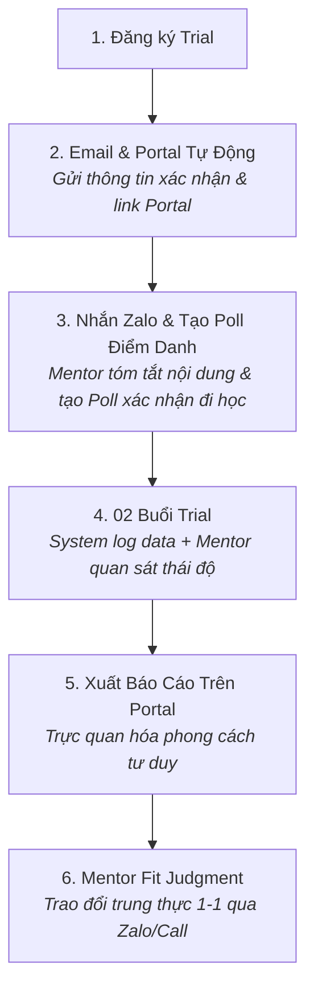

# P05 · Trial Class Playbook

> **Quy trình hỗ trợ phụ huynh đồng hành xuyên suốt 02 buổi học thử từ chuẩn bị, thu thập bằng chứng đến tư vấn độ phù hợp.**  
> **Triết lý:** *"Automate the evidence. Humanize the meaning."*

---

## Metadata Header
* **Objective:** Giúp phụ huynh an tâm chuẩn bị cho con, tự động thu thập bằng chứng học tập và nhận tư vấn trung thực về độ phù hợp.
* **Trigger:** Phụ huynh hoàn tất đăng ký 02 buổi học thử trên hệ thống.
* **Standard Time:** Hệ thống xử lý tức thời; Mentor tư vấn Fit Judgment ≤  15 phút/gia đình.
* **Target Audience:** Phụ huynh và học sinh mới đăng ký tham gia học thử lớp Sư Tử Con / Chuyên Toán.
* **Owner:** Hybrid (System & Mentor).
* **Output:** 02 buổi học thử hoàn tất + Báo cáo Trial Evidence trên Family Portal + Phiên tư vấn Fit Judgment trung thực.

---

<details open>
<summary><h3>Purpose & JTBD</h3></summary>

Giải quyết các bài toán trọng tâm của phụ huynh trong giai đoạn trải nghiệm (JTBD):
* **`F5` (Preparedness):** Phụ huynh và con chuẩn bị đầy đủ về thiết bị, thời gian và tâm lý thoải mái mà không cần gọi điện giải thích thủ công.
* **`E1` (Trust & Relief):** Giảm bớt căng thẳng, không biến 2 buổi học thử thành bài thi khảo sát áp lực.
* **`S3` (Good Educational Choice):** Cung cấp bằng chứng học tập trực quan để phụ huynh tự tin đánh giá độ phù hợp của môi trường giáo dục.
* **`F1` (Accurate Assessment):** Nhận tham vấn trung thực dựa trên năng lực và phong cách tư duy thực tế của học sinh.

</details>

---

<details open>
<summary><h3>SOP Steps</h3></summary>



| Giai đoạn | Hành động Hệ thống (System Action) | Hành động Con người (Mentor Action qua Zalo) | Thời lượng |
| :--- | :--- | :--- | :---: |
| **1. Trước Trial** *(Pre-Trial)* | • Tự động gửi **Email xác nhận** + tài khoản truy cập **Family Portal**.<br>• Hiển thị hướng dẫn chuẩn bị thiết bị ngắn gọn trên Portal. | • Mentor tạo nhóm Zalo lớp học, gửi lời chào đón.<br>• **Nhắn tin tóm tắt sơ bộ nội dung buổi học** và **tạo Poll bình chọn trên Zalo** để nắm chắc danh sách phụ huynh/học sinh tham gia.<br>• Hỗ trợ gia đình nếu có vấn đề kỹ thuật/thiết bị. | ≤  10 phút |
| **2. Trong Trial** *(During Trial)* | • Tự động ghi nhận log học tập: thời gian giải quyết bài toán, tương tác, các điểm kẹt kiến thức.<br>• Hệ thống chấm và phân tích dữ liệu tư duy ban đầu. | • Giảng viên/Mentor quan sát độ tự tin, khả năng tự học và sự hào hứng của con.<br>• Ghi chú nhanh các biểu hiện đặc thù vào hệ thống Dory. | — |
| **3. Sau Trial** *(Post-Trial)* | • Tự động kết xuất **Báo cáo Bằng chứng Năng lực (Trial Evidence)** lên Family Portal của phụ huynh.<br>• Gửi Email thông báo kết quả sẵn sàng trên Portal. | • **Tư vấn Fit Judgment:** Mentor nhắn tin/gọi điện trao đổi 1-1 với phụ huynh dựa trên dữ liệu thật trên Portal.<br>• **Sẵn sàng từ chối:** Nếu thấy con chưa phù hợp thời điểm này, khuyên bố mẹ chân thành và trao lộ trình tự học tại nhà trên Portal. | ≤  15 phút/case |

</details>

---

<details>
<summary><h3>Do's & Don'ts</h3></summary>

| Nên Làm (Best Practices / Do's) | Cấm Kỵ (Avoid / Don'ts) |
| :--- | :--- |
| ✅ **Tạo Poll Zalo trước buổi học:** Luôn chủ động tạo bình chọn trên nhóm Zalo lớp học để phụ huynh confirm lịch tham gia. | ❌ **Tuyệt đối không chèo kéo bán hàng:** Không gọi điện ép phụ huynh nộp học phí kiểu telesales. |
| ✅ **Truyền thông rõ bản chất Trial:** Nhấn mạnh 2 buổi Trial là không gian để con bộc lộ phong cách tư duy, không phải bài test đỗ/trượt. | ❌ **Không nói chung chung:** Tránh khen/chê chung chung mà không dẫn chứng hành vi hay bài toán cụ thể. |
| ✅ **Tận dụng Family Portal:** Hướng dẫn phụ huynh truy cập Portal để chủ động xem dữ liệu khách quan của con. | ❌ **Không giấu khuyết điểm:** Không vẽ ra viễn cảnh màu hồng chỉ để chốt học sinh vào lớp. |

</details>

---

<details>
<summary><h3>Communication Templates</h3></summary>

#### 1. Mẫu Nhắn Tin Tóm Tắt & Tạo Poll Zalo Trước Buổi Học
```
Chào các bố mẹ lớp Trial Sư Tử Con tối nay,
Để chuẩn bị tốt nhất cho 2 buổi học thử, thầy/cô xin tóm tắt ngắn gọn:
• Thời gian: 19h30 - 21h00 tối nay
• Nội dung: Trải nghiệm tư duy logic và giải mã thuật toán đầu tiên
• Thiết bị: Máy tính/Laptop có kết nối mạng ổn định

Bố mẹ vui lòng vote Poll bên dưới để thầy/cô nắm chắc danh sách nhé ạ!
[POLL ZALO: Tham gia chắc chắn / Cần hỗ trợ kỹ thuật]
```

#### 2. Kịch Bản Tư Vấn Fit Judgment Sau Học Thử
```
Dạ chào anh/chị [Tên Phụ Huynh],
Thầy/cô gửi anh/chị Báo cáo Bằng chứng Năng lực của con sau 2 buổi Trial trên Family Portal.
Quan sát thực tế cho thấy con có phản xạ tư duy hình ảnh rất nhanh, tuy nhiên ở phần biến đổi logic con đang cần thêm thời gian để tự ngẫm.
Với mục tiêu của gia đình, thầy/cô thấy con hoàn toàn phù hợp để bắt đầu khóa 12 buổi. Bố mẹ vào Portal xem chi tiết sản phẩm của con nhé ạ!
```

</details>

---

<details>
<summary><h3>Assessment Rubrics</h3></summary>

| Trụ Cột Đánh Giá | L1 (Chưa Đạt) | L2 (Cơ Bản) | L3 (Đạt Chuẩn - DoD ⭐) | L4 (Tốt) | L5 (Xuất Sắc) |
| :--- | :--- | :--- | :--- | :--- | :--- |
| **1. Execution** | Không tạo Poll Zalo, để tình trạng no-show cao; quên xuất báo cáo. | Tạo poll muộn, tư vấn chậm trễ sau 48h. | **Tạo Poll Zalo trước 24h; gửi Portal đúng hạn; hoàn tất tư vấn Fit Judgment trong 24h sau Trial.** | Phối hợp mượt mà, giải quyết sự cố kỹ thuật của học sinh tức thì trong giờ học. | Tỷ lệ học sinh tham gia đủ 2 buổi đạt ≥  95\%, quy trình tự động hóa hoàn hảo. |
| **2. Fit Judgment Depth** | Ép phụ huynh đăng ký khóa học bất chấp mức độ phù hợp. | Nhận xét cảm tính, thiếu số liệu dẫn chứng từ Portal. | **Tư vấn trung thực dựa trên bằng chứng dữ liệu; sẵn sàng khuyên gia đình hoãn đăng ký nếu chưa phù hợp.** | Phân tích sâu sắc phong cách tư duy của con, đưa ra lộ trình tự học tại nhà bổ trợ. | Tạo dựng niềm tin tuyệt đối, phụ huynh cảm phục sự trung thực dù không đăng ký ngay. |
| **3. Parent Conversion** | Phụ huynh bất mãn, đánh giá buổi học lãng phí thời gian. | Phụ huynh xem xong không phản hồi. | **Tỷ lệ chuyển đổi nhập học tự nhiên ≥  40\%; 100\% phụ huynh nhận được giá trị rõ ràng.** | Phụ huynh chủ động đăng ký và giới thiệu thêm con của bạn bè cùng học. | Phụ huynh trở thành đại sứ lan tỏa uy tín trung thực của Nemo12. |

</details>

---

<details open>
<summary><h3>Decision Logs</h3></summary>

#### 📌 DAR 02: Mô Hình Đánh Giá Fit Judgment: System-Driven vs Human Insight
* **Quyết định chốt:** Bằng chứng năng lực và log dữ liệu được hệ thống tự động xuất bản lên Portal (**System-First**); Mentor chịu trách nhiệm tham vấn trực tiếp 1-1 (**Human Judgment**) để đảm bảo sự đồng thuận cao nhất.

#### 📌 DAR 13: Quy Chuẩn 02 Buổi Học Thử Miễn Phí & Kiểm Soát No-Show
* **Quyết định chốt:** Áp dụng mô hình **02 buổi Trial miễn phí** để học sinh đủ thời gian bộc lộ phong cách tư duy; tích hợp **Poll Zalo trước 24h** tại Bước 1 để kiểm soát sĩ số chủ động.

#### 📌 DAR 14: Nguyên Tắc "Sẵn Sàng Từ Chối" (Honest Gatekeeping)
* **Quyết định chốt:** Mentor tuyệt đối không vì áp lực doanh số mà nhận học sinh chưa phù hợp; sẵn sàng từ chối trung thực và trao lộ trình tự học tại nhà trên Portal.

</details>
---

<details>
<summary><h3>FAQ</h3></summary>

#### Nhóm 1: Về Quy Trình Vận Hành & Hỗ Trợ
* **Quy trình này có gây quá tải thời gian cho Mentor không?**  
  👉 **A:** Mọi bước đã được chuẩn hóa và tinh gọn tối đa, kết hợp tự động hóa dữ liệu để Mentor tập trung hoàn toàn vào chất lượng thấu cảm.
* **Khi có sự cố phát sinh ngoài kịch bản thì xử lý như thế nào?**  
  👉 **A:** Mentor kích hoạt nguyên tắc trung thực và chủ động liên hệ trực tiếp 1-1 với gia đình để hỗ trợ nhanh chóng.

</details>
