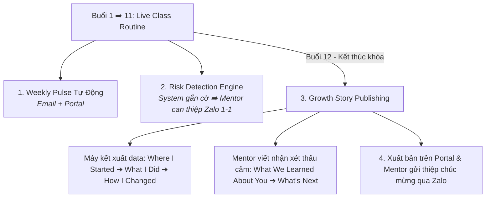

# P06 · Live Class Playbook

> **Quy trình đồng hành cùng phụ huynh trong suốt 12 buổi học chính thức, báo cáo tuần tự động, can thiệp rủi ro và xuất bản Growth Story.**  
> **Triết lý:** *"Automate the evidence. Humanize the meaning."*

---

## Metadata Header
* **Objective:** Minh bạch hóa tiến độ học tập hàng tuần của con, phát hiện sớm nguy cơ sụt giảm nỗ lực và xuất bản ấn phẩm Growth Story 5 phần kết khóa.
* **Trigger:** Học sinh chính thức bước vào khóa học 12 buổi (Live Class).
* **Standard Time:** Hệ thống đồng bộ tự động; Mentor viết Growth Story ≤  10 phút/học sinh; can thiệp rủi ro ≤  15 phút/case.
* **Target Audience:** Phụ huynh và học sinh đang tham gia khóa học 12 buổi.
* **Owner:** Hybrid (System & Mentor).
* **Output:** Dashboard Weekly Pulse + Can thiệp nguy cơ kịp thời + Ấn phẩm số Growth Story xuất bản tại Buổi 12.

---

<h3>Purpose & JTBD Mapping</h3>

Giải quyết các bài toán trọng tâm của phụ huynh trong hành trình 12 buổi học (JTBD):
* **`F1` (Accurate Assessment):** Nắm rõ mức độ tiến bộ thực chất và các điểm con đang làm chủ hoặc còn hổng qua dữ liệu minh bạch trên Portal.
* **`F4` (Early Warning):** Nhận được cảnh báo sớm từ Mentor khi con có dấu hiệu chán nản, kẹt bài hoặc sụt giảm nỗ lực.
* **`E2` (Reduced Pressure):** Phụ huynh hoàn toàn an tâm, giải tỏa áp lực đôn đốc hay quát tháo con mỗi tối.
* **`S2` (Beyond Grades):** Tự hào sở hữu câu chuyện chuyển biến tư duy và phẩm chất của con vượt trên điểm số vô cảm.
* **`S5` (Shared Moments):** Cùng con ghi nhận và tự hào về những cột mốc bứt phá trong quá trình học.

---

<h3>Stakeholder Mapping</h3>

| Stakeholder | Job cần giải quyết (JTBD) | Live Class mang lại giá trị gì? (Delivered Value) |
| :--- | :--- | :--- |
| **Phụ huynh chính thức** | Theo dõi sát sao sự tiến bộ thực chất của con qua 12 buổi học mà không cần phải gặng hỏi hay nghi ngờ. | Báo cáo Weekly Progress Pulse tự động hàng tuần và ấn phẩm Growth Story 5 phần lưu giữ trọn đời trên Portal. |
| **Học sinh chính thức** | Làm chủ kiến thức nền tảng, phát triển tư duy logic/AI và hoàn thiện Portfolio sản phẩm công nghệ cá nhân. | Lớp học tương tác cao, được theo sát và hỗ trợ kịp thời; tự hào nhìn thấy sự chuyển biến của bản thân sau 12 buổi. |
| **Mentor & Sư phạm** | Dẫn dắt hành trình chuyển biến của từng học sinh, can thiệp sư phạm sớm khi có rủi ro và đúc kết nhận xét thấu cảm. | Hệ thống tự động hóa thu thập dữ liệu (Automate Evidence) giúp Mentor toàn tâm toàn ý vào việc thấu cảm và truyền cảm hứng (Humanize Meaning). |

---

<h3>SOP Steps</h3>

| Quy trình con | Hành động Hệ thống (System Action) | Hành động Con người (Mentor Action qua Zalo) | Chu kỳ & Thời lượng |
| :--- | :--- | :--- | :---: |
| **1. Báo cáo tuần** *(Weekly Progress Pulse)* | • Tự động trích xuất log: số bài hoàn thành, thời lượng tự học, điểm làm chủ kiến thức. • Cập nhật dashboard trên **Family Portal**. • Gửi **Email Weekly Pulse** tóm tắt vào sáng hôm sau. | • Mentor **không phải gõ báo cáo hành chính** lặp lại. • Mentor chỉ gửi 1 tin nhắn ấm áp trên nhóm Zalo chia sẻ không khí lớp học và ghi nhận nỗ lực chung. | Hàng tuần ($\le$ 5 phút/lớp) |
| **2. Can thiệp rủi ro** *(Risk Intervention)* | • **Phát hiện tín hiệu (Signal):** Tự động gắn cờ cảnh báo nội bộ khi học sinh vắng 2 buổi liên tiếp, trễ bài tập 2 tuần hoặc sụt giảm nỗ lực $\ge 30\%$. • Tuyệt đối **không gửi tin nhắn bot cảnh báo thô** sang Zalo phụ huynh. | • **Review & Judgment:** Mentor kiểm tra bối cảnh (con ốm, áp lực thi ở trường...). • **Action:** Mentor trực tiếp nhắn tin/gọi điện riêng cho phụ huynh qua Zalo để thấu hiểu và phối hợp gỡ rối nhẹ nhàng. | Khi phát sinh tín hiệu ($\le$ 15 phút/case) |
| **3. Xuất bản Growth Story** *(Buổi 12)* | • Tự động tổng hợp dữ liệu 12 buổi (Portfolio, bài tập, biểu đồ năng lực) thành 3 phần đầu của ấn phẩm. • Xuất bản ấn phẩm hoàn chỉnh lên Family Portal và gửi Email thông báo tốt nghiệp. | • **Viết nhận xét thấu cảm (Phần 4 & 5):** Mentor dành 10 phút/bé viết góc nhìn độc bản về sự chuyển hóa tính cách & gợi ý chặng đường tiếp theo. • Gửi tin nhắn chúc mừng ấm áp trên Zalo. | Buổi 12 ($\le$ 10 phút/bé) |

---

<h3>Mentor Growth Narrative & Reflection</h3>

Hướng dẫn kỹ năng viết nhận xét thấu cảm cho Mentor trong ấn phẩm **Growth Story (Phần 4 & 5)**:

#### Cấu Trúc 5 Phần Của Ấn Phẩm Growth Story:
* **Phần 1: Where I Started (Máy xuất):** Vị trí xuất phát điểm và các điểm nghẽn ban đầu của con.
* **Phần 2: What I Did (Máy xuất):** Các dự án, bài toán thực tế con đã tự tay hoàn thành.
* **Phần 3: How I Changed (Máy xuất):** Biểu đồ đo lường sự tiến bộ về năng lực logic và thời gian giải quyết vấn đề.
* **Phần 4: What We Learned About You (Mentor viết):** Quan sát độc bản về tính cách, khoảnh khắc con vượt qua sự nản chí, phẩm chất kiên trì của riêng con.
* **Phần 5: What's Next (Mentor viết):** Lời khuyên định hướng chuyên môn chân thành cho chặng đường tiếp theo của con.

---

<h3>Do's & Don'ts</h3>

| Nên Làm (Best Practices / Do's) | Cấm Kỵ (Avoid / Don'ts) |
| :--- | :--- |
| ✅ Tận dụng tối đa dữ liệu tự động của Portal để giảm tải công việc hành chính. | ❌ Để bot tự động gửi tin nhắn báo lỗi làm phụ huynh lo âu. |
| ✅ Can thiệp rủi ro bằng sự thấu hiểu bối cảnh (ốm đau, thi cử ở trường). | ❌ Đổ lỗi cho học sinh hoặc phụ huynh khi con bị trễ tiến độ. |
| ✅ Nhận xét Growth Story bằng câu chuyện cụ thể và lời văn ấm áp. | ❌ Sao chép nhận xét mẫu rập khuôn hàng loạt cho cả lớp. |

---

<h3>Assessment Rubrics</h3>

| Trụ Cột Đánh Giá | L1 (Chưa Đạt) | L2 (Cơ Bản) | L3 (ĐẠT CHUẨN DoD ⭐) | L4 (Tốt) | L5 (Xuất Sắc) |
| :--- | :--- | :--- | :--- | :--- | :--- |
| **1. Execution** | Quên xuất báo cáo tuần; không can thiệp khi học sinh vắng 2 buổi. | Gửi báo cáo trễ hạn; can thiệp rủi ro hời hợt sau 1 tuần. | **Hệ thống gửi Weekly Pulse đúng hạn; Mentor can thiệp rủi ro trong 24h; hoàn tất Growth Story trước Buổi 12.** | Xử lý các ca nguy cơ học tập cực kỳ chu đáo; kết nối phụ huynh chặt chẽ. | 100% học sinh hoàn thành khóa học với trải nghiệm tuyệt vời, không có trường hợp drop-out bất ngờ. |
| **2. Empathy Depth** | Nhận xét Growth Story rập khuôn, vô hồn hoặc chỉ chép lại số liệu. | Nhận xét chung chung, thiếu câu chuyện hay kỷ niệm vượt khó của con. | **Nhận xét nêu bật được 1 phẩm chất độc bản và 1 khoảnh khắc bứt phá thật của học sinh; định hướng trung thực.** | Chạm sâu vào cảm xúc của cả gia đình, phụ huynh đọc và rưng rưng xúc động. | Tạo nên bước ngoặt thay đổi tích cực trong cách bố mẹ nhìn nhận và đối xử với con. |
| **3. Retention & Love** | Phụ huynh bức xúc vì con bị bỏ rơi hoặc không tiến bộ. | Phụ huynh kết thúc khóa học trong im lặng. | **$\ge 60\%$ phụ huynh tái đăng ký khóa học tiếp theo; $100\%$ gia đình tự hào chia sẻ Growth Story.** | Phụ huynh chủ động gửi thư cảm ơn Mentor và đăng bài chia sẻ tự hào trên mạng xã hội. | Gia đình trở thành đại sứ trọn đời của Nemo12. |

---

<h3>Decision Logs</h3>

Tổng hợp các quyết định kiến trúc và đánh giá CMMI DAR bảo vệ cho phương pháp tiếp cận của Playbook:

#### 📌 DAR 01: Nhịp Báo Cáo Tuần: Weekly Pulse 3 Dòng vs Báo Cáo Chi Tiết
* **Bối cảnh:** Cân bằng giữa việc cập nhật tiến độ liên tục cho phụ huynh và việc tránh làm phiền bố mẹ bận rộn.

| Tiêu Chí Đánh Giá (Criteria) | Trọng Số | Option A: Soạn Báo Cáo Dài Hàng Trang Mỗi Tuần | Option B: Weekly Pulse 3 Dòng + Link Xem Bằng Chứng Trực Tiếp ⭐ |
| :--- | :---: | :---: | :---: |
| **C1: Tối Giản & Tránh Quá Tải Thông Tin (Cognitive Load)** | W4 | 2.0 / 5 (8.0) | 5.0 / 5 (20.0) |
| **C2: Minh Bạch Bằng Chứng Học Tập (Evidence Transparency)** | W3 | 4.8 / 5 (14.4) | 4.9 / 5 (14.7) |
| **C3: Tinh Gọn Thời Gian Của Mentor (Mentor Efficiency)** | W3 | 2.5 / 5 (7.5) | 4.8 / 5 (14.4) |
| **TỔNG ĐIỂM (TOTAL SCORE)** | **Sum: 10** | 29.9 / 50 | 49.1 / 50 (Approved ⭐) |
| **Phân Tích & Đánh Đổi (Trade-offs)** | — | Phụ huynh không có thời gian đọc, mentor kiệt sức vì làm báo cáo hình thức. | Đòi hỏi hệ thống log bằng chứng học tập phải hoạt động ổn định và Mentor cập nhật đúng SLA 24h sau buổi học. |

* **Quyết định:** Áp dụng định dạng Weekly Pulse 3 Dòng siêu tinh gọn gửi qua Zalo mỗi tuần, kết nối trực tiếp với dashboard bằng chứng trên Family Portal.

#### 📌 DAR 03: Ấn Phẩm Kết Khóa: Bảng Điểm Truyền Thống vs Growth Story 5 Phần
* **Bối cảnh:** Lựa chọn hình thức tổng kết hành trình học tập 12 buổi của học sinh.

| Tiêu Chí Đánh Giá (Criteria) | Trọng Số | Option A: Bảng Điểm Số & Nhận Xét Chung Chung | Option B: Ấn Phẩm Kể Chuyện Growth Story 5 Phần Cá Nhân Hóa ⭐ |
| :--- | :---: | :---: | :---: |
| **C1: Chiều Sâu Tôn Vinh Sự Chuyển Hóa (Transformation Depth)** | W4 | 1.5 / 5 (6.0) | 5.0 / 5 (20.0) |
| **C2: Giá Trị Lưu Niệm & Niềm Tự Hào Của Cha Mẹ (Parent Pride)** | W4 | 1.0 / 5 (4.0) | 5.0 / 5 (20.0) |
| **C3: Mức Độ Tự Động Hóa Dữ Liệu (Automation Feasibility)** | W2 | 5.0 / 5 (10.0) | 4.5 / 5 (9.0) |
| **TỔNG ĐIỂM (TOTAL SCORE)** | **Sum: 10** | 20.0 / 50 | 49.0 / 50 (Approved ⭐) |
| **Phân Tích & Đánh Đổi (Trade-offs)** | — | Vô hồn, dễ gây so sánh điểm số tiêu cực và không lột tả được nỗ lực của con. | Cần kết hợp log dữ liệu tự động từ hệ thống và nhận xét cá nhân hóa của Mentor trước Buổi 12. |

* **Quyết định:** Đóng gói toàn bộ hành trình 12 buổi thành ấn phẩm Growth Story 5 phần gửi tặng gia đình vào Buổi 12, biến thành tựu học tập thành niềm tự hào kết nối cha mẹ và con cái.

---

<h3>Decision Logs</h3>

Tổng hợp các quyết định kiến trúc và đánh giá CMMI DAR bảo vệ cho phương pháp tiếp cận của Playbook:

#### 📌 DAR 01: Nhịp Báo Cáo Tuần: Weekly Pulse 3 Dòng vs Báo Cáo Chi Tiết
* **Bối cảnh:** Cân bằng giữa việc cập nhật tiến độ liên tục cho phụ huynh và việc tránh làm phiền bố mẹ bận rộn.

| Tiêu Chí Đánh Giá (Criteria) | Trọng Số | Option A: Soạn Báo Cáo Dài Hàng Trang Mỗi Tuần | Option B: Weekly Pulse 3 Dòng + Link Xem Bằng Chứng Trực Tiếp ⭐ |
| :--- | :---: | :---: | :---: |
| **C1: Tối Giản & Tránh Quá Tải Thông Tin (Cognitive Load)** | W4 | 2.0 / 5 (8.0) | 5.0 / 5 (20.0) |
| **C2: Minh Bạch Bằng Chứng Học Tập (Evidence Transparency)** | W3 | 4.8 / 5 (14.4) | 4.9 / 5 (14.7) |
| **C3: Tinh Gọn Thời Gian Của Mentor (Mentor Efficiency)** | W3 | 2.5 / 5 (7.5) | 4.8 / 5 (14.4) |
| **TỔNG ĐIỂM (TOTAL SCORE)** | **Sum: 10** | 29.9 / 50 | 49.1 / 50 (Approved ⭐) |
| **Phân Tích & Đánh Đổi (Trade-offs)** | — | Phụ huynh không có thời gian đọc, mentor kiệt sức vì làm báo cáo hình thức. | Đòi hỏi hệ thống log bằng chứng học tập phải hoạt động ổn định và Mentor cập nhật đúng SLA 24h sau buổi học. |

* **Quyết định:** Áp dụng định dạng Weekly Pulse 3 Dòng siêu tinh gọn gửi qua Zalo mỗi tuần, kết nối trực tiếp với dashboard bằng chứng trên Family Portal.

#### 📌 DAR 03: Ấn Phẩm Kết Khóa: Bảng Điểm Truyền Thống vs Growth Story 5 Phần
* **Bối cảnh:** Lựa chọn hình thức tổng kết hành trình học tập 12 buổi của học sinh.

| Tiêu Chí Đánh Giá (Criteria) | Trọng Số | Option A: Bảng Điểm Số & Nhận Xét Chung Chung | Option B: Ấn Phẩm Kể Chuyện Growth Story 5 Phần Cá Nhân Hóa ⭐ |
| :--- | :---: | :---: | :---: |
| **C1: Chiều Sâu Tôn Vinh Sự Chuyển Hóa (Transformation Depth)** | W4 | 1.5 / 5 (6.0) | 5.0 / 5 (20.0) |
| **C2: Giá Trị Lưu Niệm & Niềm Tự Hào Của Cha Mẹ (Parent Pride)** | W4 | 1.0 / 5 (4.0) | 5.0 / 5 (20.0) |
| **C3: Mức Độ Tự Động Hóa Dữ Liệu (Automation Feasibility)** | W2 | 5.0 / 5 (10.0) | 4.5 / 5 (9.0) |
| **TỔNG ĐIỂM (TOTAL SCORE)** | **Sum: 10** | 20.0 / 50 | 49.0 / 50 (Approved ⭐) |
| **Phân Tích & Đánh Đổi (Trade-offs)** | — | Vô hồn, dễ gây so sánh điểm số tiêu cực và không lột tả được nỗ lực của con. | Cần kết hợp log dữ liệu tự động từ hệ thống và nhận xét cá nhân hóa của Mentor trước Buổi 12. |

* **Quyết định:** Đóng gói toàn bộ hành trình 12 buổi thành ấn phẩm Growth Story 5 phần gửi tặng gia đình vào Buổi 12, biến thành tựu học tập thành niềm tự hào kết nối cha mẹ và con cái.

---

<h3>FAQ</h3>

#### Nhóm 1: Về Vận Hành Lớp Học 12 Buổi (Class Operations & Support)
* **Học sinh vắng một buổi học chính thức thì được hỗ trợ học bù như thế nào?**  
  👉 **A:** Hệ thống tự động lưu video bài giảng và bài tập thực hành trên Family Portal; Mentor sẽ dành 15 phút đầu giờ buổi kế tiếp để gỡ rối nhanh cho con.
* **Khi con gặp khó khăn với bài tập về nhà thì liên hệ hỗ trợ ra sao?**  
  👉 **A:** Học sinh gửi câu hỏi trực tiếp trên hệ thống hoặc nhắn tin trong nhóm lớp để Mentor hướng dẫn gợi mở tư duy, tuyệt đối không giải hộ bài.

#### Nhóm 2: Về Báo Cáo Tuần & Bằng Chứng Học Tập (Progress Tracking)
* **Phụ huynh có thể xem sản phẩm lập trình và bài giải của con ở đâu?**  
  👉 **A:** Mọi sản phẩm, log nỗ lực và nhận xét của Mentor được cập nhật liên tục theo thời gian thực trên Family Portal của từng học sinh.
* **Ấn phẩm Growth Story kết khóa được bàn giao dưới định dạng nào?**  
  👉 **A:** Gia đình nhận bản Digital tương tác trực quan trên Portal kèm bản in trang trọng lưu niệm gửi tới tận nhà sau Buổi 12.

