# P07 · Family Meeting Playbook

> **Gặp mặt trực tiếp tại gia đình hoặc không gian thân mật, đối thoại thấu cảm chiều sâu theo các khoảnh khắc ý nghĩa.**  
> **Triết lý:** *"Automate the evidence. Humanize the meaning."*

---

## Metadata Header
* **Objective:** Hiểu sâu bối cảnh gia đình, kỳ vọng của phụ huynh và môi trường học tập thực tế của con để cá nhân hóa việc mentoring.
* **Trigger:** Phát sinh các khoảnh khắc ý nghĩa (đột phá lớn, thay đổi hành vi đột ngột, khủng hoảng niềm tin).
* **Standard Time:** 60 phút gặp mặt trực tiếp; chuẩn bị trước ≤  15 phút; ghi chép Dory ≤  15 phút.
* **Target Audience:** Phụ huynh và học sinh được chọn lọc kích hoạt High-Touch (chiếm khoảng 5–10% tệp học viên).
* **Owner:** Mentor (Human-Led).
* **Output:** 01 buổi gặp mặt gắn kết sâu + Bản Family Notes 6 trục Dory được cập nhật trong 24h.

---

<h3>Core Mindset</h3>

> **"Đến để hiểu, không phải để đánh giá."**  
> *"Chưa thực sự hiểu thì sao dám support."*

Family Meeting / Family Tour không phải là hoạt động chăm sóc khách hàng mang tính thủ tục hành chính. **Đây là bước chuyển hóa quan trọng nhất của quá trình Mentoring.**  
Trước khi mentor hiểu học sinh, mentor cần hiểu gia đình. Trước khi thiết kế lộ trình học tập, cần hiểu môi trường và bối cảnh mà việc học diễn ra.

| Priority | Trọng tâm | Ý nghĩa vận hành |
| :--- | :--- | :--- |
| ⭐⭐⭐ | **Xây dựng Niềm Tin (Trust)** | Không có niềm tin thì rất khó thu thập insight chân thực, phối hợp giáo dục hay tháo gỡ khúc mắc. |
| ⭐⭐⭐ | **Hiểu Chân dung Tương lai (Future Portrait)** | Đích đến và kỳ vọng thực sự của gia đình là kim chỉ nam để mọi quyết định sư phạm bám theo. |
| ⭐⭐⭐ | **Khám phá Bối cảnh Học tập (Learning Context)** | Môi trường sống, góc học, thiết bị và Family Dynamics giải thích nguyên nhân gốc rễ hành vi của học sinh ([DAR 17]). |

---

<h3>Stakeholder Mapping</h3>

| Stakeholder | Job cần giải quyết (JTBD) | Family Meeting mang lại gì? (Delivered Value) |
| :--- | :--- | :--- |
| **Phụ huynh** | Tin rằng con mình được lắng nghe, thấu hiểu và đồng hành đúng phương pháp. | An tâm, giải tỏa lo âu, cảm nhận được sự tận tâm và cam kết đồng hành thực chất. |
| **Học sinh** | Cảm thấy tiếng nói của mình được tôn trọng, không bị bố mẹ áp đặt định kiến. | Psychological Safety, động lực tự thân, cảm giác mentor đứng về phía mình. |
| **Mentor / Marlins Care** | Có đầy đủ dữ liệu định tính và bối cảnh để điều chỉnh kế hoạch cá nhân hóa. | Insight thực tế (`pain`, `jtbd`, `need`, `belief`), tăng retention và gắn kết bền vững. |

---

<h3>Session Agenda</h3>

> **Quy tắc vàng điều phối: Lắng nghe 70% — Đặt câu hỏi 20% — Chia sẻ 10%.**

```mermaid
gantt
    title Timeline Family Meeting (60 phút)
    dateFormat  HH:mm
    axisFormat  %H:%M
    section Diễn tiến buổi gặp
    Warm-up & Tạo không khí (05p)    :00:00, 05m
    Family Story - Lắng nghe PH (10p):00:05, 10m
    Student Story - Đối thoại cùng con (15p):00:15, 15m
    Alignment - Đúc kết & Phản chiếu (15p)  :00:30, 15m
    Next Steps & Cam kết nhỏ (10p)  :00:45, 10m
    Closing & Tạm biệt (05p)        :00:55, 05m
```

| Phần | Thời lượng | Nội dung chính | Lưu ý thực thi cho Mentor |
| :--- | :---: | :--- | :--- |
| **0. Warm-up** | 5p | Chào hỏi, tạo cảm giác thân mật *"như khách quý đến chơi nhà"*. | **Không mở laptop, không rút sổ ghi chép ngay.** Hỏi thăm thú cưng, không gian nhà, khen góc học của con. |
| **1. Family Story** | 10p | Mời phụ huynh chia sẻ về hành trình lớn lên của con và những điều tự hào nhất. | Lắng nghe trọn vẹn, không vội nói về chương trình học hay điểm số. |
| **2. Student Story** | 15p | Chuyển sự chú ý sang học sinh: sở thích, điều hào hứng gần đây, trải nghiệm học tập. | Tạo không gian an toàn để con tự do bày tỏ, không biến thành cuộc phỏng vấn chất vấn. |
| **3. Alignment** | 15p | Mentor phản chiếu các quan sát tích cực về điểm mạnh của con và góc nhìn sư phạm. | Hai bên cùng nhìn về một hướng; gia đình nhận được giá trị và định hướng rõ ràng. |
| **4. Next Steps** | 10p | Thống nhất 1–2 mục tiêu ưu tiên trong 4 tuần tới và cam kết phối hợp giữa 3 bên. | Thiết lập một hành động/cam kết nhỏ (Micro-commitment) cho học sinh, bố mẹ và mentor. |
| **5. Closing** | 5p | Cảm ơn sự tiếp đón của gia đình, chụp bức ảnh kỷ niệm (nếu gia đình đồng ý). | Kết thúc đúng giờ (không kéo dài lê thê làm phiền sinh hoạt của gia đình). |

---

<h3>Mentor Guides & Scripts</h3>

#### A. Question Bank (Top 5 Câu hỏi mở)
*Không hỏi như checklist máy móc, hãy chọn 2–3 câu phù hợp nhất với mạch trò chuyện tự nhiên:*
1. **Khám phá Future Portrait:** *"Nếu chỉ mong con thay đổi hoặc đạt được một điều ý nghĩa nhất sau giai đoạn này, anh/chị mong muốn điều gì nhất? Vì sao?"*
2. **Khám phá Family Dynamics & Tự chủ:** *"Ở nhà, khi gặp một bài tập hoặc vấn đề khó, con thường tự mày mò, nhờ bố mẹ hỗ trợ hay có xu hướng né tránh?"*
3. **Khám phá Hidden Motivation:** *"Có khoảnh khắc nào gần đây anh/chị thấy con say sưa làm một việc quên cả giờ giấc và rất tự hào về sản phẩm của mình không?"*
4. **Kiểm chứng phản hồi học tập:** *"Sau các buổi học vừa qua, anh/chị hoặc con có điều gì bất ngờ, băn khoăn hay muốn chia sẻ thêm với mentor không?"*
5. **Căn chỉnh kỳ vọng (Alignment):** *"Nếu 6 tháng tới nhìn lại, điều gì xảy ra sẽ khiến anh/chị cảm thấy quyết định đồng hành cùng Nemo12 là hoàn toàn xứng đáng?"*

#### B. Observation Guide (Top 5 Cụm tín hiệu quan sát)
1. **Family Dynamics:** Ai là người quyết định chính? Ai hay nói thay con? Học sinh có dám nhìn thẳng và thể hiện chính kiến trước mặt bố mẹ không?
2. **Student Behavior:** Học sinh cởi mở, tò mò hay e dè, phòng thủ? Điều gì làm ánh mắt học sinh sáng lên khi nhắc tới?
3. **Learning Environment:** Góc học tập có yên tĩnh, đủ ánh sáng không? Máy tính, đường truyền mạng và các yếu tố xao nhãng xung quanh như thế nào?
4. **Parent Involvement:** Phụ huynh mong muốn đồng hành ở mức độ nào? Có sẵn sàng dành thời gian lắng nghe con hay phó mặc hoàn toàn cho mentor?
5. **Hidden Signals:** Sách trên giá, tranh vẽ, mô hình Lego/Minecraft, thú cưng... — các manh mối bộc lộ thế giới nội tâm của học sinh.

#### C. Exit Checklist
*Trước khi chào tạm biệt gia đình, mentor tự rà soát nhanh trong đầu:*
- [ ] Tôi đã hiểu điều gì tạo nên động lực tự thân thực sự của học sinh chưa?
- [ ] Tôi đã nắm được môi trường học tập và rào cản thực tế của con ở nhà chưa?
- [ ] Tôi đã xác định được ai là người đồng hành và có ảnh hưởng lớn nhất đến con chưa?
- [ ] Học sinh đã có cơ hội cất lên tiếng nói riêng của mình trong buổi gặp chưa?
- [ ] Gia đình và mentor đã thống nhất được 1 bước hành động cụ thể tiếp theo chưa?
- [ ] Tôi đã thu thập được ít nhất 3 insight thực tế mới (chưa từng có trong Portal)?

---

<h3>Do's & Don'ts</h3>

#### ✅ Do's (Nên làm)
* **Giao tiếp bình đẳng:** Lắng nghe học sinh với sự tôn trọng như một cá thể độc lập; khuyến khích con nói lên cảm xúc thật.
* **Tách bạch dữ liệu:** Phân định rành mạch giữa *Fact* (Sự thật khách quan), *Observation* (Quan sát thấy) và *Interpretation* (Suy đoán của mentor).
* **Ghi nhận nỗ lực:** Tìm kiếm và khen ngợi những điểm sáng, thói quen tốt hoặc sự nỗ lực của con trước mặt bố mẹ.
* **Tôn trọng ranh giới gia đình:** Luôn lịch thiệp, giữ gìn tác phong sư phạm và tôn trọng không gian sống riêng tư của gia đình theo [DAR 17].

#### ❌ Don'ts (Không được làm)
* **Không mang tâm thế "khảo sát / thanh tra":** Tuyệt đối không cầm giấy bút hay laptop gõ liên tục như đang phỏng vấn lấy số liệu.
* **Không chỉ nói chuyện với bố mẹ:** Tránh biến học sinh thành người vô hình hoặc chỉ ngồi nghe người lớn nói về mình.
* **Không phán xét hay đổ lỗi:** Không chỉ trích cách dạy con của phụ huynh hoặc phàn nàn về học sinh một cách tiêu cực.
* **Không hứa hẹn vượt khả năng:** Không đưa ra những cam kết viển vông về điểm số mà tập trung vào sự tiến bộ về thói quen và phương pháp học.

---

<h3>SOP Steps</h3>

| Giai đoạn | Nhiệm vụ cụ thể | Thời lượng | Deliverable / Trạng thái |
| :--- | :--- | :---: | :--- |
| **Trước buổi gặp** *(Pre-Meeting)* | • Phát hiện tín hiệu và gửi đề xuất phê duyệt qua Host trong 4h ([DAR 18]). • Đọc hồ sơ học sinh trên Portal (không hỏi lại thông tin đã có). • Chuẩn bị 2–3 câu hỏi mở trọng tâm và danh mục Observation cues. | 15p | Kế hoạch gặp & Host Approved |
| **Trong buổi gặp** *(In-Meeting)* | • Triển khai theo Agenda 60 phút (Warm-up $\to$ Stories $\to$ Alignment $\to$ Next Steps). • Lắng nghe tích cực (70%), tách biệt Fact và Observation ([DAR 17]). • Thống nhất cam kết hành động nhỏ tiếp theo với gia đình. | 60p | Buổi gặp diễn ra tự nhiên, ấm cúng |
| **Sau buổi gặp** *(Post-Meeting)* | • Hoàn thiện Family Notes và gắn tag vào **Hệ thống Dory** trong 24h. • Gửi tin nhắn cảm ơn ngắn gọn và ấm áp cho phụ huynh qua Zalo. | 15p | Cập nhật hồ sơ gia đình trên Dory |

---

<h3>Assessment Rubrics</h3>

Đánh giá chất lượng thực thi Family Meeting theo 3 trụ cột chuẩn hóa (Thang đo L1 – L5, **L3 là chuẩn Definition of Done ⭐**):

| Trụ Cột Đánh Giá | L1 (Chưa Đạt) | L2 (Cơ Bản) | L3 (Đạt Chuẩn - DoD ⭐) | L4 (Tốt) | L5 (Xuất Sắc) |
| :--- | :--- | :--- | :--- | :--- | :--- |
| **1. Kỹ năng Điều phối & Tác phong (Execution)** | Trễ hẹn, biến thành buổi hỏi đáp tra khảo, học sinh bị gạt ra ngoài lề. | Giao tiếp đúng quy trình nhưng gượng gạo, chủ yếu nói nhiều hơn nghe. | **Đúng giờ, tạo không khí thân mật tự nhiên; tuân thủ tỷ lệ Listen 70% - Ask 20% - Talk 10%; cả PH và con đều được chia sẻ.** | Dẫn dắt mượt mà, xử lý tinh tế các tình huống nhạy cảm, giúp gia đình cởi mở hoàn toàn. | Tạo ra một cuộc trò chuyện truyền cảm hứng sâu sắc, xóa tan khoảng cách thế hệ trong gia đình. |
| **2. Độ sâu Insight & Ghi chép Dory (Sensemaking)** | Không ghi chép, bỏ sót thông tin hoặc ghi chép suy diễn cảm tính. | Ghi lại thông tin hành chính bề nổi, không có gì mới so với form đăng ký. | **Khai thác đủ 3 insight (Dynamics, Environment, Motivation); cập nhật Family Notes & gắn tag 6 trục Dory trong 24h.** | Phát hiện được những điểm mù sư phạm và động lực nội tại độc đáo của học sinh có bằng chứng rõ ràng. | Insight có giá trị định hình lại toàn bộ chiến lược đồng hành, giúp cả team hiểu sâu sắc học sinh. |
| **3. Mức độ Tin cậy & Gắn kết (Parent Value)** | Phụ huynh cảm thấy bị soi mói, khó chịu hoặc mất thời gian. | Phụ huynh lịch sự tiếp đón nhưng vẫn giữ khoảng cách phòng thủ. | **Gia đình an tâm, cảm nhận rõ sự tận tâm của Mentor; đồng thuận với mục tiêu và bước hành động tiếp theo.** | Phụ huynh chủ động chia sẻ những khó khăn sâu kín và đặt niềm tin trọn vẹn vào định hướng của Mentor. | Phụ huynh xem Mentor như người đồng hành tri kỷ của gia đình, chủ động kết nối và giới thiệu thêm các gia đình khác. |

---

<h3>🏛️ Decision Logs</h3>

Tổng hợp các quyết định kiến trúc và đánh giá CMMI bảo vệ cho phương pháp tiếp cận của Playbook P07:

#### 📌 DAR 04: Bộ Lọc Kích Hoạt Trải Nghiệm Chuyên Sâu (High-Touch Activation Filter)
* **Bối cảnh:** Điểm chạm gặp mặt trực tiếp tốn nhiều nguồn lực thời gian của nhân sự.
* **Quyết định:** Kích hoạt dựa trên **Khoảnh khắc ý nghĩa (Meaningful Moments)**: Con có nguy cơ bỏ cuộc, gia đình có biến cố tâm lý lớn, hoặc cần căn chỉnh kỳ vọng đặc biệt. Tuyệt đối không kích hoạt theo lịch định kỳ cứng nhắc hay mức chi tiêu tài chính.

#### 📌 DAR 17: Không Gian Gặp Gỡ High-Touch: Thăm Nhà Học Sinh vs Không Gian Trung Lập
* **Bối cảnh:** Lựa chọn địa điểm gặp mặt trực tiếp 60 phút giữa nhà học sinh (Family Tour) và quán cà phê/lounge.
* **Ma trận đánh giá (CMMI Evaluation):**
  * *Option A (100% bắt buộc đến nhà):* 33/50 điểm — Rủi ro làm phụ huynh e ngại nếu nhà chưa gọn gàng.
  * *Option B (100% gặp ngoài quán cà phê):* 32/50 điểm — Mất 50% dữ liệu về góc học tập và môi trường sống thực tế.
  * *Option C (In-Home First + Fallback Lounge/Cà phê linh hoạt) ⭐:* **48/50 điểm (Approved)**.
* **Quyết định:** Áp dụng nguyên tắc **In-Home First (Ưu tiên thăm nhà)** để quan sát trọn vẹn góc học tập và tương tác tự nhiên trong gia đình; đồng thời luôn sẵn sàng **Tùy chọn không gian trung lập (Lounge / Cà phê)** để tôn trọng sự riêng tư và tạo tâm lý thoải mái cho phụ huynh.

#### 📌 DAR 18: Quản Trị Vận Hành High-Touch: Thẩm Quyền Phê Duyệt & Ngân Sách
* **Bối cảnh:** Quản trị quy trình kích hoạt Family Tour để bắt đúng thời điểm vàng mà không làm quá tải đội ngũ.
* **Ma trận đánh giá (CMMI Evaluation):**
  * *Option A (Mentor tự do kích hoạt):* 24/50 điểm — Dễ quá tải lịch dạy, chi phí tự phát.
  * *Option B (Phê duyệt 3 tầng qua Ban Giám Đốc):* 33/50 điểm — Chậm trễ, mất thời điểm vàng hỗ trợ học sinh.
  * *Option C (Phê duyệt 4 giờ bởi Host + Định mức khoán ≤  2 ca/tháng) ⭐:* **48/50 điểm (Approved)**.
* **Quyết định:** Thiết lập **Cơ chế phê duyệt tinh gọn 4 giờ** do Marlins Host (Anh Đắc) duyệt trực tiếp; giới hạn định mức **≤  2 ca/tháng/Mentor** và áp dụng định mức khoán chi phí từ quỹ Marlins Care Retention.

---

<h3>Decision Logs</h3>

Tổng hợp các quyết định kiến trúc và đánh giá CMMI DAR bảo vệ cho phương pháp tiếp cận của Playbook:

#### 📌 DAR 05: Thời Điểm Tổ Chức Family Meeting: Bắt Buộc Định Kỳ vs Khi Có Khoảnh Khắc Ý Nghĩa
* **Bối cảnh:** Lựa chọn thời điểm gặp gỡ trực tiếp gia đình để đạt hiệu quả thấu cảm cao nhất.

| Tiêu Chí Đánh Giá (Criteria) | Trọng Số | Option A: Họp Phụ Huynh Bắt Buộc Cả Lớp Cùng Lúc | Option B: Gặp Gỡ 1-1 Theo Khoảnh Khắc Ý Nghĩa (Meaningful Moments) ⭐ |
| :--- | :---: | :---: | :---: |
| **C1: Mức Độ Cần Thiết & Giá Trị Thực Chất (Value per Meeting)** | W4 | 2.5 / 5 (10.0) | 5.0 / 5 (20.0) |
| **C2: Tối Ưu Thời Gian Của Phụ Huynh & Mentor (Time Optimization)** | W3 | 2.0 / 5 (6.0) | 4.8 / 5 (14.4) |
| **C3: Tác Động Gắn Kết Gia Đình (Bonding Impact)** | W3 | 3.0 / 5 (9.0) | 4.9 / 5 (14.7) |
| **TỔNG ĐIỂM (TOTAL SCORE)** | **Sum: 10** | 25.0 / 50 | 49.1 / 50 (Approved ⭐) |
| **Phân Tích & Đánh Đổi (Trade-offs)** | — | Hình thức hành chính rập khuôn, không giải quyết được vấn đề riêng của từng nhà. | Số lượng cuộc gặp ít hơn nhưng đòi hỏi chuẩn bị Family Notes 6 trục kỹ lưỡng trước khi gặp. |

* **Quyết định:** Chỉ tổ chức Family Meeting 1-1 khi xuất hiện khoảnh khắc ý nghĩa (High-touch Meaningful Moments) hoặc cột mốc giữa kỳ (~Buổi 5-7), đảm bảo mỗi cuộc gặp đều mang lại giá trị độc bản.

---

<h3>🏛️ Decision Logs</h3>

Tổng hợp các quyết định kiến trúc và đánh giá CMMI bảo vệ cho phương pháp tiếp cận của Playbook P07:

#### 📌 DAR 04: Bộ Lọc Kích Hoạt Trải Nghiệm Chuyên Sâu (High-Touch Activation Filter)
* **Bối cảnh:** Điểm chạm gặp mặt trực tiếp tốn nhiều nguồn lực thời gian của nhân sự.
* **Quyết định:** Kích hoạt dựa trên **Khoảnh khắc ý nghĩa (Meaningful Moments)**: Con có nguy cơ bỏ cuộc, gia đình có biến cố tâm lý lớn, hoặc cần căn chỉnh kỳ vọng đặc biệt. Tuyệt đối không kích hoạt theo lịch định kỳ cứng nhắc hay mức chi tiêu tài chính.

#### 📌 DAR 17: Không Gian Gặp Gỡ High-Touch: Thăm Nhà Học Sinh vs Không Gian Trung Lập
* **Bối cảnh:** Lựa chọn địa điểm gặp mặt trực tiếp 60 phút giữa nhà học sinh (Family Tour) và quán cà phê/lounge.
* **Ma trận đánh giá (CMMI Evaluation):**
  * *Option A (100% bắt buộc đến nhà):* 33/50 điểm — Rủi ro làm phụ huynh e ngại nếu nhà chưa gọn gàng.
  * *Option B (100% gặp ngoài quán cà phê):* 32/50 điểm — Mất 50% dữ liệu về góc học tập và môi trường sống thực tế.
  * *Option C (In-Home First + Fallback Lounge/Cà phê linh hoạt) ⭐:* **48/50 điểm (Approved)**.
* **Quyết định:** Áp dụng nguyên tắc **In-Home First (Ưu tiên thăm nhà)** để quan sát trọn vẹn góc học tập và tương tác tự nhiên trong gia đình; đồng thời luôn sẵn sàng **Tùy chọn không gian trung lập (Lounge / Cà phê)** để tôn trọng sự riêng tư và tạo tâm lý thoải mái cho phụ huynh.

#### 📌 DAR 18: Quản Trị Vận Hành High-Touch: Thẩm Quyền Phê Duyệt & Ngân Sách
* **Bối cảnh:** Quản trị quy trình kích hoạt Family Tour để bắt đúng thời điểm vàng mà không làm quá tải đội ngũ.
* **Ma trận đánh giá (CMMI Evaluation):**
  * *Option A (Mentor tự do kích hoạt):* 24/50 điểm — Dễ quá tải lịch dạy, chi phí tự phát.
  * *Option B (Phê duyệt 3 tầng qua Ban Giám Đốc):* 33/50 điểm — Chậm trễ, mất thời điểm vàng hỗ trợ học sinh.
  * *Option C (Phê duyệt 4 giờ bởi Host + Định mức khoán ≤  2 ca/tháng) ⭐:* **48/50 điểm (Approved)**.
* **Quyết định:** Thiết lập **Cơ chế phê duyệt tinh gọn 4 giờ** do Marlins Host (Anh Đắc) duyệt trực tiếp; giới hạn định mức **≤  2 ca/tháng/Mentor** và áp dụng định mức khoán chi phí từ quỹ Marlins Care Retention.

---

<h3>Decision Logs</h3>

Tổng hợp các quyết định kiến trúc và đánh giá CMMI DAR bảo vệ cho phương pháp tiếp cận của Playbook:

#### 📌 DAR 05: Thời Điểm Tổ Chức Family Meeting: Bắt Buộc Định Kỳ vs Khi Có Khoảnh Khắc Ý Nghĩa
* **Bối cảnh:** Lựa chọn thời điểm gặp gỡ trực tiếp gia đình để đạt hiệu quả thấu cảm cao nhất.

| Tiêu Chí Đánh Giá (Criteria) | Trọng Số | Option A: Họp Phụ Huynh Bắt Buộc Cả Lớp Cùng Lúc | Option B: Gặp Gỡ 1-1 Theo Khoảnh Khắc Ý Nghĩa (Meaningful Moments) ⭐ |
| :--- | :---: | :---: | :---: |
| **C1: Mức Độ Cần Thiết & Giá Trị Thực Chất (Value per Meeting)** | W4 | 2.5 / 5 (10.0) | 5.0 / 5 (20.0) |
| **C2: Tối Ưu Thời Gian Của Phụ Huynh & Mentor (Time Optimization)** | W3 | 2.0 / 5 (6.0) | 4.8 / 5 (14.4) |
| **C3: Tác Động Gắn Kết Gia Đình (Bonding Impact)** | W3 | 3.0 / 5 (9.0) | 4.9 / 5 (14.7) |
| **TỔNG ĐIỂM (TOTAL SCORE)** | **Sum: 10** | 25.0 / 50 | 49.1 / 50 (Approved ⭐) |
| **Phân Tích & Đánh Đổi (Trade-offs)** | — | Hình thức hành chính rập khuôn, không giải quyết được vấn đề riêng của từng nhà. | Số lượng cuộc gặp ít hơn nhưng đòi hỏi chuẩn bị Family Notes 6 trục kỹ lưỡng trước khi gặp. |

* **Quyết định:** Chỉ tổ chức Family Meeting 1-1 khi xuất hiện khoảnh khắc ý nghĩa (High-touch Meaningful Moments) hoặc cột mốc giữa kỳ (~Buổi 5-7), đảm bảo mỗi cuộc gặp đều mang lại giá trị độc bản.

---

<h3>FAQ</h3>

#### Nhóm 1: Về Chuẩn Bị & Đặt Lịch Gặp Gỡ (Scheduling & Preparation)
* **Buổi Family Meeting kéo dài bao lâu và diễn ra ở đâu?**  
  👉 **A:** Thời lượng tiêu chuẩn là 60 phút, diễn ra trực tiếp tại nhà học sinh hoặc không gian yên tĩnh phù hợp do gia đình lựa chọn.
* **Cả bố và mẹ có bắt buộc phải cùng tham dự không?**  
  👉 **A:** Nemo12 khuyến khích cả bố, mẹ và học sinh cùng hiện diện trọn vẹn để tạo sự thấu hiểu đồng thuận đa chiều trong gia đình.

#### Nhóm 2: Về Kết Quả Bàn Giao (Family Notes & Next Steps)
* **Bản Family Notes 6 trục bao gồm những nội dung gì?**  
  👉 **A:** Ghi nhận 6 chiều kích: Điểm mạnh cốt lõi, Rào cản tâm lý, Phong cách tư duy, Mục tiêu gia đình, Thỏa thuận đồng hành và Kế hoạch 30 ngày tiếp theo.
* **Sau buổi gặp, Mentor sẽ theo dõi tiến độ như thế nào?**  
  👉 **A:** Mentor cập nhật Family Notes lên Portal và định kỳ nhắn tin chia sẻ những chuyển biến nhỏ của con theo đúng cam kết đã thống nhất.

