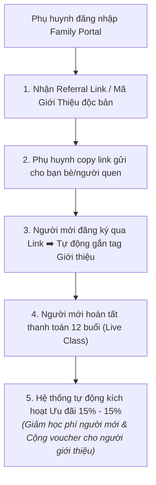

# P08 · Referrals Program Playbook

> **Quy chuẩn chính sách và cơ chế vận hành tự động chương trình Phụ huynh Giới thiệu Phụ huynh (Chính sách 15% - 15%), tích hợp sẵn trên Family Portal.**  
> **Triết lý:** *"Automate the evidence. Humanize the meaning."*

---

## Metadata Header
* **Objective:** Tạo cơ chế tri ân tự nhiên và minh bạch để phụ huynh tin tưởng chủ động chia sẻ môi trường học tập Nemo12 cho bạn bè; tự động hóa 100% việc cấp mã và áp dụng ưu đãi.
* **Trigger:** Phụ huynh đăng nhập Family Portal hoặc chia sẻ link giới thiệu.
* **Standard Time:** Tự động hóa 100% thời gian thực (Realtime); Cấp voucher ngay sau khi giao dịch thành công.
* **Target Audience:** Phụ huynh có con đang theo học hoặc đã hoàn thành khóa học tại Nemo12.
* **Owner:** System-First (Family Portal & Care).
* **Output:** Mã giới thiệu cá nhân hóa trên Portal + Voucher 15% tự động trong ví phụ huynh + Ưu đãi 15% cho học viên mới.

---

<h3>Purpose & JTBD</h3>

Giải quyết bài toán tâm lý và mong muốn lan tỏa của phụ huynh (JTBD):
* **`S2` (Beyond Grades):** Tự hào chia sẻ sự tiến bộ và môi trường học tập văn minh của con cho những người bạn có cùng nỗi trăn trở giáo dục.
* **`S4` (Belonging):** Cảm nhận mình là một phần của cộng đồng cha mẹ đồng hành tích cực cùng Nemo12.
* **`E5` (Worthwhile Investment):** Tối ưu chi phí học tập của con cho các khóa tiếp theo một cách xứng đáng và minh bạch.

---

<h3>System Engine & SOP</h3>

Quy trình vận hành tự động hóa 100% của hệ thống Referral:

| Bước | Hành động Hệ thống (System Action) | Hành động Phụ huynh (Parent Action) |
| :--- | :--- | :--- |
| **1. Cấp mã độc bản** | Tự động tạo `Referral_Code` và đường dẫn cá nhân hóa hiển thị sẵn trên Family Portal. | Đăng nhập Portal, bấm 1 chạm để sao chép link giới thiệu. |
| **2. Gắn tag tự động** | Khi người mới click link và điền thông tin đăng ký ➔  Hệ thống tự động liên kết ID của người giới thiệu vào hồ sơ học sinh mới. | Gửi link qua tin nhắn cho bạn bè/người thân có con trong độ tuổi. |
| **3. Xác thực thanh toán** | Khi người mới thanh toán thành công khóa 12 buổi ➔  Hệ thống tự động áp dụng mức giảm 15% học phí cho hóa đơn của người mới. | Người mới nhận ưu đãi 15% ngay trên màn hình thanh toán. |
| **4. Trả thưởng người giới thiệu** | Tự động cộng Voucher 15% vào ví tài khoản Family Portal của người giới thiệu + Gửi Email chúc mừng và cảm ơn tự động. | Người giới thiệu nhận thông báo qua Email/Portal, dùng voucher cho kỳ học tiếp theo của con. |

---

<h3>Do's & Don'ts</h3>

| Nên Làm (Best Practices / Do's) | Cấm Kỵ (Avoid / Don'ts) |
| :--- | :--- |
| ✅ **Minh bạch trạng thái:** Hiển thị rõ ràng trên Family Portal trạng thái lời giới thiệu để phụ huynh dễ theo dõi. | ❌ **Tuyệt đối không biến thành mô hình đa cấp (Zero MLM):** Không tạo hoa hồng nhiều tầng, không chi trả tiền mặt. |
| ✅ **Trân trọng lời giới thiệu:** Gửi Email cảm ơn ấm áp mang danh nghĩa Giảng viên/Mentor trực tiếp dạy con. | ❌ **Không làm phiền:** Không liên tục spam tin nhắn ép phụ huynh phải đi chia sẻ link. |
| ✅ **Hỗ trợ kịp thời:** Giải quyết tức thời các trường hợp phụ huynh quên nhập mã giới thiệu qua kênh hỗ trợ 1-1. | ❌ **Không gây khó dễ:** Không đặt ra các điều khoản ẩn gây khó khăn khi áp dụng voucher học phí. |

---

<h3>Assessment Rubrics</h3>

| Trụ Cột Đánh Giá | L1 (Chưa Đạt) | L2 (Cơ Bản) | L3 (ĐẠT CHUẨN DoD ⭐) | L4 (Tốt) | L5 (Xuất Sắc) |
| :--- | :--- | :--- | :--- | :--- | :--- |
| **1. System Automation** | Hệ thống lỗi mã, không ghi nhận người giới thiệu, phải xử lý thủ công. | Hệ thống hoạt động nhưng chậm trễ, phải chờ duyệt tay mất nhiều ngày. | **Hệ thống tự động hóa 100% thời gian thực; cấp mã và áp dụng voucher 15% tức thì và chính xác.** | Giao diện quản lý ví voucher trên Portal mượt mà, trực quan, hỗ trợ chia sẻ 1-click. | Hệ thống ổn định tuyệt đối, tự động phân tích và đề xuất tri ân phụ huynh đại sứ tích cực. |
| **2. Policy Integrity** | Trả tiền mặt hoặc tạo chính sách hoa hồng nhiều tầng kiểu đa cấp (MLM). | Chính sách mập mờ, nhiều điều kiện ràng buộc gây khó khăn cho phụ huynh. | **Tuân thủ nghiêm ngặt chính sách 15% - 15% dạng Tuition Credit; minh bạch và rõ ràng.** | Truyền thông chính sách nhẹ nhàng, mang tinh thần tri ân giáo dục văn minh. | Phụ huynh hoàn toàn tự hào khi chia sẻ vì tính minh bạch và nhân văn của chương trình. |
| **3. Advocacy Growth** | Không có phụ huynh nào giới thiệu; phụ huynh e ngại chia sẻ. | Chỉ có vài lượt chia sẻ mang tính chất người thân trong gia đình. | **≥  20\% học viên mới đến từ nguồn phụ huynh giới thiệu (Organic Referral).** | Hình thành mạng lưới phụ huynh đại sứ gắn kết, chủ động bảo vệ và lan tỏa giá trị Nemo12. | Chương trình trở thành động cơ tăng trưởng tự nhiên bền vững nhất của tổ chức. |

---

<h3>Decision Logs</h3>

#### 📌 DAR 19: Chính Sách Tri Ân Song Phương (15% - 15% Dual Tuition Credit)
* **Bối cảnh:** Lựa chọn giữa hình thức chi trả hoa hồng tiền mặt (Affiliate Cash Commission) hay cấp Voucher học phí trừ trực tiếp (Tuition Credit).
* **Quyết định chốt:** Áp dụng chính sách **Ưu đãi song phương 15% học phí cho người mới và tặng Voucher 15% cho người giới thiệu trừ vào khóa học tiếp theo**; tuyệt đối không trả tiền mặt để bảo vệ uy tín giáo dục chuẩn mực và tránh biến tướng thương mại.

