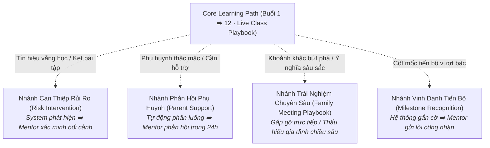

# Parent Journey Map

> **Hành trình phụ huynh Nemo12 & Marlins Care được thiết kế theo cấu trúc: Core Path (Đường ray chính) + Triggered Branches (Nhánh kích hoạt có điều kiện).**

---

## 1. Bản Đồ 3 Pha Vòng Đời (3-Phase Lifecycle)

| Pha (Phase) | Cột Mốc Thời Gian | JTBD Trọng Tâm | Trải Nghiệm Mong Muốn | Vai Trò Hệ Thống | Vai Trò Con Người | Playbooks Phụ Trách |
| :--- | :--- | :--- | :--- | :--- | :--- | :---: |
| **Pha 1: Trước Khóa Học** | Tiếp cận, Nhận thức & Workshop | `F5`, `E1`, `S3`, `F1` | Hiểu rõ phương pháp giáo dục bản chất, tháo gỡ bế tắc/ngộ nhận khi kèm con, chuẩn bị tâm thế vững vàng và tin tưởng đồng hành cùng Nemo12. | Tự động hóa đăng ký, gửi thông tin chuẩn bị Workshop, cập nhật học liệu tự học trên Family Portal. | Xây dựng thương hiệu cá nhân ([Social Media](/playbooks/social-media/overview)), Quản trị cộng đồng ([Community Playbook](/playbooks/community/overview)), Tổ chức Workshop chuyển hóa trực tuyến ([Marlins Workshop](/playbooks/marlins-workshop/overview)). | **Social Media, Community, Marlins Workshop** |
| **Pha 2: Trong Khóa Học** | 12 Buổi Live Class | `F1`, `F4`, `E2`, `F2`, `S5` | Thấy con tiến bộ thực chất bằng dữ liệu, cảm nhận con được thấu hiểu qua Mentor, có kỷ niệm gia đình ý nghĩa và nhận Growth Story kết khóa. | Gửi báo cáo tiến độ tuần tự động, phát hiện sụt giảm nỗ lực / kẹt bài tập ([Live Class](/playbooks/live-class/overview)). | **Live Class Mentoring Routine** ([Live Class](/playbooks/live-class/overview)) quan sát độc bản, tổ chức **Family Meeting** ([Family Meeting](/playbooks/family-meeting/overview)) tại khoảnh khắc ý nghĩa. | **Live Class, Family Meeting** |
| **Pha 3: Sau Khóa Học** | Tái tục & Lan tỏa cộng đồng | `S2`, `E5`, `F3`, `S4` | Tiếp tục đồng hành dài hạn và trở thành đại sứ lan tỏa giá trị giáo dục Nemo12 đến bạn bè. | Quản trị mã liên kết và ghi nhận ưu đãi tự động 15% - 15% trên Family Portal ([Referrals Program](/playbooks/referrals/overview)). | Chăm sóc và tri ân phụ huynh đại sứ ([Referrals Program](/playbooks/referrals/overview)). | **Referrals Program** |

---

## 2. Triggered Branches (Các Nhánh Rẽ Kích Hoạt)

---

## 3. Persistent Capabilities

::: tip ⚓ Marlins Workshop
**Marlins Workshop** (15h00 - 17h00 Chủ Nhật hàng tuần qua Zoom) không phải là sự kiện một lần duy nhất. Đây là **năng lực hỗ trợ thường trực (Persistent Capability)** sẵn sàng tiếp đón phụ huynh ở bất kỳ giai đoạn nào khi họ cần gỡ rối định kiến hoặc muốn trao đổi phương pháp giáo dục.
:::

