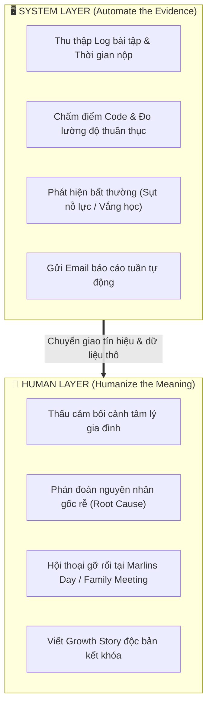

# Capability Map

> **Bản đồ phân định ranh giới năng lực giữa Hệ thống tự động (Machine/System) và Con người (Mentor & Marlins Care Specialists).**

---

## 1. Ranh Giới Năng Lực (Machine vs Human)

---

## 2. Bảng Phân Công Trách Nhiệm Chi Tiết

| Năng Lực Nghiệp Vụ | Phụ Trách Chính | Cơ Chế Thực Thi |
| :--- | :---: | :--- |
| **Ghi nhận & Cảnh báo dữ liệu** | **Nemo12 System** | Tự động quét tiến độ LMS, gửi thông báo nhắc lịch và cảnh báo rủi ro học tập. |
| **Quan sát hành vi định tính** | **Dolphin Mentor** | Ghi nhận thái độ, mức độ tập trung và phản ứng cảm xúc của học sinh trong giờ học. |
| **Đối thoại chuyên sâu với phụ huynh** | **Marlins Care Host** | Điều phối phiên thảo luận Fishbowl tại Marlins Day và tham vấn 1-1 cho gia đình. |
| **Bảo mật & Quyền riêng tư** | **Hệ thống & Mentor** | Ẩn danh hóa 100% dữ liệu trước khi trích xuất case study chia sẻ cộng đồng. |
