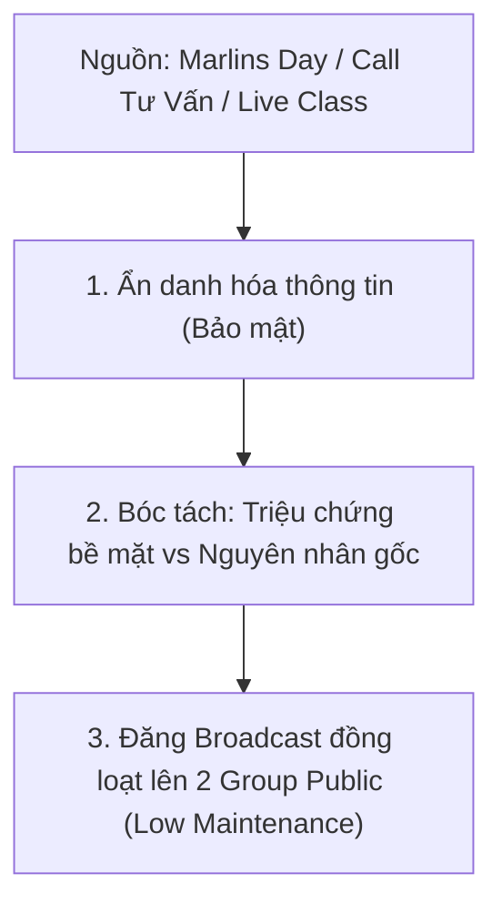

# Framework

Quy chuẩn chuyển hóa dữ liệu quan sát thực tế thành **Serial Case Study Ẩn Danh** đăng đồng thời trên 2 Group Public:

#### Công Thức Bóc Tách "Khám Bệnh":
* **Triệu chứng phụ huynh thấy (Symptom):** *"Con lớp 8, mẹ bảo lười học, không chịu làm bài tập, điểm toán tụt dốc..."*
* **Khám bệnh ra sự thật (Root Cause):** Hệ thống Nemo12 soi ra con không hề lười, mà bị **hổng kiến thức Bất đẳng thức & Biến đổi đại số từ tận kỳ 2 Lớp 7**, dẫn tới việc lên lớp 8 nghe giảng như "vịt nghe sấm" và sinh ra phản ứng phòng vệ là buông xuôi.
* **Kê đơn & Chuyển biến (Prescription):** Lộ trình vá đúng mắt xích bị hổng trong 3 tuần $\to$ Con tự tin lấy lại nhịp học.
