# Session Agenda

> **Quy tắc vàng điều phối: Lắng nghe 70% — Đặt câu hỏi 20% — Chia sẻ 10%.**

```mermaid
gantt
    title Timeline Family Meeting (60 phút)
    dateFormat  HH:mm
    axisFormat  %H:%M
    section Diễn tiến buổi gặp
    Warm-up & Tạo không khí (05p)    :00:00, 05m
    Family Story - Lắng nghe PH (10p):00:05, 10m
    Student Story - Đối thoại cùng con (15p):00:15, 15m
    Alignment - Đúc kết & Phản chiếu (15p)  :00:30, 15m
    Next Steps & Cam kết nhỏ (10p)  :00:45, 10m
    Closing & Tạm biệt (05p)        :00:55, 05m
```

| Phần | Thời lượng | Nội dung chính | Lưu ý thực thi cho Mentor |
| :--- | :---: | :--- | :--- |
| **0. Warm-up** | 5p | Chào hỏi, tạo cảm giác thân mật *"như khách quý đến chơi nhà"*. | **Không mở laptop, không rút sổ ghi chép ngay.** Hỏi thăm thú cưng, không gian nhà, khen góc học của con. |
| **1. Family Story** | 10p | Mời phụ huynh chia sẻ về hành trình lớn lên của con và những điều tự hào nhất. | Lắng nghe trọn vẹn, không vội nói về chương trình học hay điểm số. |
| **2. Student Story** | 15p | Chuyển sự chú ý sang học sinh: sở thích, điều hào hứng gần đây, trải nghiệm học tập. | Tạo không gian an toàn để con tự do bày tỏ, không biến thành cuộc phỏng vấn chất vấn. |
| **3. Alignment** | 15p | Mentor phản chiếu các quan sát tích cực về điểm mạnh của con và góc nhìn sư phạm. | Hai bên cùng nhìn về một hướng; gia đình nhận được giá trị và định hướng rõ ràng. |
| **4. Next Steps** | 10p | Thống nhất 1–2 mục tiêu ưu tiên trong 4 tuần tới và cam kết phối hợp giữa 3 bên. | Thiết lập một hành động/cam kết nhỏ (Micro-commitment) cho học sinh, bố mẹ và mentor. |
| **5. Closing** | 5p | Cảm ơn sự tiếp đón của gia đình, chụp bức ảnh kỷ niệm (nếu gia đình đồng ý). | Kết thúc đúng giờ (không kéo dài lê thê làm phiền sinh hoạt của gia đình). |
