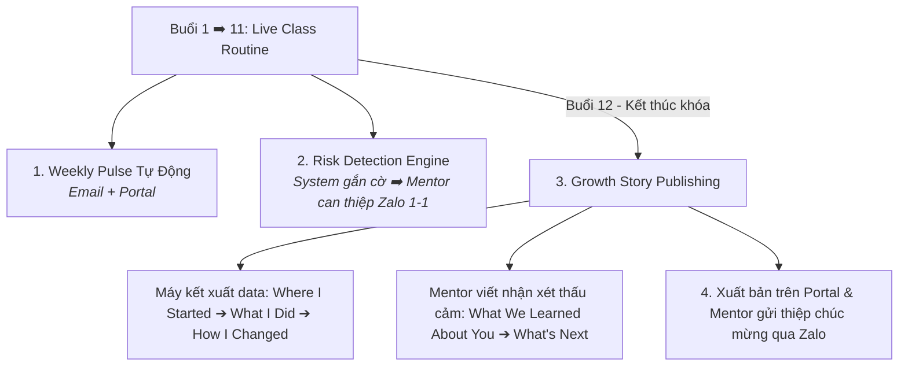

# SOP Steps

| Quy trình con | Hành động Hệ thống (System Action) | Hành động Con người (Mentor Action qua Zalo) | Chu kỳ & Thời lượng |
| :--- | :--- | :--- | :---: |
| **1. Báo cáo tuần** *(Weekly Progress Pulse)* | • Tự động trích xuất log: số bài hoàn thành, thời lượng tự học, điểm làm chủ kiến thức. • Cập nhật dashboard trên **Family Portal**. • Gửi **Email Weekly Pulse** tóm tắt vào sáng hôm sau. | • Mentor **không phải gõ báo cáo hành chính** lặp lại. • Mentor chỉ gửi 1 tin nhắn ấm áp trên nhóm Zalo chia sẻ không khí lớp học và ghi nhận nỗ lực chung. | Hàng tuần ($\le$ 5 phút/lớp) |
| **2. Can thiệp rủi ro** *(Risk Intervention)* | • **Phát hiện tín hiệu (Signal):** Tự động gắn cờ cảnh báo nội bộ khi học sinh vắng 2 buổi liên tiếp, trễ bài tập 2 tuần hoặc sụt giảm nỗ lực $\ge 30\%$. • Tuyệt đối **không gửi tin nhắn bot cảnh báo thô** sang Zalo phụ huynh. | • **Review & Judgment:** Mentor kiểm tra bối cảnh (con ốm, áp lực thi ở trường...). • **Action:** Mentor trực tiếp nhắn tin/gọi điện riêng cho phụ huynh qua Zalo để thấu hiểu và phối hợp gỡ rối nhẹ nhàng. | Khi phát sinh tín hiệu ($\le$ 15 phút/case) |
| **3. Xuất bản Growth Story** *(Buổi 12)* | • Tự động tổng hợp dữ liệu 12 buổi (Portfolio, bài tập, biểu đồ năng lực) thành 3 phần đầu của ấn phẩm. • Xuất bản ấn phẩm hoàn chỉnh lên Family Portal và gửi Email thông báo tốt nghiệp. | • **Viết nhận xét thấu cảm (Phần 4 & 5):** Mentor dành 10 phút/bé viết góc nhìn độc bản về sự chuyển hóa tính cách & gợi ý chặng đường tiếp theo. • Gửi tin nhắn chúc mừng ấm áp trên Zalo. | Buổi 12 ($\le$ 10 phút/bé) |
