# Session Agenda

```mermaid
gantt
    title Timeline Marlins Day (15:00 - 17:00 Chủ Nhật)
    dateFormat  HH:mm
    axisFormat  %H:%M
    section Lịch trình chi tiết
    Warm-up & Ice-breaking (15p)       :15:00, 15m
    Fishbowl Lượt 1 (25p)              :15:15, 25m
    Reflection 1 - Tự làm & Chia sẻ (15p) :15:40, 15m
    Giải lao & Thưởng trà (10p)        :15:55, 10m
    Fishbowl Lượt 2 & Live Demo (35p)  :16:05, 35m
    Reflection 2 & Q&A (20p)           :16:40, 20m
```

| Khung giờ | Thời lượng | Hoạt động cốt lõi | Chi tiết thực thi | Người phụ trách |
| :---: | :---: | :--- | :--- | :--- |
| **15:00 – 15:15** | 15p | **Warm-up & Check-in** | Đón tiếp, gọi đồ uống, tạo không khí ấm cúng, giới thiệu format Fishbowl. | Host & Co-host |
| **15:15 – 15:40** | 25p | **Fishbowl Lượt 1** | Mổ xẻ 1 chủ đề nóng (ví dụ: *Áp lực thi chuyên & Nỗi sợ con tụt lại*). 3-4 PH ngồi vòng trong đối thoại. | Anh Đắc điều phối |
| **15:40 – 15:55** | 15p | **Reflection 1** | Phụ huynh tự điền phiếu phản tư cá nhân (4F Reflection), chia sẻ cặp đôi. | Co-host hỗ trợ |
| **15:55 – 16:05** | 10p | **Tea Break** | Thưởng trà ngắm cảnh thành phố, kết nối tự do giữa các bố mẹ. | Toàn bộ |
| **16:05 – 16:40** | 35p | **Fishbowl 2 & Demo** | Trực tiếp mở màn hình Nemo12 soi dữ liệu lỗ hổng kiến thức thực tế. | Anh Đắc & Hồng |
| **16:40 – 17:00** | 20p | **Wrap-up & Next-step** | Đúc kết thông điệp, mời phụ huynh vào Zalo Private và kết nối 1-1. | Host & Co-host |
