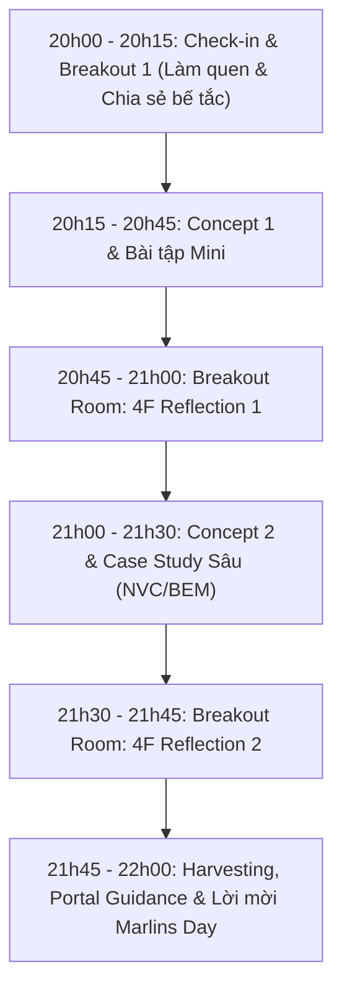

# Session Agenda

Cấu trúc chuẩn 120 phút (20h00 – 22h00) thiết kế theo mô hình **Double Reflection Loops**:

| Khung giờ | Nội dung hoạt động | Hình thức | Mục tiêu & Phương pháp |
| :---: | :--- | :---: | :--- |
| **20:00 – 20:15** (15') | **Warm-up & Breakout Check-in** | Nhóm nhỏ (3-4 người) | • Điểm danh Cam/Mic. • Phụ huynh chia sẻ 1 "cơn đau đầu / cảm giác bất lực" gần nhất khi kèm con học tại nhà. |
| **20:15 – 20:45** (30') | **Chuyên đề 1 & Bài tập Mini** | Toàn phòng | • Anh Đắc mổ xẻ 1 Ngộ nhận trọng tâm. • Giao bài tập tình huống thực tế (tình huống con lười học / trốn tránh bài khó). |
| **20:45 – 21:00** (15') | **Breakout 4F Reflection 1** | Nhóm nhỏ | Thực hành khung **4F**: • **Facts:** Sự thật con đã làm gì? • **Feelings:** Cảm xúc lúc đó của bố/mẹ là gì? • **Findings:** Ngộ nhận nào đang chi phối phản ứng của mình? • **Future:** Lần tới sẽ phản ứng khác đi như thế nào? |
| **21:00 – 21:30** (30') | **Chuyên đề 2 & Case Study Thực Chiến** | Toàn phòng | • Mentor Hồng chia sẻ góc nhìn sư phạm thực tế từ lớp học Nemo12. • Hướng dẫn công cụ NVC / BEM xử lý triệt để bế tắc. |
| **21:30 – 21:45** (15') | **Breakout 4F Reflection 2** | Nhóm nhỏ | Áp dụng giải pháp mới vào đúng trường hợp cụ thể của con mình; các bố mẹ góp ý chéo cho nhau. |
| **21:45 – 22:00** (15') | **Harvesting & Call To Action** | Toàn phòng | • Đại diện 2 phụ huynh chia sẻ bài học tâm đắc nhất. • Hướng dẫn làm bài tập theo pace riêng trên **Family Portal**. • Mời tham gia **Marlins Day** chiều Chủ Nhật tại Lotte Hotel. |
