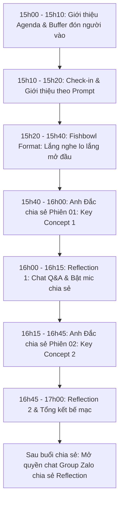

# Session Agenda

Cấu trúc chuẩn 120 phút (**15h00 – 17h00 Chủ Nhật hàng tuần**) thiết kế theo mô hình **Fishbowl & Double Reflection Loops**:

| Khung giờ | Nội dung hoạt động | Hình thức | Mục tiêu & Phương pháp |
| :---: | :--- | :---: | :--- |
| **15:00 – 15:10** (10') | **Giới thiệu Agenda & Buffer** | Toàn phòng | • Giới thiệu Agenda của buổi chia sẻ. • Buffer thêm thời gian (khoảng 5 phút) chờ thêm phụ huynh vào phòng Zoom ổn định. |
| **15:10 – 15:20** (10') | **Check-in & Giới thiệu bản thân** | Zoom Chat & Toàn phòng | Phụ huynh giới thiệu bản thân trong Zoom theo prompt: **(1)** Thông tin về bố mẹ: *Tên, Năm sinh* **(2)** Thông tin về các con: *Tên, Năm sinh, Học lớp mấy, Trường* **(3)** *Mục tiêu của bố mẹ khi vào workshop này?* |
| **15:20 – 15:40** (20') | **Fishbowl Format: Lắng nghe lo lắng mở đầu** | Đối thoại Fishbowl | • Mời 1–2 bố/mẹ tình nguyện chia sẻ mở đầu về nỗi lo lắng, trăn trở của mình khi kèm con học. • **Mục tiêu:** Hiểu mong muốn của các bố mẹ khi tham gia buổi này, làm dữ liệu để điều chỉnh các phần chia sẻ sau cho phù hợp. |
| **15:40 – 16:00** (20') | **Chuyên đề Phiên 01: Key Concept 1** | Thuyết trình tương tác | • Anh Đắc chia sẻ phiên 01 về 1 Key Concept có thể hỗ trợ các bố mẹ dựa trên data từ vấn đề vừa được chia sẻ. |
| **16:00 – 16:15** (15') | **Reflection ngắn 1 & Đối thoại** | Chat & Bật mic | • Reflection ngắn cho bố mẹ comment vào chat câu hỏi: *\"Anh/Chị thu được điều gì mới sau phiên chia sẻ vừa rồi?\"* • Gọi 2–3 bố mẹ bật mic chia sẻ các reflection trực tiếp. |
| **16:15 – 16:45** (30') | **Chuyên đề Phiên 02: Key Concept 2** | Thuyết trình tương tác | • Anh Đắc chia sẻ phiên 02 về 1 Key Concept có thể hỗ trợ các bố mẹ dựa trên data từ vấn đề vừa rồi. |
| **16:45 – 17:00** (15') | **Reflection ngắn 2 & Tổng kết** | Chat & Toàn phòng | • Reflection ngắn cho bố mẹ comment vào chat câu hỏi: *\"Anh/Chị thu được điều gì mới sau phiên chia sẻ vừa rồi?\"* • Đúc kết bài học, gửi lời cảm ơn và kết thúc buổi chia sẻ. |

> 💬 **Sau buổi chia sẻ:** Mở quyền chat trên group Zalo để các phụ huynh vào chia sẻ các reflection sau phần vừa rồi.
