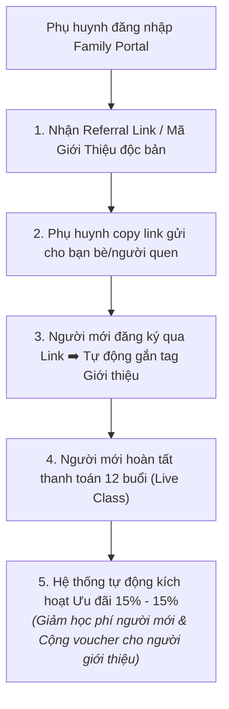

# SOP Steps

Quy trình vận hành tự động hóa 100% của hệ thống Referral:

| Bước | Hành động Hệ thống (System Action) | Hành động Phụ huynh (Parent Action) |
| :--- | :--- | :--- |
| **1. Cấp mã độc bản** | Tự động tạo `Referral_Code` và đường dẫn cá nhân hóa hiển thị sẵn trên Family Portal. | Đăng nhập Portal, bấm 1 chạm để sao chép link giới thiệu. |
| **2. Gắn tag tự động** | Khi người mới click link và điền thông tin đăng ký $\to$ Hệ thống tự động liên kết ID của người giới thiệu vào hồ sơ học sinh mới. | Gửi link qua tin nhắn cho bạn bè/người thân có con trong độ tuổi. |
| **3. Xác thực thanh toán** | Khi người mới thanh toán thành công khóa 12 buổi $\to$ Hệ thống tự động áp dụng mức giảm 15% học phí cho hóa đơn của người mới. | Người mới nhận ưu đãi 15% ngay trên màn hình thanh toán. |
| **4. Trả thưởng người giới thiệu** | Tự động cộng Voucher 15% vào ví tài khoản Family Portal của người giới thiệu + Gửi Email chúc mừng và cảm ơn tự động. | Người giới thiệu nhận thông báo qua Email/Portal, dùng voucher cho kỳ học tiếp theo của con. |
