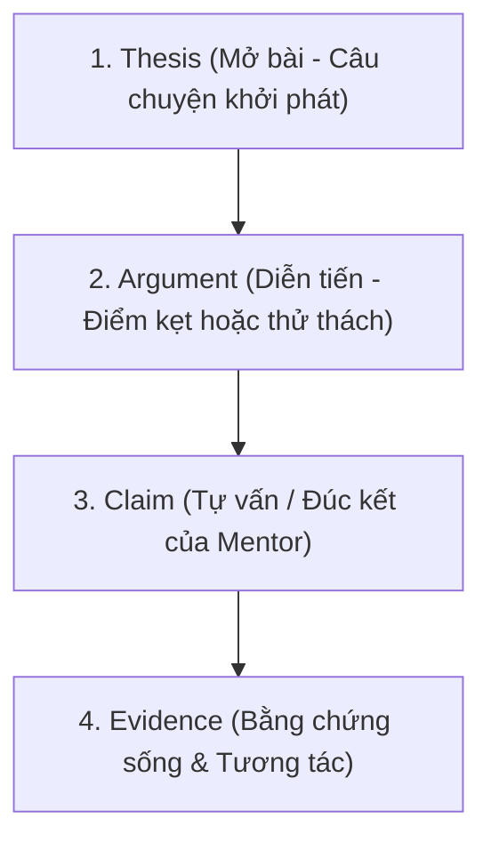

# Framework

Mọi bài viết đều được triển khai theo cấu trúc logic chuẩn **T-A-C-E (Thesis – Argument – Claim – Evidence)** nhưng được diễn đạt bằng ngôn từ đời thường, mềm mại:

| Cấu phần | Vai trò trong bài viết | Cách viết mẫu gợi ý |
| :--- | :--- | :--- |
| **1. Thesis** *(Mở bài)* | Đưa ra ngay tình huống hoặc một câu nói ngây ngô nhưng sâu sắc của học sinh. Vào đề trực diện, không lan man. | *"Chiều nay bạn Bơ (10 tuổi) hỏi tôi một câu làm tôi đứng hình mất 5 giây..."* |
| **2. Argument** *(Diễn tiến)* | Kể lại khoảnh khắc con gặp khó khăn khi làm web và cách con tự tìm cách vượt qua (hoặc cách Mentor đồng hành). | *"Bạn ấy loay hoay mãi với cái nút bấm trên trang web tự làm. Tôi định nhảy vào sửa hộ, nhưng rồi quyết định lùi lại..."* |
| **3. Claim** *(Đúc kết/Tự vấn)* | Bài học sâu sắc mà Mentor nhận được; góc nhìn tâm lý nhẹ nhàng, dễ hiểu cho bố mẹ. | *"Hóa ra tụi nhỏ không sợ bài khó, tụi nhỏ chỉ sợ người lớn không đủ kiên nhẫn để chờ chúng tự tìm ra lời giải."* |
| **4. Evidence** *(Bằng chứng)* | Ảnh mặt người thật (khoảnh khắc cười/tập trung), ảnh sản phẩm website con tự làm, hoặc ảnh chụp mẩu ghi chú dễ thương. | Ảnh chụp Mentor và học sinh bên chiếc laptop hiển thị giao diện web do chính tay con hoàn thiện. |
