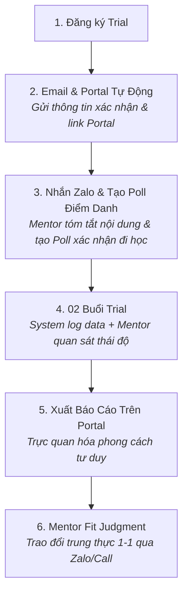

# SOP Steps

| Giai đoạn | Hành động Hệ thống (System Action) | Hành động Con người (Mentor Action qua Zalo) | Thời lượng |
| :--- | :--- | :--- | :---: |
| **1. Trước Trial** *(Pre-Trial)* | • Tự động gửi **Email xác nhận** + tài khoản truy cập **Family Portal**. • Hiển thị hướng dẫn chuẩn bị thiết bị ngắn gọn trên Portal. | • Mentor tạo nhóm Zalo lớp học, gửi lời chào đón. • **Nhắn tin tóm tắt sơ bộ nội dung buổi học** và **tạo Poll bình chọn trên Zalo** để nắm chắc danh sách phụ huynh/học sinh tham gia. • Hỗ trợ gia đình nếu có vấn đề kỹ thuật/thiết bị. | $\le$ 10 phút |
| **2. Trong Trial** *(During Trial)* | • Tự động ghi nhận log học tập: thời gian giải quyết bài toán, tương tác, các điểm kẹt kiến thức. • Hệ thống chấm và phân tích dữ liệu tư duy ban đầu. | • Giảng viên/Mentor quan sát độ tự tin, khả năng tự học và sự hào hứng của con. • Ghi chú nhanh các biểu hiện đặc thù vào hệ thống Dory. | — |
| **3. Sau Trial** *(Post-Trial)* | • Tự động kết xuất **Báo cáo Bằng chứng Năng lực (Trial Evidence)** lên Family Portal của phụ huynh. • Gửi Email thông báo kết quả sẵn sàng trên Portal. | • **Tư vấn Fit Judgment:** Mentor nhắn tin/gọi điện trao đổi 1-1 với phụ huynh dựa trên dữ liệu thật trên Portal. • **Sẵn sàng từ chối:** Nếu thấy con chưa phù hợp thời điểm này, khuyên bố mẹ chân thành và trao lộ trình tự học tại nhà trên Portal. | $\le$ 15 phút/case |
